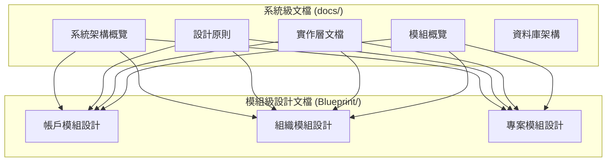

# 文檔結構說明 (Documentation Structure)

## 概述

本專案採用分層文檔架構，將系統文檔分為兩個主要目錄，每個目錄都有明確的職責和用途。

## 文檔目錄結構

### 1. `docs/` 目錄 - 系統級文檔
**目的**: 提供系統級別的高層次概覽和實作指南

**內容分類**:
- **`architecture/`** - 系統架構文檔
  - 整體架構設計
  - 跨模組整合架構
  - 領域模型概覽
  - 系統用例圖

- **`design-principles/`** - 設計原則文檔
  - API 合約設計
  - 認證流程策略
  - 錯誤處理策略
  - 效能優化策略
  - 安全策略

- **`implementation/`** - 實作層文檔
  - 應用層服務實作
  - 領域層實體設計
  - 基礎設施層實作
  - 共享模組實作

- **`modules/`** - 模組概覽文檔
  - 各模組的架構概覽
  - 路由配置
  - 狀態管理
  - 測試策略

- **`schemas/`** - 資料庫架構文檔
  - Firebase 集合設計
  - 資料模型定義

### 2. `memory-bank/references/Blueprint/` 目錄 - 模組級設計文檔
**目的**: 提供模組級別的詳細設計和實作計劃

**內容分類**:
- **`account-module-feature-based/`** - 帳戶模組詳細設計
  - 問題分析
  - 架構設計
  - 功能分析
  - 實作路線圖

- **`organization-module-optimization/`** - 組織模組優化設計
  - 架構設計
  - 響應式架構
  - 設計系統
  - 效能優化

- **`projects-module-ddd-refactor/`** - 專案模組 DDD 重構設計
  - 問題分析
  - DDD 架構設計
  - 垂直切片架構
  - 實作路線圖

## 文檔層級關係

## 文檔使用指南

### 對於系統架構師
- 從 `docs/architecture/` 開始，了解整體架構
- 參考 `docs/design-principles/` 了解設計原則
- 查看 `docs/SYSTEM_ARCHITECTURE.md` 了解資料模型

### 對於模組開發者
- 從 `memory-bank/references/Blueprint/` 選擇對應模組
- 參考 `docs/implementation/` 了解實作細節
- 查看 `docs/modules/` 了解模組概覽

### 對於前端開發者
- 從 `docs/modules/` 了解模組路由和狀態管理
- 參考 `docs/design-principles/` 了解 UI 設計原則
- 查看 `docs/implementation/shared-module/` 了解共享服務

## 文檔維護原則

### 1. 分層維護
- **系統級文檔**: 由架構師維護，關注整體設計
- **模組級文檔**: 由模組負責人維護，關注具體實作

### 2. 內容互補
- 兩個目錄的內容互補，不重複
- 系統級文檔提供概覽，模組級文檔提供細節

### 3. 版本同步
- 當系統架構變更時，同步更新相關文檔
- 當模組設計變更時，同步更新概覽文檔

## 文檔品質檢查

### 定期檢查項目
- [ ] 文檔內容是否與實際實作一致
- [ ] 跨模組文檔是否保持同步
- [ ] 是否有重複或過時的文檔
- [ ] 文檔結構是否清晰易懂

### 文檔更新流程
1. 實作變更時，先更新模組級文檔
2. 影響系統架構時，同步更新系統級文檔
3. 定期檢查文檔一致性
4. 清理過時或重複的文檔

## 總結

本專案採用分層文檔架構，確保文檔的清晰性和可維護性。`docs/` 目錄提供系統級概覽，`memory-bank/references/Blueprint/` 目錄提供模組級細節，兩者互補形成完整的文檔體系。
