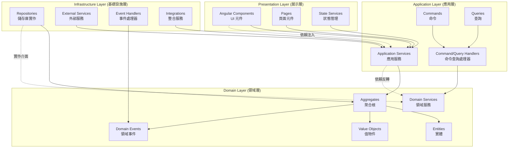
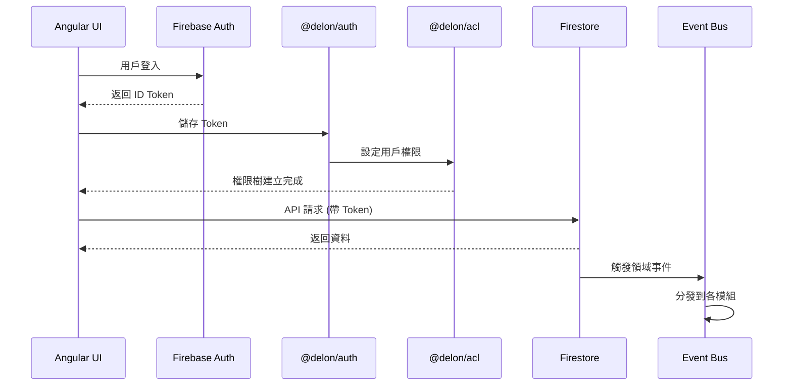

# 建築工程管理平台 - 系統架構文件

## DDD 四層架構與依賴方向



## 模組邊界與上下文

| 模組 | 職責範圍 | 邊界上下文 | 依賴關係 |
|------|----------|------------|----------|
| **Account** ✨ | 統一帳戶抽象層，定義所有帳戶共同行為 | 帳戶身份管理上下文 | 基礎模組，所有模組的根基 |
| **User** | 用戶認證、個人檔案、證照管理（繼承 Account） | 用戶身份管理上下文 | 繼承 Account 模組 |
| **Organization** | 組織管理、成員管理、團隊管理（繼承 Account） | 組織管理上下文 | 繼承 Account 模組 |
| **Project** | 專案管理、任務管理、文件管理 | 專案執行上下文 | 依賴 Account 模組（統一擁有者類型） |
| **Social** | 社交關係、推薦系統 | 社交互動上下文 | 事件驅動，依賴所有核心模組 |
| **Achievement** | 成就系統、規則引擎 | 激勵系統上下文 | 事件驅動，依賴所有模組 |
| **Notification** | 通知系統、推送服務 | 通訊上下文 | 事件驅動，依賴所有模組 |

## 技術棧整合架構



---

## 專案結構

src/
├── app/
│   ├── app.component.ts                    # 根元件
│   ├── app.config.ts                       # 應用程式配置
│   ├── app.routes.ts                       # 路由配置
│   │
│   ├── core/                               # 核心基礎設施
│   │   ├── auth/                          # 認證核心
│   │   │   ├── services/
│   │   │   │   ├── firebase-auth.service.ts        # Firebase 認證服務
│   │   │   │   ├── delon-auth.service.ts           # @delon/auth 整合服務
│   │   │   │   └── auth-integration.service.ts     # 認證整合服務
│   │   │   ├── guards/
│   │   │   │   ├── auth.guard.ts                   # 認證守衛
│   │   │   │   └── acl.guard.ts                    # 權限守衛
│   │   │   ├── interceptors/
│   │   │   │   ├── auth.interceptor.ts             # 認證攔截器
│   │   │   │   └── token.interceptor.ts            # Token 攔截器
│   │   │   └── index.ts                            # 認證模組匯出
│   │   │
│   │   ├── acl/                                # 權限控制
│   │   │   ├── services/
│   │   │   │   ├── acl.service.ts                      # ACL 權限服務
│   │   │   │   └── permission.service.ts               # 權限管理服務
│   │   │   ├── directives/
│   │   │   │   └── acl.directive.ts                    # ACL 指令 (*appAcl)
│   │   │   ├── pipes/
│   │   │   │   └── acl.pipe.ts                         # ACL 管道
│   │   │   └── index.ts                                # ACL 模組匯出
│   │   │
│   │   ├── event-bus/                          # 事件匯流排
│   │   │   ├── services/
│   │   │   │   ├── event-bus.service.ts                # 事件匯流排服務
│   │   │   │   ├── event-store.service.ts              # 事件儲存服務
│   │   │   │   └── event-processor.service.ts          # 事件處理服務
│   │   │   ├── models/
│   │   │   │   ├── domain-event.interface.ts           # 領域事件介面
│   │   │   │   └── integration-event.interface.ts      # 整合事件介面
│   │   │   └── index.ts                                # 事件匯流排模組匯出
│   │   │
│   │   ├── infrastructure/                     # 基礎設施
│   │   │   ├── firestore/
│   │   │   │   ├── base-repository.ts                  # 基礎儲存庫抽象類
│   │   │   │   ├── firestore.service.ts                # Firestore 服務
│   │   │   │   └── firestore-config.ts                 # Firestore 配置
│   │   │   ├── storage/
│   │   │   │   ├── file-storage.service.ts             # 檔案儲存服務
│   │   │   │   └── storage-config.ts                   # 儲存配置
│   │   │   ├── logging/
│   │   │   │   ├── logger.service.ts                   # 日誌服務
│   │   │   │   └── audit.service.ts                    # 審計服務
│   │   │   └── index.ts                                # 基礎設施模組匯出
│   │   │
│   │   └── shared/                             # 共享工具
│   │       ├── utils/                                 # 工具函數
│   │       ├── constants/                             # 常數定義
│   │       ├── models/                                # 共享模型
│   │       └── index.ts                               # 共享模組匯出
│   │
│   ├── features/                               # 功能模組
│   │   │
│   │   ├── account/                           # 帳戶模組 ✨ (統一基類)
│   │   │   ├── domain/                         # 領域層
│   │   │   │   ├── aggregates/
│   │   │   │   │   └── account.aggregate.ts              # Account 抽象聚合根
│   │   │   │   ├── entities/
│   │   │   │   │   └── account.entity.ts                 # Account 抽象實體
│   │   │   │   ├── value-objects/
│   │   │   │   │   ├── account-info.vo.ts                # 帳戶資訊值物件
│   │   │   │   │   └── account-type.vo.ts                # 帳戶類型值物件
│   │   │   │   ├── events/
│   │   │   │   │   └── account-created.event.ts          # 帳戶建立事件
│   │   │   │   ├── services/
│   │   │   │   │   └── account-domain.service.ts         # 帳戶領域服務
│   │   │   │   └── repositories/
│   │   │   │       └── account.repository.interface.ts   # 帳戶儲存庫介面
│   │   │   ├── infrastructure/                 # 基礎設施層
│   │   │   │   ├── repositories/
│   │   │   │   │   └── firestore-account.repository.ts   # Firestore 帳戶儲存庫
│   │   │   │   └── index.ts
│   │   │   └── index.ts
│   │   │
│   │   ├── user/                              # 用戶模組 ✨ (繼承 Account)
│   │   │   ├── presentation/                   # 展示層
│   │   │   │   ├── components/
│   │   │   │   │   ├── auth/
│   │   │   │   │   │   ├── login.component.ts                    # 登入元件
│   │   │   │   │   │   ├── registration.component.ts             # 註冊元件
│   │   │   │   │   │   ├── forgot-password.component.ts          # 忘記密碼元件
│   │   │   │   │   │   └── email-verification.component.ts       # 郵箱驗證元件
│   │   │   │   │   ├── profile/
│   │   │   │   │   │   ├── profile-card.component.ts             # 個人檔案卡片元件
│   │   │   │   │   │   ├── profile-edit.component.ts             # 個人檔案編輯元件
│   │   │   │   │   │   ├── avatar.component.ts                   # 頭像元件
│   │   │   │   │   │   └── basic-info.component.ts               # 基本資訊元件
│   │   │   │   │   ├── certificates/
│   │   │   │   │   │   ├── certificate-management.component.ts   # 證照管理元件
│   │   │   │   │   │   ├── certificate-list.component.ts         # 證照列表元件
│   │   │   │   │   │   ├── certificate-upload.component.ts       # 證照上傳元件
│   │   │   │   │   │   └── certificate-verification.component.ts # 證照驗證元件
│   │   │   │   │   ├── social/
│   │   │   │   │   │   ├── following-list.component.ts           # 追蹤列表元件
│   │   │   │   │   │   ├── followers-list.component.ts           # 粉絲列表元件
│   │   │   │   │   │   ├── social-button.component.ts            # 社交按鈕元件
│   │   │   │   │   │   └── social-card.component.ts              # 社交卡片元件
│   │   │   │   │   └── notifications/
│   │   │   │   │       ├── notification-center.component.ts      # 通知中心元件
│   │   │   │   │       ├── notification-list.component.ts        # 通知列表元件
│   │   │   │   │       └── notification-settings.component.ts    # 通知設定元件
│   │   │   │   ├── pages/
│   │   │   │   │   ├── user-profile.page.ts                      # 用戶檔案頁面
│   │   │   │   │   ├── user-settings.page.ts                     # 用戶設定頁面
│   │   │   │   │   └── user-dashboard.page.ts                    # 用戶儀表板頁面
│   │   │   │   ├── state/
│   │   │   │   │   ├── user-state.service.ts                     # 用戶狀態服務
│   │   │   │   │   ├── auth-state.service.ts                     # 認證狀態服務
│   │   │   │   │   └── profile-state.service.ts                  # 檔案狀態服務
│   │   │   │   └── index.ts                                      # 展示層模組匯出
│   │   │   │
│   │   │   ├── application/                    # 應用層
│   │   │   │   ├── services/
│   │   │   │   │   ├── auth-application.service.ts              # 認證應用服務
│   │   │   │   │   ├── profile-application.service.ts           # 檔案應用服務
│   │   │   │   │   ├── certificate-application.service.ts       # 證照應用服務
│   │   │   │   │   ├── social-application.service.ts            # 社交應用服務
│   │   │   │   │   └── notification-application.service.ts      # 通知應用服務
│   │   │   │   ├── commands/
│   │   │   │   │   ├── auth/
│   │   │   │   │   │   ├── login-user.command.ts                # 用戶登入命令
│   │   │   │   │   │   ├── register-user.command.ts             # 用戶註冊命令
│   │   │   │   │   │   ├── forgot-password.command.ts           # 忘記密碼命令
│   │   │   │   │   │   └── verify-email.command.ts              # 郵箱驗證命令
│   │   │   │   │   ├── profile/
│   │   │   │   │   │   ├── create-profile.command.ts            # 建立檔案命令
│   │   │   │   │   │   └── update-profile.command.ts            # 更新檔案命令
│   │   │   │   │   └── certificates/
│   │   │   │   │       ├── add-certificate.command.ts           # 新增證照命令
│   │   │   │   │       └── verify-certificate.command.ts        # 驗證證照命令
│   │   │   │   ├── queries/
│   │   │   │   │   ├── get-profile.query.ts                     # 查詢檔案查詢
│   │   │   │   │   ├── get-certificates.query.ts                # 查詢證照查詢
│   │   │   │   │   └── get-following.query.ts                   # 查詢追蹤查詢
│   │   │   │   ├── handlers/
│   │   │   │   │   ├── command-handlers/                        # 命令處理器目錄
│   │   │   │   │   └── query-handlers/                          # 查詢處理器目錄
│   │   │   │   └── index.ts                                     # 應用層模組匯出
│   │   │   │
│   │   │   ├── domain/                         # 領域層
│   │   │   │   ├── aggregates/
│   │   │   │   │   └── user.aggregate.ts                 # 繼承 Account Aggregate
│   │   │   │   ├── entities/
│   │   │   │   │   ├── user.entity.ts                    # 繼承 Account Entity
│   │   │   │   │   ├── profile.entity.ts
│   │   │   │   │   ├── certificate.entity.ts
│   │   │   │   │   ├── achievement.entity.ts
│   │   │   │   │   ├── notification.entity.ts
│   │   │   │   │   └── social.entity.ts
│   │   │   │   ├── value-objects/
│   │   │   │   │   ├── user-info.vo.ts
│   │   │   │   │   ├── profile-info.vo.ts
│   │   │   │   │   ├── certificate-info.vo.ts
│   │   │   │   │   ├── achievement-info.vo.ts
│   │   │   │   │   └── social-info.vo.ts
│   │   │   │   ├── events/
│   │   │   │   │   ├── user-created.event.ts
│   │   │   │   │   ├── profile-updated.event.ts
│   │   │   │   │   ├── certificate-added.event.ts
│   │   │   │   │   └── achievement-awarded.event.ts
│   │   │   │   ├── services/
│   │   │   │   │   ├── user-domain.service.ts
│   │   │   │   │   ├── profile-domain.service.ts
│   │   │   │   │   ├── certificate-domain.service.ts
│   │   │   │   │   └── social-domain.service.ts
│   │   │   │   ├── repositories/
│   │   │   │   │   ├── user.repository.interface.ts
│   │   │   │   │   ├── profile.repository.interface.ts
│   │   │   │   │   └── certificate.repository.interface.ts
│   │   │   │   └── index.ts
│   │   │   │
│   │   │   ├── infrastructure/                 # 基礎設施層
│   │   │   │   ├── repositories/
│   │   │   │   │   ├── firestore-user.repository.ts
│   │   │   │   │   ├── firestore-profile.repository.ts
│   │   │   │   │   ├── firestore-certificate.repository.ts
│   │   │   │   │   └── firestore-achievement.repository.ts
│   │   │   │   ├── event-handlers/
│   │   │   │   │   ├── user-event.handler.ts
│   │   │   │   │   ├── profile-event.handler.ts
│   │   │   │   │   └── certificate-event.handler.ts
│   │   │   │   ├── external-services/
│   │   │   │   │   ├── firebase-auth.service.ts
│   │   │   │   │   ├── email.service.ts
│   │   │   │   │   ├── file-storage.service.ts
│   │   │   │   │   └── certificate-verification.service.ts
│   │   │   │   ├── integrations/
│   │   │   │   │   ├── organization-integration.service.ts
│   │   │   │   │   ├── project-integration.service.ts
│   │   │   │   │   └── team-integration.service.ts
│   │   │   │   └── index.ts
│   │   │   │
│   │   │   ├── user.routes.ts
│   │   │   └── index.ts
│   │   │
│   │   ├── organization/                       # 組織模組 ✨ (繼承 Account)
│   │   │   ├── presentation/
│   │   │   │   ├── components/
│   │   │   │   │   ├── organization-card.component.ts
│   │   │   │   │   ├── organization-form.component.ts
│   │   │   │   │   ├── organization-list.component.ts
│   │   │   │   │   ├── team-management.component.ts
│   │   │   │   │   ├── member-management.component.ts
│   │   │   │   │   └── project-assignment.component.ts
│   │   │   │   ├── pages/
│   │   │   │   │   ├── organization-list.page.ts
│   │   │   │   │   ├── organization-detail.page.ts
│   │   │   │   │   └── organization-settings.page.ts
│   │   │   │   └── state/
│   │   │   │       └── organization-state.service.ts
│   │   │   ├── application/
│   │   │   │   ├── services/
│   │   │   │   │   ├── organization-application.service.ts
│   │   │   │   │   ├── member-management.service.ts
│   │   │   │   │   ├── team-management.service.ts
│   │   │   │   │   └── project-assignment.service.ts
│   │   │   │   ├── commands/
│   │   │   │   │   ├── create-organization.command.ts
│   │   │   │   │   ├── update-organization.command.ts
│   │   │   │   │   ├── invite-member.command.ts
│   │   │   │   │   └── create-team.command.ts
│   │   │   │   └── queries/
│   │   │   │       ├── get-organization.query.ts
│   │   │   │       ├── get-members.query.ts
│   │   │   │       └── get-teams.query.ts
│   │   │   ├── domain/
│   │   │   │   ├── aggregates/
│   │   │   │   │   └── organization.aggregate.ts         # 繼承 Account Aggregate
│   │   │   │   ├── entities/
│   │   │   │   │   ├── organization.entity.ts            # 繼承 Account Entity
│   │   │   │   │   ├── member.entity.ts
│   │   │   │   │   ├── team.entity.ts
│   │   │   │   │   │   └── project-assignment.entity.ts
│   │   │   │   ├── value-objects/
│   │   │   │   │   ├── organization-profile.vo.ts
│   │   │   │   │   ├── member-info.vo.ts
│   │   │   │   │   ├── team-info.vo.ts
│   │   │   │   │   └── project-assignment.vo.ts
│   │   │   │   ├── events/
│   │   │   │   │   ├── organization-created.event.ts
│   │   │   │   │   ├── member-invited.event.ts
│   │   │   │   │   └── team-created.event.ts
│   │   │   │   ├── services/
│   │   │   │   │   ├── organization-domain.service.ts
│   │   │   │   │   ├── member-domain.service.ts
│   │   │   │   │   └── team-domain.service.ts
│   │   │   │   └── repositories/
│   │   │   │       ├── organization.repository.interface.ts
│   │   │   │       ├── member.repository.interface.ts
│   │   │   │       └── team.repository.interface.ts
│   │   │   ├── infrastructure/
│   │   │   │   ├── repositories/
│   │   │   │   │   ├── firestore-organization.repository.ts
│   │   │   │   │   ├── firestore-member.repository.ts
│   │   │   │   │   └── firestore-team.repository.ts
│   │   │   │   ├── event-handlers/
│   │   │   │   │   ├── organization-event.handler.ts
│   │   │   │   │   ├── member-event.handler.ts
│   │   │   │   │   └── team-event.handler.ts
│   │   │   │   ├── external-services/
│   │   │   │   │   ├── license-verification.service.ts
│   │   │   │   │   ├── organization-notification.service.ts
│   │   │   │   │   └── organization-audit.service.ts
│   │   │   │   └── integrations/
│   │   │   │       ├── user-integration.service.ts
│   │   │   │       └── project-integration.service.ts
│   │   │   ├── organization.routes.ts
│   │   │   └── index.ts
│   │   │
│   │   ├── project/                            # 專案模組 ✨
│   │   │   ├── presentation/
│   │   │   │   ├── components/
│   │   │   │   │   ├── project/
│   │   │   │   │   │   ├── project-card.component.ts
│   │   │   │   │   │   ├── project-form.component.ts
│   │   │   │   │   │   ├── project-list.component.ts
│   │   │   │   │   │   └── project-detail.component.ts
│   │   │   │   │   ├── tasks/
│   │   │   │   │   │   ├── task-management.component.ts
│   │   │   │   │   │   ├── task-list.component.ts
│   │   │   │   │   │   ├── task-form.component.ts
│   │   │   │   │   │   └── task-detail.component.ts
│   │   │   │   │   ├── documents/
│   │   │   │   │   │   ├── document-management.component.ts
│   │   │   │   │   │   ├── document-list.component.ts
│   │   │   │   │   │   ├── document-upload.component.ts
│   │   │   │   │   │   └── document-viewer.component.ts
│   │   │   │   │   ├── cost/
│   │   │   │   │   │   ├── cost-budget.component.ts
│   │   │   │   │   │   ├── cost-actual.component.ts
│   │   │   │   │   │   ├── cost-forecast.component.ts
│   │   │   │   │   │   ├── cost-variance.component.ts
│   │   │   │   │   │   └── cost-breakdown.component.ts
│   │   │   │   │   ├── reports/
│   │   │   │   │   │   ├── daily-report.component.ts
│   │   │   │   │   │   ├── inspection-report.component.ts
│   │   │   │   │   │   ├── analytics-report.component.ts
│   │   │   │   │   │   └── gantt-chart.component.ts
│   │   │   │   │   └── materials/
│   │   │   │   │       ├── materials-management.component.ts
│   │   │   │   │       ├── equipment-management.component.ts
│   │   │   │   │       └── safety-records.component.ts
│   │   │   │   ├── pages/
│   │   │   │   │   ├── project-list.page.ts
│   │   │   │   │   ├── project-detail.page.ts
│   │   │   │   │   ├── project-dashboard.page.ts
│   │   │   │   │   └── project-reports.page.ts
│   │   │   │   └── state/
│   │   │   │       ├── project-state.service.ts
│   │   │   │       ├── task-state.service.ts
│   │   │   │       └── cost-state.service.ts
│   │   │   ├── application/
│   │   │   │   ├── services/
│   │   │   │   │   ├── project-application.service.ts
│   │   │   │   │   ├── task-management.service.ts
│   │   │   │   │   ├── document-management.service.ts
│   │   │   │   │   ├── cost-control.service.ts
│   │   │   │   │   ├── report.service.ts
│   │   │   │   │   └── gantt-chart.service.ts
│   │   │   │   ├── commands/
│   │   │   │   │   ├── create-project.command.ts
│   │   │   │   │   ├── create-task.command.ts
│   │   │   │   │   ├── update-task.command.ts
│   │   │   │   │   ├── create-document.command.ts
│   │   │   │   │   ├── create-budget.command.ts
│   │   │   │   │   ├── update-cost.command.ts
│   │   │   │   │   ├── create-daily-report.command.ts
│   │   │   │   │   └── generate-gantt-data.command.ts
│   │   │   │   └── queries/
│   │   │   │       ├── get-project.query.ts
│   │   │   │       ├── get-tasks.query.ts
│   │   │   │       ├── get-documents.query.ts
│   │   │   │       ├── get-cost-data.query.ts
│   │   │   │       └── get-gantt-data.query.ts
│   │   │   ├── domain/
│   │   │   │   ├── aggregates/
│   │   │   │   │   └── project.aggregate.ts
│   │   │   │   ├── entities/
│   │   │   │   │   ├── project.entity.ts
│   │   │   │   │   ├── milestone.entity.ts
│   │   │   │   │   ├── task.entity.ts
│   │   │   │   │   ├── document.entity.ts
│   │   │   │   │   ├── cost.entity.ts
│   │   │   │   │   ├── report.entity.ts
│   │   │   │   │   ├── material.entity.ts
│   │   │   │   │   └── equipment.entity.ts
│   │   │   │   ├── value-objects/
│   │   │   │   │   ├── project-info.vo.ts
│   │   │   │   │   ├── milestone-info.vo.ts
│   │   │   │   │   ├── task-info.vo.ts
│   │   │   │   │   ├── document-info.vo.ts
│   │   │   │   │   ├── cost-info.vo.ts
│   │   │   │   │   └── report-info.vo.ts
│   │   │   │   ├── events/
│   │   │   │   │   ├── project-created.event.ts
│   │   │   │   │   ├── task-completed.event.ts
│   │   │   │   │   ├── milestone-reached.event.ts
│   │   │   │   │   └── cost-updated.event.ts
│   │   │   │   ├── services/
│   │   │   │   │   ├── project-domain.service.ts
│   │   │   │   │   ├── milestone-domain.service.ts
│   │   │   │   │   ├── task-domain.service.ts
│   │   │   │   │   └── cost-domain.service.ts
│   │   │   │   └── repositories/
│   │   │   │       ├── project.repository.interface.ts
│   │   │   │       ├── task.repository.interface.ts
│   │   │   │       ├── document.repository.interface.ts
│   │   │   │       └── cost.repository.interface.ts
│   │   │   ├── infrastructure/
│   │   │   │   ├── repositories/
│   │   │   │   │   ├── firestore-project.repository.ts
│   │   │   │   │   ├── firestore-task.repository.ts
│   │   │   │   │   ├── firestore-document.repository.ts
│   │   │   │   │   └── firestore-cost.repository.ts
│   │   │   │   ├── event-handlers/
│   │   │   │   │   ├── project-event.handler.ts
│   │   │   │   │   ├── task-event.handler.ts
│   │   │   │   │   ├── document-event.handler.ts
│   │   │   │   │   └── cost-event.handler.ts
│   │   │   │   ├── external-services/
│   │   │   │   │   ├── file-storage.service.ts
│   │   │   │   │   ├── project-notification.service.ts
│   │   │   │   │   └── project-audit.service.ts
│   │   │   │   └── integrations/
│   │   │   │       ├── organization-integration.service.ts
│   │   │   │       ├── user-integration.service.ts
│   │   │   │       └── team-integration.service.ts
│   │   │   ├── project.routes.ts
│   │   │   └── index.ts
│   │   │
│   │   ├── social/                             # 社交模組 ✨
│   │   │   ├── presentation/
│   │   │   │   ├── components/
│   │   │   │   │   ├── following/
│   │   │   │   │   │   ├── following-list.component.ts
│   │   │   │   │   │   ├── followers-list.component.ts
│   │   │   │   │   │   ├── follow-button.component.ts
│   │   │   │   │   │   └── follow-status.component.ts
│   │   │   │   │   ├── discovery/
│   │   │   │   │   │   ├── user-discovery.component.ts
│   │   │   │   │   │   ├── user-recommendation.component.ts
│   │   │   │   │   │   ├── user-search.component.ts
│   │   │   │   │   │   └── user-profile-card.component.ts
│   │   │   │   │   ├── stats/
│   │   │   │   │   │   ├── social-stats.component.ts
│   │   │   │   │   │   ├── social-chart.component.ts
│   │   │   │   │   │   └── social-leaderboard.component.ts
│   │   │   │   │   └── network/
│   │   │   │   │       ├── interaction.component.ts
│   │   │   │   │       ├── mutual-connection.component.ts
│   │   │   │   │       └── network.component.ts
│   │   │   │   ├── pages/
│   │   │   │   │   ├── social-dashboard.page.ts
│   │   │   │   │   ├── user-discovery.page.ts
│   │   │   │   │   └── social-network.page.ts
│   │   │   │   └── state/
│   │   │   │       ├── social-state.service.ts
│   │   │   │       └── relationship-state.service.ts
│   │   │   ├── application/
│   │   │   │   ├── services/
│   │   │   │   │   ├── follow-application.service.ts
│   │   │   │   │   ├── recommendation-application.service.ts
│   │   │   │   │   ├── search-application.service.ts
│   │   │   │   │   └── analytics-application.service.ts
│   │   │   │   ├── commands/
│   │   │   │   │   ├── follow-user.command.ts
│   │   │   │   │   ├── unfollow-user.command.ts
│   │   │   │   │   ├── recommend-users.command.ts
│   │   │   │   │   ├── search-users.command.ts
│   │   │   │   │   └── generate-social-stats.command.ts
│   │   │   │   └── queries/
│   │   │   │       ├── get-following.query.ts
│   │   │   │       ├── get-followers.query.ts
│   │   │   │       ├── get-recommendations.query.ts
│   │   │   │       ├── search-users.query.ts
│   │   │   │       └── get-social-stats.query.ts
│   │   │   ├── domain/
│   │   │   │   ├── aggregates/
│   │   │   │   │   └── social-relation.aggregate.ts
│   │   │   │   ├── entities/
│   │   │   │   │   ├── relationship.entity.ts
│   │   │   │   │   ├── network.entity.ts
│   │   │   │   │   └── mutual.entity.ts
│   │   │   │   ├── value-objects/
│   │   │   │   │   ├── relationship-info.vo.ts
│   │   │   │   │   ├── network-info.vo.ts
│   │   │   │   │   └── social-stats.vo.ts
│   │   │   │   ├── events/
│   │   │   │   │   ├── user-followed.event.ts
│   │   │   │   │   └── user-unfollowed.event.ts
│   │   │   │   ├── services/
│   │   │   │   │   ├── relationship-domain.service.ts
│   │   │   │   │   ├── network-domain.service.ts
│   │   │   │   │   ├── recommendation-domain.service.ts
│   │   │   │   │   └── privacy-domain.service.ts
│   │   │   │   └── repositories/
│   │   │   │       ├── social.repository.interface.ts
│   │   │   │       ├── relationship.repository.interface.ts
│   │   │   │       └── network.repository.interface.ts
│   │   │   ├── infrastructure/
│   │   │   │   ├── repositories/
│   │   │   │   │   ├── firestore-social.repository.ts
│   │   │   │   │   ├── firestore-relationship.repository.ts
│   │   │   │   │   └── firestore-network.repository.ts
│   │   │   │   ├── engines/
│   │   │   │   │   ├── recommendation.engine.ts
│   │   │   │   │   ├── ml-service-integration.ts
│   │   │   │   │   └── graph-analytics.service.ts
│   │   │   │   ├── event-handlers/
│   │   │   │   │   ├── follow-event.handler.ts
│   │   │   │   │   ├── recommendation-event.handler.ts
│   │   │   │   │   └── social-stats-event.handler.ts
│   │   │   │   ├── external-services/
│   │   │   │   │   ├── cache.service.ts
│   │   │   │   │   └── queue.service.ts
│   │   │   │   └── integrations/
│   │   │   │       ├── user-integration.service.ts
│   │   │   │       ├── organization-integration.service.ts
│   │   │   │       └── project-integration.service.ts
│   │   │   ├── social.routes.ts
│   │   │   └── index.ts
│   │   │
│   │   ├── achievement/                        # 成就模組 ✨
│   │   │   ├── presentation/
│   │   │   │   ├── components/
│   │   │   │   │   ├── display/
│   │   │   │   │   │   ├── achievement-card.component.ts
│   │   │   │   │   │   ├── achievement-list.component.ts
│   │   │   │   │   │   ├── achievement-badge.component.ts
│   │   │   │   │   │   └── achievement-progress.component.ts
│   │   │   │   │   ├── leaderboard/
│   │   │   │   │   │   ├── leaderboard.component.ts
│   │   │   │   │   │   ├── ranking-card.component.ts
│   │   │   │   │   │   └── top-stats.component.ts
│   │   │   │   │   ├── management/
│   │   │   │   │   │   ├── achievement-management.component.ts
│   │   │   │   │   │   ├── rule-management.component.ts
│   │   │   │   │   │   └── category-management.component.ts
│   │   │   │   │   └── charts/
│   │   │   │   │       ├── stats-chart.component.ts
│   │   │   │   │       ├── progress-chart.component.ts
│   │   │   │   │       └── achievement-timeline.component.ts
│   │   │   │   ├── pages/
│   │   │   │   │   ├── achievement-dashboard.page.ts
│   │   │   │   │   ├── leaderboard.page.ts
│   │   │   │   │   └── achievement-management.page.ts
│   │   │   │   └── state/
│   │   │   │       ├── achievement-state.service.ts
│   │   │   │       └── progress-state.service.ts
│   │   │   ├── application/
│   │   │   │   ├── services/
│   │   │   │   │   ├── achievement-application.service.ts
│   │   │   │   │   ├── rule-engine.service.ts
│   │   │   │   │   ├── statistics-application.service.ts
│   │   │   │   │   └── notification-application.service.ts
│   │   │   │   ├── commands/
│   │   │   │   │   ├── award-achievement.command.ts
│   │   │   │   │   ├── update-progress.command.ts
│   │   │   │   │   ├── evaluate-rule.command.ts
│   │   │   │   │   ├── create-rule.command.ts
│   │   │   │   │   ├── generate-stats.command.ts
│   │   │   │   │   └── notify-achievement.command.ts
│   │   │   │   └── queries/
│   │   │   │       ├── get-achievements.query.ts
│   │   │   │       ├── get-leaderboard.query.ts
│   │   │   │       └── get-progress.query.ts
│   │   │   ├── domain/
│   │   │   │   ├── aggregates/
│   │   │   │   │   └── achievement.aggregate.ts
│   │   │   │   ├── entities/
│   │   │   │   │   ├── achievement.entity.ts
│   │   │   │   │   ├── rule.entity.ts
│   │   │   │   │   ├── category.entity.ts
│   │   │   │   │   ├── progress.entity.ts
│   │   │   │   │   └── leaderboard.entity.ts
│   │   │   │   ├── value-objects/
│   │   │   │   │   ├── achievement-info.vo.ts
│   │   │   │   │   ├── rule-info.vo.ts
│   │   │   │   │   ├── criteria.vo.ts
│   │   │   │   │   └── progress.vo.ts
│   │   │   │   ├── events/
│   │   │   │   │   ├── achievement-awarded.event.ts
│   │   │   │   │   └── progress-updated.event.ts
│   │   │   │   ├── services/
│   │   │   │   │   ├── achievement-domain.service.ts
│   │   │   │   │   ├── rule-domain.service.ts
│   │   │   │   │   ├── progress-domain.service.ts
│   │   │   │   │   └── statistics-domain.service.ts
│   │   │   │   └── repositories/
│   │   │   │       ├── achievement.repository.interface.ts
│   │   │   │       ├── rule.repository.interface.ts
│   │   │   │       ├── progress.repository.interface.ts
│   │   │   │       └── leaderboard.repository.interface.ts
│   │   │   ├── infrastructure/
│   │   │   │   ├── repositories/
│   │   │   │   │   ├── firestore-achievement.repository.ts
│   │   │   │   │   ├── firestore-rule.repository.ts
│   │   │   │   │   ├── firestore-progress.repository.ts
│   │   │   │   │   └── firestore-leaderboard.repository.ts
│   │   │   │   ├── engines/
│   │   │   │   │   ├── rule.engine.ts
│   │   │   │   │   ├── complex-event-processor.ts
│   │   │   │   │   └── scoring-processor.ts
│   │   │   │   ├── event-handlers/
│   │   │   │   │   ├── achievement-event.handler.ts
│   │   │   │   │   ├── rule-event.handler.ts
│   │   │   │   │   └── progress-event.handler.ts
│   │   │   │   ├── external-services/
│   │   │   │   │   ├── cache.service.ts
│   │   │   │   │   └── batch.service.ts
│   │   │   │   └── integrations/
│   │   │   │       ├── user-integration.service.ts
│   │   │   │       ├── organization-integration.service.ts
│   │   │   │       ├── project-integration.service.ts
│   │   │   │       └── notification-integration.service.ts
│   │   │   ├── achievement.routes.ts
│   │   │   └── index.ts
│   │   │
│   │   ├── notification/                       # 通知模組 ✨
│   │   │   ├── presentation/
│   │   │   │   ├── components/
│   │   │   │   │   ├── display/
│   │   │   │   │   │   ├── notification-center.component.ts
│   │   │   │   │   │   ├── notification-list.component.ts
│   │   │   │   │   │   ├── notification-item.component.ts
│   │   │   │   │   │   └── notification-badge.component.ts
│   │   │   │   │   ├── settings/
│   │   │   │   │   │   ├── notification-settings.component.ts
│   │   │   │   │   │   ├── notification-preferences.component.ts
│   │   │   │   │   │   └── notification-templates.component.ts
│   │   │   │   │   └── push/
│   │   │   │   │       ├── push.component.ts
│   │   │   │   │       ├── email-notification.component.ts
│   │   │   │   │       ├── sms-notification.component.ts
│   │   │   │   │       └── in-app-notification.component.ts
│   │   │   │   ├── pages/
│   │   │   │   │   ├── notification-center.page.ts
│   │   │   │   │   ├── notification-settings.page.ts
│   │   │   │   │   └── notification-history.page.ts
│   │   │   │   └── state/
│   │   │   │       ├── notification-state.service.ts
│   │   │   │       └── preference-state.service.ts
│   │   │   ├── application/
│   │   │   │   ├── services/
│   │   │   │   │   ├── notification-application.service.ts
│   │   │   │   │   ├── push-application.service.ts
│   │   │   │   │   ├── template-application.service.ts
│   │   │   │   │   ├── preference-application.service.ts
│   │   │   │   │   └── batch-application.service.ts
│   │   │   │   ├── commands/
│   │   │   │   │   ├── create-notification.command.ts
│   │   │   │   │   ├── mark-as-read.command.ts
│   │   │   │   │   ├── send-push.command.ts
│   │   │   │   │   ├── send-email.command.ts
│   │   │   │   │   ├── send-sms.command.ts
│   │   │   │   │   ├── create-template.command.ts
│   │   │   │   │   ├── render-template.command.ts
│   │   │   │   │   ├── update-preferences.command.ts
│   │   │   │   │   ├── batch-process.command.ts
│   │   │   │   │   └── schedule.command.ts
│   │   │   │   └── queries/
│   │   │   │       ├── get-notifications.query.ts
│   │   │   │       ├── get-templates.query.ts
│   │   │   │       └── get-preferences.query.ts
│   │   │   ├── domain/
│   │   │   │   ├── aggregates/
│   │   │   │   │   └── notification.aggregate.ts
│   │   │   │   ├── entities/
│   │   │   │   │   ├── notification.entity.ts
│   │   │   │   │   ├── template.entity.ts
│   │   │   │   │   ├── preference.entity.ts
│   │   │   │   │   ├── channel.entity.ts
│   │   │   │   │   └── queue.entity.ts
│   │   │   │   ├── value-objects/
│   │   │   │   │   ├── notification-info.vo.ts
│   │   │   │   │   ├── template-info.vo.ts
│   │   │   │   │   ├── preference-info.vo.ts
│   │   │   │   │   └── channel-info.vo.ts
│   │   │   │   ├── events/
│   │   │   │   │   ├── notification-created.event.ts
│   │   │   │   │   ├── notification-read.event.ts
│   │   │   │   │   └── notification-sent.event.ts
│   │   │   │   ├── services/
│   │   │   │   │   ├── notification-domain.service.ts
│   │   │   │   │   ├── template-domain.service.ts
│   │   │   │   │   ├── preference-domain.service.ts
│   │   │   │   │   └── routing-domain.service.ts
│   │   │   │   └── repositories/
│   │   │   │       ├── notification.repository.interface.ts
│   │   │   │       ├── template.repository.interface.ts
│   │   │   │       └── preference.repository.interface.ts
│   │   │   ├── infrastructure/
│   │   │   │   ├── repositories/
│   │   │   │   │   ├── firestore-notification.repository.ts
│   │   │   │   │   ├── firestore-template.repository.ts
│   │   │   │   │   └── firestore-preference.repository.ts
│   │   │   │   ├── push-services/
│   │   │   │   │   ├── firebase-cloud-messaging.ts
│   │   │   │   │   ├── sendgrid-email.service.ts
│   │   │   │   │   ├── twilio-sms.service.ts
│   │   │   │   │   └── apple-push-notification.ts
│   │   │   │   ├── event-handlers/
│   │   │   │   │   ├── notification-event.handler.ts
│   │   │   │   │   ├── template-event.handler.ts
│   │   │   │   │   └── preference-event.handler.ts
│   │   │   │   ├── queue-scheduler/
│   │   │   │   │   ├── queue.service.ts
│   │   │   │   │   ├── scheduler.service.ts
│   │   │   │   │   ├── worker.service.ts
│   │   │   │   │   └── retry.service.ts
│   │   │   │   ├── monitoring/
│   │   │   │   │   ├── monitoring.service.ts
│   │   │   │   │   ├── analytics.service.ts
│   │   │   │   │   └── logging.service.ts
│   │   │   │   └── integrations/
│   │   │   │       ├── user-integration.service.ts
│   │   │   │       ├── organization-integration.service.ts
│   │   │   │       ├── project-integration.service.ts
│   │   │   │       └── achievement-integration.service.ts
│   │   │   ├── notification.routes.ts
│   │   │   └── index.ts
│   │   │
│   │   └── index.ts
│   │
│   ├── shared/                                 # 共享模組 ✨
│   │   ├── components/                          # 共享元件
│   │   │   ├── ui/
│   │   │   │   ├── loading/
│   │   │   │   │   ├── loading-spinner.component.ts
│   │   │   │   │   ├── loading-skeleton.component.ts
│   │   │   │   │   └── loading-overlay.component.ts
│   │   │   │   ├── dialog/
│   │   │   │   │   ├── confirmation-dialog.component.ts
│   │   │   │   │   ├── form-dialog.component.ts
│   │   │   │   │   └── info-dialog.component.ts
│   │   │   │   ├── form/
│   │   │   │   │   ├── dynamic-form.component.ts
│   │   │   │   │   ├── file-upload.component.ts
│   │   │   │   │   ├── date-picker.component.ts
│   │   │   │   │   └── rich-text-editor.component.ts
│   │   │   │   ├── layout/
│   │   │   │   │   ├── page-header.component.ts
│   │   │   │   │   ├── content-wrapper.component.ts
│   │   │   │   │   ├── sidebar.component.ts
│   │   │   │   │   └── breadcrumb.component.ts
│   │   │   │   ├── data-display/
│   │   │   │   │   ├── data-table.component.ts
│   │   │   │   │   ├── status-badge.component.ts
│   │   │   │   │   ├── progress-bar.component.ts
│   │   │   │   │   ├── avatar-group.component.ts
│   │   │   │   │   └── tag-list.component.ts
│   │   │   │   └── feedback/
│   │   │   │       ├── toast.component.ts
│   │   │   │       ├── alert.component.ts
│   │   │   │       ├── empty-state.component.ts
│   │   │   │       └── error-boundary.component.ts
│   │   │   └── business/
│   │   │       ├── user-avatar.component.ts
│   │   │       ├── organization-logo.component.ts
│   │   │       ├── project-status.component.ts
│   │   │       ├── activity-timeline.component.ts
│   │   │       └── permission-guard.component.ts
│   │   │
│   │   ├── services/                            # 共享服務
│   │   │   ├── api/
│   │   │   │   ├── base-api.service.ts
│   │   │   │   ├── http-client.service.ts
│   │   │   │   └── api-error-handler.service.ts
│   │   │   ├── storage/
│   │   │   │   ├── local-storage.service.ts
│   │   │   │   ├── session-storage.service.ts
│   │   │   │   └── indexeddb.service.ts
│   │   │   ├── utility/
│   │   │   │   ├── date-utils.service.ts
│   │   │   │   ├── validation.service.ts
│   │   │   │   ├── file-utils.service.ts
│   │   │   │   ├── crypto.service.ts
│   │   │   │   └── format.service.ts
│   │   │   ├── navigation/
│   │   │   │   ├── router.service.ts
│   │   │   │   ├── breadcrumb.service.ts
│   │   │   │   └── history.service.ts
│   │   │   └── theme/
│   │   │       ├── theme.service.ts
│   │   │       ├── dark-mode.service.ts
│   │   │       └── responsive.service.ts
│   │   │
│   │   ├── models/                              # 共享模型
│   │   │   ├── interfaces/
│   │   │   │   ├── base.interface.ts
│   │   │   │   ├── api-response.interface.ts
│   │   │   │   ├── paginated-response.interface.ts
│   │   │   │   ├── audit.interface.ts
│   │   │   │   └── entity.interface.ts
│   │   │   ├── types/
│   │   │   │   ├── common.types.ts
│   │   │   │   ├── api.types.ts
│   │   │   │   ├── permissions.types.ts
│   │   │   │   └── validation.types.ts
│   │   │   ├── enums/
│   │   │   │   ├── status.enum.ts
│   │   │   │   ├── roles.enum.ts
│   │   │   │   ├── permissions.enum.ts
│   │   │   │   └── notification-types.enum.ts
│   │   │   └── dto/
│   │   │       ├── base.dto.ts
│   │   │       ├── pagination.dto.ts
│   │   │       └── filter.dto.ts
│   │   │
│   │   ├── pipes/                               # 共享管道
│   │   │   ├── date-format.pipe.ts
│   │   │   ├── file-size.pipe.ts
│   │   │   ├── truncate.pipe.ts
│   │   │   ├── safe-html.pipe.ts
│   │   │   ├── currency-format.pipe.ts
│   │   │   └── highlight.pipe.ts
│   │   │
│   │   ├── directives/                          # 共享指令
│   │   │   ├── auto-focus.directive.ts
│   │   │   ├── click-outside.directive.ts
│   │   │   ├── lazy-load.directive.ts
│   │   │   ├── tooltip.directive.ts
│   │   │   ├── drag-drop.directive.ts
│   │   │   └── infinite-scroll.directive.ts
│   │   │
│   │   ├── validators/                          # 共享驗證器
│   │   │   ├── email.validator.ts
│   │   │   ├── password.validator.ts
│   │   │   ├── phone.validator.ts
│   │   │   ├── url.validator.ts
│   │   │   ├── file.validator.ts
│   │   │   └── business.validator.ts
│   │   │
│   │   ├── guards/                              # 共享守衛
│   │   │   ├── route-guard.ts
│   │   │   ├── permission-guard.ts
│   │   │   ├── role-guard.ts
│   │   │   ├── unsaved-changes-guard.ts
│   │   │   └── organization-context-guard.ts
│   │   │
│   │   ├── interceptors/                        # 共享攔截器
│   │   │   ├── error-handler.interceptor.ts
│   │   │   ├── loading.interceptor.ts
│   │   │   ├── cache.interceptor.ts
│   │   │   ├── retry.interceptor.ts
│   │   │   └── request-id.interceptor.ts
│   │   │
│   │   ├── utils/                               # 工具函數
│   │   │   ├── array.utils.ts
│   │   │   ├── object.utils.ts
│   │   │   ├── string.utils.ts
│   │   │   ├── date.utils.ts
│   │   │   ├── file.utils.ts
│   │   │   ├── validation.utils.ts
│   │   │   ├── crypto.utils.ts
│   │   │   └── format.utils.ts
│   │   │
│   │   ├── constants/                           # 常數定義
│   │   │   ├── api.constants.ts
│   │   │   ├── app.constants.ts
│   │   │   ├── storage.constants.ts
│   │   │   ├── validation.constants.ts
│   │   │   └── business.constants.ts
│   │   │
│   │   └── index.ts
│   │
│   ├── layout/                                 # 版面配置 ✨
│   │   ├── components/
│   │   │   ├── header/
│   │   │   │   ├── header.component.ts
│   │   │   │   ├── user-menu.component.ts
│   │   │   │   ├── notification-bell.component.ts
│   │   │   │   └── organization-switcher.component.ts
│   │   │   ├── sidebar/
│   │   │   │   ├── sidebar.component.ts
│   │   │   │   ├── navigation-menu.component.ts
│   │   │   │   └── menu-item.component.ts
│   │   │   ├── footer/
│   │   │   │   └── footer.component.ts
│   │   │   └── layout/
│   │   │       ├── main-layout.component.ts
│   │   │       ├── auth-layout.component.ts
│   │   │       └── fullscreen-layout.component.ts
│   │   ├── services/
│   │   │   ├── layout.service.ts
│   │   │   ├── navigation.service.ts
│   │   │   └── sidebar.service.ts
│   │   └── index.ts
│   │
│   └── main.ts                                 # 應用程式入口
│
├── assets/                                     # 靜態資源 ✨
│   ├── images/
│   │   ├── logos/
│   │   ├── icons/
│   │   ├── avatars/
│   │   └── backgrounds/
│   ├── styles/
│   │   ├── themes/
│   │   │   ├── default.less
│   │   │   ├── dark.less
│   │   │   └── compact.less
│   │   ├── components/
│   │   ├── utilities/
│   │   │   ├── mixins.less
│   │   │   ├── variables.less
│   │   │   └── functions.less
│   │   └── global.less
│   ├── i18n/
│   │   ├── en.json
│   │   ├── zh-TW.json
│   │   └── zh-CN.json
│   ├── fonts/
│   ├── data/
│   │   ├── mock/
│   │   └── seeds/
│   └── config/
│       ├── environment.ts
│       ├── firebase.config.ts
│       └── app.config.ts
│
├── environments/                               # 環境配置 ✨
│   ├── environment.ts
│   ├── environment.prod.ts
│   ├── environment.dev.ts
│   └── environment.staging.ts
│
├── types/                                      # 全域型別定義 ✨
│   ├── global.d.ts
│   ├── firebase.d.ts
│   ├── api.d.ts
│   └── index.d.ts
│
├── styles/                                     # 全域樣式  ✨
│   ├── styles.less
│   ├── theme.less
│   └── variables.less
│
├── index.html                                  # HTML 入口
├── main.ts                                     # TypeScript 入口
└── style-icons.ts                              # 圖示定義

# 根目錄檔案
├── angular.json                                # Angular 配置
├── package.json                                # 套件依賴
├── tsconfig.json                               # TypeScript 配置
├── tsconfig.app.json                          # 應用程式 TS 配置
├── tsconfig.spec.json                         # 測試 TS 配置
├── eslint.config.mjs                          # ESLint 配置
├── stylelint.config.mjs                       # Stylelint 配置
├── firebase.json                               # Firebase 配置
├── firestore.rules                            # Firestore 安全規則
├── firestore.indexes.json                     # Firestore 索引
├── .gitignore                                 # Git 忽略檔案
├── README.md                                  # 專案說明
└── yarn.lock                                  # 套件鎖定檔

## 架構設計原則

### DDD 四層架構原則
1. **依賴方向**：Presentation → Application → Domain ← Infrastructure
2. **領域層獨立**：Domain 層不依賴任何外部技術，只包含業務邏輯
3. **依賴反轉**：高層模組不依賴低層模組，都依賴抽象
4. **介面隔離**：使用 Port/Adapter 模式，Domain 定義介面，Infrastructure 實作

### 模組邊界原則 ✨ 統一 Account 設計
1. **Account 基礎**：User 和 Organization 都繼承自 Account 抽象基類
2. **強依賴**：Account ← User/Organization；Project 依賴 Account（統一擁有者類型）
3. **事件驅動**：Social、Achievement、Notification（橫切關注點）
4. **上下文隔離**：每個模組有明確的職責範圍和邊界
5. **技術整合**：Firebase + @delon/auth + @delon/acl 統一認證授權（基於 Account）

## 快速開始（Windows 11 + yarn）

1) 安裝依賴

```bash
yarn install
```

2) 設定 Firebase 參數（`environments/environment.ts`）

```ts
export const environment = {
  production: false,
  firebase: {
    apiKey: '...',
    authDomain: '...',
    projectId: '...',
    storageBucket: '...',
    messagingSenderId: '...',
    appId: '...'
  }
};
```

3) 初始化核心 Providers（`src/app/app.config.ts`）

```ts
import { ApplicationConfig, provideZoneChangeDetection } from '@angular/core';
import { provideRouter } from '@angular/router';
import { provideHttpClient, withInterceptors } from '@angular/common/http';
import { provideFirebaseApp, initializeApp } from '@angular/fire/app';
import { provideAuth, getAuth } from '@angular/fire/auth';
import { provideFirestore, getFirestore } from '@angular/fire/firestore';
import { environment } from '../environments/environment';
import { authInterceptor } from './core/auth/interceptors/auth.interceptor';
import { tokenInterceptor } from './core/auth/interceptors/token.interceptor';

export const appConfig: ApplicationConfig = {
  providers: [
    provideRouter([]),
    provideZoneChangeDetection({ eventCoalescing: true }),
    provideHttpClient(withInterceptors([tokenInterceptor, authInterceptor])),
    provideFirebaseApp(() => initializeApp(environment.firebase)),
    provideAuth(() => getAuth()),
    provideFirestore(() => getFirestore()),
  ],
};
```

4) 啟動開發伺服器

```bash
yarn start
```

## 文件改進總結

### 本次改進內容
1. **加入 DDD 四層架構圖**：清楚展示各層級的依賴方向和職責分工
2. **模組邊界與上下文表格**：說明各模組的職責範圍、邊界上下文和依賴關係
3. **技術棧整合架構圖**：展示 Firebase + @delon/auth + @delon/acl 的整合流程
4. **檔案用途註解**：為每個檔案添加詳細的功能說明，提升可讀性
5. **架構設計原則**：明確說明 DDD 和模組邊界的設計原則

### 架構優勢
- **清晰的依賴方向**：避免循環依賴，便於維護和測試
- **模組化設計**：各模組職責明確，便於團隊協作開發
- **技術棧整合**：統一的認證授權流程，降低複雜度
- **事件驅動架構**：橫切關注點解耦，提升系統彈性

## 認證與授權整合（Firebase → @angular/fire → @delon/auth → @delon/acl）

- **登入鏈**：
  - UI 輸入憑證 → `@angular/fire`（Firebase Auth）登入 → 取得 Firebase ID Token
  - `Auth Integration Service` 正規化 Token → 交由 `@delon/auth TokenService` 儲存（localStorage）
  - `token.interceptor.ts` 自動附加 `Authorization: Bearer <ID Token>` 至 API 請求

- **狀態與刷新**：
  - 監聽 `onIdTokenChanged` 同步 `TokenService`，處理過期/刷新
  - `@delon/auth` 暴露登入狀態供 UI 使用

- **ACL 映射**：
  - 來源：Account 檔案角色/權限 + `organizationId`（必要時 `projectId`）
  - 轉換：映射為 `roles` 與 `abilities`，交由 `@delon/acl` 管理
  - 使用：`ACLGuard` 保護路由；模板層以 `*appAcl` 控制顯示

- **責任邊界**：
  - `token.interceptor.ts`：只負責注入 Authorization 標頭
  - `auth.interceptor.ts`：集中處理 401/403 等導流與錯誤
  - `ACLGuard`：依權限樹判斷可達性

## 組織切換（ACL 即時更新）

- Account 切換組織時，重新計算 ACL 映射（角色/能力依當前 `organizationId`）。
- 更新完成後，受保護路由與模板條件（`*appAcl`）應立即反映。

## 安全對齊（Firestore 規則）

- 自訂 Claims（例：`accountRoles`、`projectRoles`）需與 Firestore Security Rules 對齊，避免前後端權限漂移。
- 規則示意請參考 `SYSTEM_ARCHITECTURE.md` 之 MVP 章節與 `firestore.rules`。