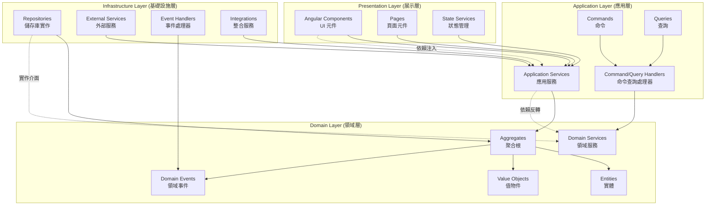
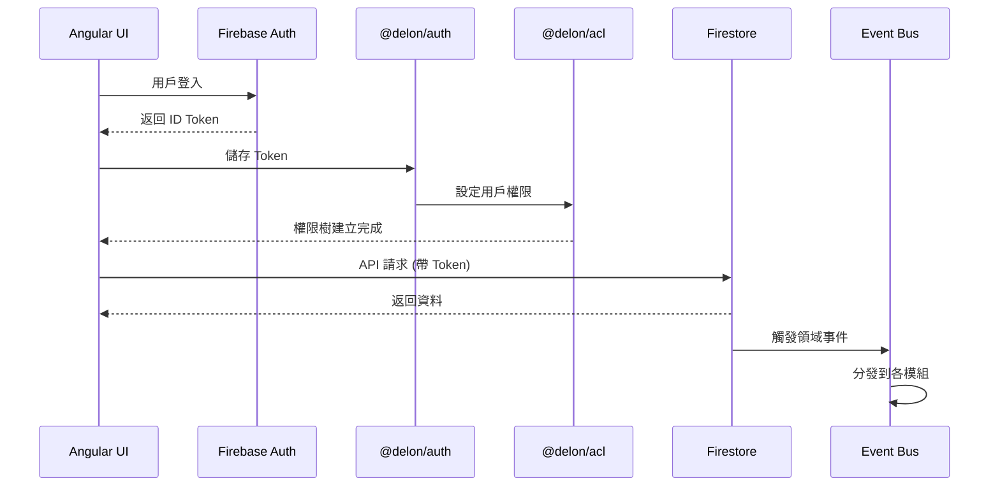

# 建築工程管理平台 - 系統架構文件

## DDD 四層架構與依賴方向



## 模組邊界與上下文

| 模組 | 職責範圍 | 邊界上下文 | 依賴關係 |
|------|----------|------------|----------|
| **Account** ✨ | 統一帳戶抽象層，定義所有帳戶共同行為 | 帳戶身份管理上下文 | 基礎模組，所有模組的根基 |
| **User** | 用戶認證、個人檔案、證照管理（繼承 Account） | 用戶身份管理上下文 | 繼承 Account 模組 |
| **Organization** | 組織管理、成員管理、團隊管理（繼承 Account） | 組織管理上下文 | 繼承 Account 模組 |
| **Project** | 專案管理、任務管理、文件管理 | 專案執行上下文 | 依賴 Account 模組（統一擁有者類型） |
| **Social** | 社交關係、推薦系統 | 社交互動上下文 | 事件驅動，依賴所有核心模組 |
| **Achievement** | 成就系統、規則引擎 | 激勵系統上下文 | 事件驅動，依賴所有模組 |
| **Notification** | 通知系統、推送服務 | 通訊上下文 | 事件驅動，依賴所有模組 |

## 技術棧整合架構



---

## 專案結構

src/
├── app/
│   ├── app.component.ts                    # 根元件
│   ├── app.config.ts                       # 應用程式配置
│   ├── app.routes.ts                       # 路由配置
│   │
│   ├── core/                               # 核心基礎設施
│   │   ├── auth/                          # 認證核心
│   │   │   ├── services/
│   │   │   │   ├── firebase-auth.service.ts        # Firebase 認證服務
│   │   │   │   ├── delon-auth.service.ts           # @delon/auth 整合服務
│   │   │   │   └── auth-integration.service.ts     # 認證整合服務
│   │   │   ├── guards/
│   │   │   │   ├── auth.guard.ts                   # 認證守衛
│   │   │   │   └── acl.guard.ts                    # 權限守衛
│   │   │   ├── interceptors/
│   │   │   │   ├── auth.interceptor.ts             # 認證攔截器
│   │   │   │   └── token.interceptor.ts            # Token 攔截器
│   │   │   └── index.ts                            # 認證模組匯出
│   │   │
│   │   ├── acl/                                # 權限控制
│   │   │   ├── services/
│   │   │   │   ├── acl.service.ts                      # ACL 權限服務
│   │   │   │   └── permission.service.ts               # 權限管理服務
│   │   │   ├── directives/
│   │   │   │   └── acl.directive.ts                    # ACL 指令 (*appAcl)
│   │   │   ├── pipes/
│   │   │   │   └── acl.pipe.ts                         # ACL 管道
│   │   │   └── index.ts                                # ACL 模組匯出
│   │   │
│   │   ├── event-bus/                          # 事件匯流排
│   │   │   ├── services/
│   │   │   │   ├── event-bus.service.ts                # 事件匯流排服務
│   │   │   │   ├── event-store.service.ts              # 事件儲存服務
│   │   │   │   └── event-processor.service.ts          # 事件處理服務
│   │   │   ├── models/
│   │   │   │   ├── domain-event.interface.ts           # 領域事件介面
│   │   │   │   └── integration-event.interface.ts      # 整合事件介面
│   │   │   └── index.ts                                # 事件匯流排模組匯出
│   │   │
│   │   ├── infrastructure/                     # 基礎設施
│   │   │   ├── firestore/
│   │   │   │   ├── base-repository.ts                  # 基礎儲存庫抽象類
│   │   │   │   ├── firestore.service.ts                # Firestore 服務
│   │   │   │   └── firestore-config.ts                 # Firestore 配置
│   │   │   ├── storage/
│   │   │   │   ├── file-storage.service.ts             # 檔案儲存服務
│   │   │   │   └── storage-config.ts                   # 儲存配置
│   │   │   ├── logging/
│   │   │   │   ├── logger.service.ts                   # 日誌服務
│   │   │   │   └── audit.service.ts                    # 審計服務
│   │   │   └── index.ts                                # 基礎設施模組匯出
│   │   │
│   │   ├── startup/                           # 應用啟動服務 ✨ (現有)
│   │   │   ├── startup.service.ts                     # 啟動服務
│   │   │   ├── guards/
│   │   │   │   └── start-page.guard.ts                # 啟動頁面守衛
│   │   │   └── index.ts                               # 啟動模組匯出
│   │   │
│   │   ├── i18n/                              # 國際化服務 ✨ (現有)
│   │   │   ├── i18n.service.ts                        # 國際化服務
│   │   │   └── i18n.service.spec.ts                   # 國際化服務測試
│   │   │
│   │   ├── shared/                             # 共享工具
│   │   │   ├── utils/                                 # 工具函數
│   │   │   ├── constants/                             # 常數定義
│   │   │   ├── models/                                # 共享模型
│   │   │   └── index.ts                               # 共享模組匯出
│   │   │
│   │   └── index.ts                            # 核心模組匯出
│   │
│   ├── features/                               # 功能模組
│   │   │
│   │   ├── account/                           # 帳戶模組 ✨ (統一基類)
│   │   │   ├── domain/                         # 領域層
│   │   │   │   ├── aggregates/
│   │   │   │   │   └── account.aggregate.ts              # Account 抽象聚合根
│   │   │   │   ├── entities/
│   │   │   │   │   └── account.entity.ts                 # Account 抽象實體
│   │   │   │   ├── value-objects/
│   │   │   │   │   ├── account-info.vo.ts                # 帳戶資訊值物件
│   │   │   │   │   └── account-type.vo.ts                # 帳戶類型值物件
│   │   │   │   ├── events/
│   │   │   │   │   └── account-created.event.ts          # 帳戶建立事件
│   │   │   │   ├── services/
│   │   │   │   │   └── account-domain.service.ts         # 帳戶領域服務
│   │   │   │   └── repositories/
│   │   │   │       └── account.repository.interface.ts   # 帳戶儲存庫介面
│   │   │   ├── infrastructure/                 # 基礎設施層
│   │   │   │   ├── repositories/
│   │   │   │   │   └── firestore-account.repository.ts   # Firestore 帳戶儲存庫
│   │   │   │   └── index.ts
│   │   │   ├── account.routes.ts                          # 帳戶路由配置
│   │   │   └── index.ts
│   │   │
│   │   ├── user/                              # 用戶模組 ✨ (繼承 Account)
│   │   │   ├── presentation/                   # 展示層
│   │   │   │   ├── components/
│   │   │   │   │   ├── auth/
│   │   │   │   │   │   ├── login.component.ts                    # 登入元件
│   │   │   │   │   │   ├── registration.component.ts             # 註冊元件
│   │   │   │   │   │   ├── forgot-password.component.ts          # 忘記密碼元件
│   │   │   │   │   │   └── email-verification.component.ts       # 郵箱驗證元件
│   │   │   │   │   └── routes.ts                                 # 認證元件路由配置
│   │   │   │   │   ├── profile/
│   │   │   │   │   │   ├── profile-card.component.ts             # 個人檔案卡片元件
│   │   │   │   │   │   ├── profile-edit.component.ts             # 個人檔案編輯元件
│   │   │   │   │   │   ├── avatar.component.ts                   # 頭像元件
│   │   │   │   │   │   └── basic-info.component.ts               # 基本資訊元件
│   │   │   │   │   ├── certificates/
│   │   │   │   │   │   ├── certificate-management.component.ts   # 證照管理元件
│   │   │   │   │   │   ├── certificate-list.component.ts         # 證照列表元件
│   │   │   │   │   │   ├── certificate-upload.component.ts       # 證照上傳元件
│   │   │   │   │   │   └── certificate-verification.component.ts # 證照驗證元件
│   │   │   │   │   ├── social/
│   │   │   │   │   │   ├── following-list.component.ts           # 追蹤列表元件
│   │   │   │   │   │   ├── followers-list.component.ts           # 粉絲列表元件
│   │   │   │   │   │   ├── social-button.component.ts            # 社交按鈕元件
│   │   │   │   │   │   └── social-card.component.ts              # 社交卡片元件
│   │   │   │   │   └── notifications/
│   │   │   │   │       ├── notification-center.component.ts      # 通知中心元件
│   │   │   │   │       ├── notification-list.component.ts        # 通知列表元件
│   │   │   │   │       └── notification-settings.component.ts    # 通知設定元件
│   │   │   │   ├── pages/
│   │   │   │   │   ├── user-profile.page.ts                      # 用戶檔案頁面
│   │   │   │   │   ├── user-settings.page.ts                     # 用戶設定頁面
│   │   │   │   │   ├── user-dashboard.page.ts                    # 用戶儀表板頁面
│   │   │   │   │   └── routes.ts                                 # 頁面路由配置
│   │   │   │   ├── state/
│   │   │   │   │   ├── user-state.service.ts                     # 用戶狀態服務
│   │   │   │   │   ├── auth-state.service.ts                     # 認證狀態服務
│   │   │   │   │   └── profile-state.service.ts                  # 檔案狀態服務
│   │   │   │   └── index.ts                                      # 展示層模組匯出
│   │   │   │
│   │   │   ├── application/                    # 應用層
│   │   │   │   ├── services/
│   │   │   │   │   ├── auth-application.service.ts              # 認證應用服務
│   │   │   │   │   ├── profile-application.service.ts           # 檔案應用服務
│   │   │   │   │   ├── certificate-application.service.ts       # 證照應用服務
│   │   │   │   │   ├── social-application.service.ts            # 社交應用服務
│   │   │   │   │   └── notification-application.service.ts      # 通知應用服務
│   │   │   │   ├── commands/
│   │   │   │   │   ├── auth/
│   │   │   │   │   │   ├── login-user.command.ts                # 用戶登入命令
│   │   │   │   │   │   ├── register-user.command.ts             # 用戶註冊命令
│   │   │   │   │   │   ├── forgot-password.command.ts           # 忘記密碼命令
│   │   │   │   │   │   └── verify-email.command.ts              # 郵箱驗證命令
│   │   │   │   │   ├── profile/
│   │   │   │   │   │   ├── create-profile.command.ts            # 建立檔案命令
│   │   │   │   │   │   └── update-profile.command.ts            # 更新檔案命令
│   │   │   │   │   └── certificates/
│   │   │   │   │       ├── add-certificate.command.ts           # 新增證照命令
│   │   │   │   │       └── verify-certificate.command.ts        # 驗證證照命令
│   │   │   │   ├── queries/
│   │   │   │   │   ├── get-profile.query.ts                     # 查詢檔案查詢
│   │   │   │   │   ├── get-certificates.query.ts                # 查詢證照查詢
│   │   │   │   │   └── get-following.query.ts                   # 查詢追蹤查詢
│   │   │   │   ├── handlers/
│   │   │   │   │   ├── command-handlers/                        # 命令處理器目錄
│   │   │   │   │   └── query-handlers/                          # 查詢處理器目錄
│   │   │   │   └── index.ts                                     # 應用層模組匯出
│   │   │   │
│   │   │   ├── domain/                         # 領域層
│   │   │   │   ├── aggregates/
│   │   │   │   │   └── user.aggregate.ts                 # 繼承 Account Aggregate
│   │   │   │   ├── entities/
│   │   │   │   │   ├── user.entity.ts                    # 繼承 Account Entity
│   │   │   │   │   ├── profile.entity.ts
│   │   │   │   │   ├── certificate.entity.ts
│   │   │   │   │   ├── achievement.entity.ts
│   │   │   │   │   ├── notification.entity.ts
│   │   │   │   │   └── social.entity.ts
│   │   │   │   ├── value-objects/
│   │   │   │   │   ├── user-info.vo.ts
│   │   │   │   │   ├── profile-info.vo.ts
│   │   │   │   │   ├── certificate-info.vo.ts
│   │   │   │   │   ├── achievement-info.vo.ts
│   │   │   │   │   └── social-info.vo.ts
│   │   │   │   ├── events/
│   │   │   │   │   ├── user-created.event.ts
│   │   │   │   │   ├── profile-updated.event.ts
│   │   │   │   │   ├── certificate-added.event.ts
│   │   │   │   │   └── achievement-awarded.event.ts
│   │   │   │   ├── services/
│   │   │   │   │   ├── user-domain.service.ts
│   │   │   │   │   ├── profile-domain.service.ts
│   │   │   │   │   ├── certificate-domain.service.ts
│   │   │   │   │   └── social-domain.service.ts
│   │   │   │   ├── repositories/
│   │   │   │   │   ├── user.repository.interface.ts
│   │   │   │   │   ├── profile.repository.interface.ts
│   │   │   │   │   └── certificate.repository.interface.ts
│   │   │   │   └── index.ts
│   │   │   │
│   │   │   ├── infrastructure/                 # 基礎設施層
│   │   │   │   ├── repositories/
│   │   │   │   │   ├── firestore-user.repository.ts
│   │   │   │   │   ├── firestore-profile.repository.ts
│   │   │   │   │   ├── firestore-certificate.repository.ts
│   │   │   │   │   └── firestore-achievement.repository.ts
│   │   │   │   ├── event-handlers/
│   │   │   │   │   ├── user-event.handler.ts
│   │   │   │   │   ├── profile-event.handler.ts
│   │   │   │   │   └── certificate-event.handler.ts
│   │   │   │   ├── external-services/
│   │   │   │   │   ├── firebase-auth.service.ts
│   │   │   │   │   ├── email.service.ts
│   │   │   │   │   ├── file-storage.service.ts
│   │   │   │   │   └── certificate-verification.service.ts
│   │   │   │   ├── integrations/
│   │   │   │   │   ├── organization-integration.service.ts
│   │   │   │   │   ├── project-integration.service.ts
│   │   │   │   │   └── team-integration.service.ts
│   │   │   │   └── index.ts
│   │   │   │
│   │   │   ├── user.routes.ts
│   │   │   └── index.ts
│   │   │
│   │   ├── organization/                       # 組織模組 ✨ (繼承 Account)
│   │   │   ├── presentation/                   # 展示層
│   │   │   │   ├── components/
│   │   │   │   │   ├── organization-card.component.ts        # 組織卡片元件
│   │   │   │   │   ├── organization-form.component.ts        # 組織表單元件
│   │   │   │   │   ├── organization-list.component.ts        # 組織列表元件
│   │   │   │   │   ├── team-management.component.ts        # 團隊管理元件
│   │   │   │   │   ├── member-management.component.ts      # 成員管理元件
│   │   │   │   │   └── project-assignment.component.ts     # 專案分配元件
│   │   │   │   ├── pages/
│   │   │   │   │   ├── organization-list.page.ts            # 組織列表頁面
│   │   │   │   │   ├── organization-detail.page.ts          # 組織詳情頁面
│   │   │   │   │   └── organization-settings.page.ts        # 組織設定頁面
│   │   │   │   └── state/
│   │   │   │       └── organization-state.service.ts        # 組織狀態服務
│   │   │   ├── application/                    # 應用層
│   │   │   │   ├── services/
│   │   │   │   │   ├── organization-application.service.ts  # 組織應用服務
│   │   │   │   │   ├── member-management.service.ts        # 成員管理服務
│   │   │   │   │   ├── team-management.service.ts          # 團隊管理服務
│   │   │   │   │   └── project-assignment.service.ts       # 專案分配服務
│   │   │   │   ├── commands/
│   │   │   │   │   ├── create-organization.command.ts      # 建立組織命令
│   │   │   │   │   ├── update-organization.command.ts      # 更新組織命令
│   │   │   │   │   ├── invite-member.command.ts            # 邀請成員命令
│   │   │   │   │   └── create-team.command.ts              # 建立團隊命令
│   │   │   │   └── queries/
│   │   │   │       ├── get-organization.query.ts            # 查詢組織查詢
│   │   │   │       ├── get-members.query.ts                 # 查詢成員查詢
│   │   │   │       └── get-teams.query.ts                   # 查詢團隊查詢
│   │   │   ├── domain/                         # 領域層
│   │   │   │   ├── aggregates/
│   │   │   │   │   └── organization.aggregate.ts         # 繼承 Account Aggregate
│   │   │   │   ├── entities/
│   │   │   │   │   ├── organization.entity.ts            # 繼承 Account Entity
│   │   │   │   │   ├── member.entity.ts                   # 成員實體
│   │   │   │   │   ├── team.entity.ts                     # 團隊實體
│   │   │   │   │   │   └── project-assignment.entity.ts   # 專案分配實體
│   │   │   │   ├── value-objects/
│   │   │   │   │   ├── organization-profile.vo.ts         # 組織檔案值物件
│   │   │   │   │   ├── member-info.vo.ts                   # 成員資訊值物件
│   │   │   │   │   ├── team-info.vo.ts                     # 團隊資訊值物件
│   │   │   │   │   └── project-assignment.vo.ts            # 專案分配值物件
│   │   │   │   ├── events/
│   │   │   │   │   ├── organization-created.event.ts       # 組織建立事件
│   │   │   │   │   ├── member-invited.event.ts            # 成員邀請事件
│   │   │   │   │   └── team-created.event.ts               # 團隊建立事件
│   │   │   │   ├── services/
│   │   │   │   │   ├── organization-domain.service.ts     # 組織領域服務
│   │   │   │   │   ├── member-domain.service.ts           # 成員領域服務
│   │   │   │   │   └── team-domain.service.ts             # 團隊領域服務
│   │   │   │   └── repositories/
│   │   │   │       ├── organization.repository.interface.ts # 組織儲存庫介面
│   │   │   │       ├── member.repository.interface.ts      # 成員儲存庫介面
│   │   │   │       └── team.repository.interface.ts        # 團隊儲存庫介面
│   │   │   ├── infrastructure/                 # 基礎設施層
│   │   │   │   ├── repositories/
│   │   │   │   │   ├── firestore-organization.repository.ts # Firestore 組織儲存庫
│   │   │   │   │   ├── firestore-member.repository.ts       # Firestore 成員儲存庫
│   │   │   │   │   └── firestore-team.repository.ts         # Firestore 團隊儲存庫
│   │   │   │   ├── event-handlers/
│   │   │   │   │   ├── organization-event.handler.ts        # 組織事件處理器
│   │   │   │   │   ├── member-event.handler.ts              # 成員事件處理器
│   │   │   │   │   └── team-event.handler.ts                # 團隊事件處理器
│   │   │   │   ├── external-services/
│   │   │   │   │   ├── license-verification.service.ts     # 執照驗證服務
│   │   │   │   │   ├── organization-notification.service.ts # 組織通知服務
│   │   │   │   │   └── organization-audit.service.ts        # 組織審計服務
│   │   │   │   └── integrations/
│   │   │   │       ├── user-integration.service.ts          # 用戶整合服務
│   │   │   │       └── project-integration.service.ts       # 專案整合服務
│   │   │   ├── organization.routes.ts                       # 組織路由配置
│   │   │   └── index.ts                                     # 組織模組匯出
│   │   │
│   │   ├── project/                            # 專案模組 ✨
│   │   │   ├── presentation/                   # 展示層
│   │   │   │   ├── components/
│   │   │   │   │   ├── project/
│   │   │   │   │   │   ├── project-card.component.ts        # 專案卡片元件
│   │   │   │   │   │   ├── project-form.component.ts        # 專案表單元件
│   │   │   │   │   │   ├── project-list.component.ts        # 專案列表元件
│   │   │   │   │   │   └── project-detail.component.ts      # 專案詳情元件
│   │   │   │   │   ├── tasks/
│   │   │   │   │   │   ├── task-management.component.ts     # 任務管理元件
│   │   │   │   │   │   ├── task-list.component.ts           # 任務列表元件
│   │   │   │   │   │   ├── task-form.component.ts           # 任務表單元件
│   │   │   │   │   │   └── task-detail.component.ts         # 任務詳情元件
│   │   │   │   │   ├── documents/
│   │   │   │   │   │   ├── document-management.component.ts # 文件管理元件
│   │   │   │   │   │   ├── document-list.component.ts       # 文件列表元件
│   │   │   │   │   │   ├── document-upload.component.ts     # 文件上傳元件
│   │   │   │   │   │   └── document-viewer.component.ts     # 文件檢視元件
│   │   │   │   │   ├── cost/
│   │   │   │   │   │   ├── cost-budget.component.ts         # 預算元件
│   │   │   │   │   │   ├── cost-actual.component.ts         # 實際成本元件
│   │   │   │   │   │   ├── cost-forecast.component.ts       # 成本預測元件
│   │   │   │   │   │   ├── cost-variance.component.ts       # 成本差異元件
│   │   │   │   │   │   └── cost-breakdown.component.ts      # 成本分解元件
│   │   │   │   │   ├── reports/
│   │   │   │   │   │   ├── daily-report.component.ts        # 日報元件
│   │   │   │   │   │   ├── inspection-report.component.ts   # 查驗報告元件
│   │   │   │   │   │   ├── analytics-report.component.ts    # 分析報告元件
│   │   │   │   │   │   └── gantt-chart.component.ts         # 甘特圖元件
│   │   │   │   │   └── materials/
│   │   │   │   │       ├── materials-management.component.ts # 材料管理元件
│   │   │   │   │       ├── equipment-management.component.ts # 設備管理元件
│   │   │   │   │       └── safety-records.component.ts      # 安全記錄元件
│   │   │   │   ├── pages/
│   │   │   │   │   ├── project-list.page.ts                 # 專案列表頁面
│   │   │   │   │   ├── project-detail.page.ts               # 專案詳情頁面
│   │   │   │   │   ├── project-dashboard.page.ts            # 專案儀表板頁面
│   │   │   │   │   └── project-reports.page.ts              # 專案報告頁面
│   │   │   │   └── state/
│   │   │   │       ├── project-state.service.ts             # 專案狀態服務
│   │   │   │       ├── task-state.service.ts                # 任務狀態服務
│   │   │   │       └── cost-state.service.ts                # 成本狀態服務
│   │   │   ├── application/                    # 應用層
│   │   │   │   ├── services/
│   │   │   │   │   ├── project-application.service.ts      # 專案應用服務
│   │   │   │   │   ├── task-management.service.ts          # 任務管理服務
│   │   │   │   │   ├── document-management.service.ts      # 文件管理服務
│   │   │   │   │   ├── cost-control.service.ts             # 成本控制服務
│   │   │   │   │   ├── report.service.ts                    # 報告服務
│   │   │   │   │   └── gantt-chart.service.ts               # 甘特圖服務
│   │   │   │   ├── commands/
│   │   │   │   │   ├── create-project.command.ts            # 建立專案命令
│   │   │   │   │   ├── create-task.command.ts               # 建立任務命令
│   │   │   │   │   ├── update-task.command.ts               # 更新任務命令
│   │   │   │   │   ├── create-document.command.ts           # 建立文件命令
│   │   │   │   │   ├── create-budget.command.ts             # 建立預算命令
│   │   │   │   │   ├── update-cost.command.ts               # 更新成本命令
│   │   │   │   │   ├── create-daily-report.command.ts       # 建立日報命令
│   │   │   │   │   └── generate-gantt-data.command.ts       # 生成甘特圖資料命令
│   │   │   │   └── queries/
│   │   │   │       ├── get-project.query.ts                 # 查詢專案查詢
│   │   │   │       ├── get-tasks.query.ts                   # 查詢任務查詢
│   │   │   │       ├── get-documents.query.ts               # 查詢文件查詢
│   │   │   │       ├── get-cost-data.query.ts               # 查詢成本資料查詢
│   │   │   │       └── get-gantt-data.query.ts              # 查詢甘特圖資料查詢
│   │   │   ├── domain/                         # 領域層
│   │   │   │   ├── aggregates/
│   │   │   │   │   └── project.aggregate.ts                 # 專案聚合根
│   │   │   │   ├── entities/
│   │   │   │   │   ├── project.entity.ts                    # 專案實體
│   │   │   │   │   ├── milestone.entity.ts                 # 里程碑實體
│   │   │   │   │   ├── task.entity.ts                      # 任務實體
│   │   │   │   │   ├── document.entity.ts                  # 文件實體
│   │   │   │   │   ├── cost.entity.ts                      # 成本實體
│   │   │   │   │   ├── report.entity.ts                    # 報告實體
│   │   │   │   │   ├── material.entity.ts                  # 材料實體
│   │   │   │   │   └── equipment.entity.ts                 # 設備實體
│   │   │   │   ├── value-objects/
│   │   │   │   │   ├── project-info.vo.ts                  # 專案資訊值物件
│   │   │   │   │   ├── milestone-info.vo.ts                # 里程碑資訊值物件
│   │   │   │   │   ├── task-info.vo.ts                     # 任務資訊值物件
│   │   │   │   │   ├── document-info.vo.ts                 # 文件資訊值物件
│   │   │   │   │   ├── cost-info.vo.ts                     # 成本資訊值物件
│   │   │   │   │   └── report-info.vo.ts                   # 報告資訊值物件
│   │   │   │   ├── events/
│   │   │   │   │   ├── project-created.event.ts            # 專案建立事件
│   │   │   │   │   ├── task-completed.event.ts             # 任務完成事件
│   │   │   │   │   ├── milestone-reached.event.ts          # 里程碑達成事件
│   │   │   │   │   └── cost-updated.event.ts               # 成本更新事件
│   │   │   │   ├── services/
│   │   │   │   │   ├── project-domain.service.ts           # 專案領域服務
│   │   │   │   │   ├── milestone-domain.service.ts         # 里程碑領域服務
│   │   │   │   │   ├── task-domain.service.ts              # 任務領域服務
│   │   │   │   │   └── cost-domain.service.ts              # 成本領域服務
│   │   │   │   └── repositories/
│   │   │   │       ├── project.repository.interface.ts     # 專案儲存庫介面
│   │   │   │       ├── task.repository.interface.ts        # 任務儲存庫介面
│   │   │   │       ├── document.repository.interface.ts    # 文件儲存庫介面
│   │   │   │       └── cost.repository.interface.ts        # 成本儲存庫介面
│   │   │   ├── infrastructure/                 # 基礎設施層
│   │   │   │   ├── repositories/
│   │   │   │   │   ├── firestore-project.repository.ts     # Firestore 專案儲存庫
│   │   │   │   │   ├── firestore-task.repository.ts        # Firestore 任務儲存庫
│   │   │   │   │   ├── firestore-document.repository.ts    # Firestore 文件儲存庫
│   │   │   │   │   └── firestore-cost.repository.ts        # Firestore 成本儲存庫
│   │   │   │   ├── event-handlers/
│   │   │   │   │   ├── project-event.handler.ts            # 專案事件處理器
│   │   │   │   │   ├── task-event.handler.ts               # 任務事件處理器
│   │   │   │   │   ├── document-event.handler.ts           # 文件事件處理器
│   │   │   │   │   └── cost-event.handler.ts               # 成本事件處理器
│   │   │   │   ├── external-services/
│   │   │   │   │   ├── file-storage.service.ts             # 檔案儲存服務
│   │   │   │   │   ├── project-notification.service.ts     # 專案通知服務
│   │   │   │   │   └── project-audit.service.ts            # 專案審計服務
│   │   │   │   └── integrations/
│   │   │   │       ├── organization-integration.service.ts # 組織整合服務
│   │   │   │       ├── user-integration.service.ts         # 用戶整合服務
│   │   │   │       └── team-integration.service.ts         # 團隊整合服務
│   │   │   ├── project.routes.ts                           # 專案路由配置
│   │   │   └── index.ts                                     # 專案模組匯出
│   │   │
│   │   ├── social/                             # 社交模組 ✨
│   │   │   ├── presentation/                   # 展示層
│   │   │   │   ├── components/
│   │   │   │   │   ├── following/
│   │   │   │   │   │   ├── following-list.component.ts      # 追蹤列表元件
│   │   │   │   │   │   ├── followers-list.component.ts      # 粉絲列表元件
│   │   │   │   │   │   ├── follow-button.component.ts       # 追蹤按鈕元件
│   │   │   │   │   │   └── follow-status.component.ts       # 追蹤狀態元件
│   │   │   │   │   ├── discovery/
│   │   │   │   │   │   ├── user-discovery.component.ts      # 用戶發現元件
│   │   │   │   │   │   ├── user-recommendation.component.ts # 用戶推薦元件
│   │   │   │   │   │   ├── user-search.component.ts         # 用戶搜尋元件
│   │   │   │   │   │   └── user-profile-card.component.ts   # 用戶檔案卡片元件
│   │   │   │   │   ├── stats/
│   │   │   │   │   │   ├── social-stats.component.ts        # 社交統計元件
│   │   │   │   │   │   ├── social-chart.component.ts        # 社交圖表元件
│   │   │   │   │   │   └── social-leaderboard.component.ts  # 社交排行榜元件
│   │   │   │   │   └── network/
│   │   │   │   │       ├── interaction.component.ts         # 互動元件
│   │   │   │   │       ├── mutual-connection.component.ts    # 共同連結元件
│   │   │   │   │       └── network.component.ts             # 網絡元件
│   │   │   │   ├── pages/
│   │   │   │   │   ├── social-dashboard.page.ts             # 社交儀表板頁面
│   │   │   │   │   ├── user-discovery.page.ts               # 用戶發現頁面
│   │   │   │   │   └── social-network.page.ts               # 社交網絡頁面
│   │   │   │   └── state/
│   │   │   │       ├── social-state.service.ts              # 社交狀態服務
│   │   │   │       └── relationship-state.service.ts        # 關係狀態服務
│   │   │   ├── application/                    # 應用層
│   │   │   │   ├── services/
│   │   │   │   │   ├── follow-application.service.ts        # 追蹤應用服務
│   │   │   │   │   ├── recommendation-application.service.ts # 推薦應用服務
│   │   │   │   │   ├── search-application.service.ts        # 搜尋應用服務
│   │   │   │   │   └── analytics-application.service.ts     # 分析應用服務
│   │   │   │   ├── commands/
│   │   │   │   │   ├── follow-user.command.ts               # 追蹤用戶命令
│   │   │   │   │   ├── unfollow-user.command.ts             # 取消追蹤命令
│   │   │   │   │   ├── recommend-users.command.ts           # 推薦用戶命令
│   │   │   │   │   ├── search-users.command.ts              # 搜尋用戶命令
│   │   │   │   │   └── generate-social-stats.command.ts     # 生成社交統計命令
│   │   │   │   └── queries/
│   │   │   │       ├── get-following.query.ts               # 查詢追蹤查詢
│   │   │   │       ├── get-followers.query.ts               # 查詢粉絲查詢
│   │   │   │       ├── get-recommendations.query.ts         # 查詢推薦查詢
│   │   │   │       ├── search-users.query.ts                # 搜尋用戶查詢
│   │   │   │       └── get-social-stats.query.ts            # 查詢社交統計查詢
│   │   │   ├── domain/                         # 領域層
│   │   │   │   ├── aggregates/
│   │   │   │   │   └── social-relation.aggregate.ts        # 社交關係聚合根
│   │   │   │   ├── entities/
│   │   │   │   │   ├── relationship.entity.ts               # 關係實體
│   │   │   │   │   ├── network.entity.ts                    # 網絡實體
│   │   │   │   │   └── mutual.entity.ts                     # 共同關係實體
│   │   │   │   ├── value-objects/
│   │   │   │   │   ├── relationship-info.vo.ts              # 關係資訊值物件
│   │   │   │   │   ├── network-info.vo.ts                   # 網絡資訊值物件
│   │   │   │   │   └── social-stats.vo.ts                   # 社交統計值物件
│   │   │   │   ├── events/
│   │   │   │   │   ├── user-followed.event.ts               # 用戶被追蹤事件
│   │   │   │   │   └── user-unfollowed.event.ts             # 用戶取消追蹤事件
│   │   │   │   ├── services/
│   │   │   │   │   ├── relationship-domain.service.ts       # 關係領域服務
│   │   │   │   │   ├── network-domain.service.ts           # 網絡領域服務
│   │   │   │   │   ├── recommendation-domain.service.ts    # 推薦領域服務
│   │   │   │   │   └── privacy-domain.service.ts           # 隱私領域服務
│   │   │   │   └── repositories/
│   │   │   │       ├── social.repository.interface.ts       # 社交儲存庫介面
│   │   │   │       ├── relationship.repository.interface.ts # 關係儲存庫介面
│   │   │   │       └── network.repository.interface.ts      # 網絡儲存庫介面
│   │   │   ├── infrastructure/                 # 基礎設施層
│   │   │   │   ├── repositories/
│   │   │   │   │   ├── firestore-social.repository.ts       # Firestore 社交儲存庫
│   │   │   │   │   ├── firestore-relationship.repository.ts  # Firestore 關係儲存庫
│   │   │   │   │   └── firestore-network.repository.ts      # Firestore 網絡儲存庫
│   │   │   │   ├── engines/
│   │   │   │   │   ├── recommendation.engine.ts             # 推薦引擎
│   │   │   │   │   ├── ml-service-integration.ts            # 機器學習服務整合
│   │   │   │   │   └── graph-analytics.service.ts           # 圖形分析服務
│   │   │   │   ├── event-handlers/
│   │   │   │   │   ├── follow-event.handler.ts              # 追蹤事件處理器
│   │   │   │   │   ├── recommendation-event.handler.ts      # 推薦事件處理器
│   │   │   │   │   └── social-stats-event.handler.ts        # 社交統計事件處理器
│   │   │   │   ├── external-services/
│   │   │   │   │   ├── cache.service.ts                     # 快取服務
│   │   │   │   │   └── queue.service.ts                     # 佇列服務
│   │   │   │   └── integrations/
│   │   │   │       ├── user-integration.service.ts          # 用戶整合服務
│   │   │   │       ├── organization-integration.service.ts  # 組織整合服務
│   │   │   │       └── project-integration.service.ts       # 專案整合服務
│   │   │   ├── social.routes.ts                             # 社交路由配置
│   │   │   └── index.ts                                     # 社交模組匯出
│   │   │
│   │   ├── achievement/                        # 成就模組 ✨
│   │   │   ├── presentation/                   # 展示層
│   │   │   │   ├── components/
│   │   │   │   │   ├── display/
│   │   │   │   │   │   ├── achievement-card.component.ts      # 成就卡片元件
│   │   │   │   │   │   ├── achievement-list.component.ts      # 成就列表元件
│   │   │   │   │   │   ├── achievement-badge.component.ts     # 成就徽章元件
│   │   │   │   │   │   └── achievement-progress.component.ts  # 成就進度元件
│   │   │   │   │   ├── leaderboard/
│   │   │   │   │   │   ├── leaderboard.component.ts          # 排行榜元件
│   │   │   │   │   │   ├── ranking-card.component.ts         # 排名卡片元件
│   │   │   │   │   │   └── top-stats.component.ts            # 頂級統計元件
│   │   │   │   │   ├── management/
│   │   │   │   │   │   ├── achievement-management.component.ts # 成就管理元件
│   │   │   │   │   │   ├── rule-management.component.ts      # 規則管理元件
│   │   │   │   │   │   └── category-management.component.ts   # 分類管理元件
│   │   │   │   │   └── charts/
│   │   │   │   │       ├── stats-chart.component.ts          # 統計圖表元件
│   │   │   │   │       ├── progress-chart.component.ts       # 進度圖表元件
│   │   │   │   │       └── achievement-timeline.component.ts # 成就時間軸元件
│   │   │   │   ├── pages/
│   │   │   │   │   ├── achievement-dashboard.page.ts         # 成就儀表板頁面
│   │   │   │   │   ├── leaderboard.page.ts                   # 排行榜頁面
│   │   │   │   │   └── achievement-management.page.ts        # 成就管理頁面
│   │   │   │   └── state/
│   │   │   │       ├── achievement-state.service.ts          # 成就狀態服務
│   │   │   │       └── progress-state.service.ts             # 進度狀態服務
│   │   │   ├── application/                    # 應用層
│   │   │   │   ├── services/
│   │   │   │   │   ├── achievement-application.service.ts    # 成就應用服務
│   │   │   │   │   ├── rule-engine.service.ts              # 規則引擎服務
│   │   │   │   │   ├── statistics-application.service.ts    # 統計應用服務
│   │   │   │   │   └── notification-application.service.ts  # 通知應用服務
│   │   │   │   ├── commands/
│   │   │   │   │   ├── award-achievement.command.ts         # 頒發成就命令
│   │   │   │   │   ├── update-progress.command.ts           # 更新進度命令
│   │   │   │   │   ├── evaluate-rule.command.ts             # 評估規則命令
│   │   │   │   │   ├── create-rule.command.ts               # 建立規則命令
│   │   │   │   │   ├── generate-stats.command.ts            # 生成統計命令
│   │   │   │   │   └── notify-achievement.command.ts        # 成就通知命令
│   │   │   │   └── queries/
│   │   │   │       ├── get-achievements.query.ts            # 查詢成就查詢
│   │   │   │       ├── get-leaderboard.query.ts             # 查詢排行榜查詢
│   │   │   │       └── get-progress.query.ts                # 查詢進度查詢
│   │   │   ├── domain/
│   │   │   │   ├── aggregates/
│   │   │   │   │   └── achievement.aggregate.ts
│   │   │   │   ├── entities/
│   │   │   │   │   ├── achievement.entity.ts
│   │   │   │   │   ├── rule.entity.ts
│   │   │   │   │   ├── category.entity.ts
│   │   │   │   │   ├── progress.entity.ts
│   │   │   │   │   └── leaderboard.entity.ts
│   │   │   │   ├── value-objects/
│   │   │   │   │   ├── achievement-info.vo.ts
│   │   │   │   │   ├── rule-info.vo.ts
│   │   │   │   │   ├── criteria.vo.ts
│   │   │   │   │   └── progress.vo.ts
│   │   │   │   ├── events/
│   │   │   │   │   ├── achievement-awarded.event.ts
│   │   │   │   │   └── progress-updated.event.ts
│   │   │   │   ├── services/
│   │   │   │   │   ├── achievement-domain.service.ts
│   │   │   │   │   ├── rule-domain.service.ts
│   │   │   │   │   ├── progress-domain.service.ts
│   │   │   │   │   └── statistics-domain.service.ts
│   │   │   │   └── repositories/
│   │   │   │       ├── achievement.repository.interface.ts
│   │   │   │       ├── rule.repository.interface.ts
│   │   │   │       ├── progress.repository.interface.ts
│   │   │   │       └── leaderboard.repository.interface.ts
│   │   │   ├── infrastructure/
│   │   │   │   ├── repositories/
│   │   │   │   │   ├── firestore-achievement.repository.ts
│   │   │   │   │   ├── firestore-rule.repository.ts
│   │   │   │   │   ├── firestore-progress.repository.ts
│   │   │   │   │   └── firestore-leaderboard.repository.ts
│   │   │   │   ├── engines/
│   │   │   │   │   ├── rule.engine.ts
│   │   │   │   │   ├── complex-event-processor.ts
│   │   │   │   │   └── scoring-processor.ts
│   │   │   │   ├── event-handlers/
│   │   │   │   │   ├── achievement-event.handler.ts
│   │   │   │   │   ├── rule-event.handler.ts
│   │   │   │   │   └── progress-event.handler.ts
│   │   │   │   ├── external-services/
│   │   │   │   │   ├── cache.service.ts
│   │   │   │   │   └── batch.service.ts
│   │   │   │   └── integrations/
│   │   │   │       ├── user-integration.service.ts
│   │   │   │       ├── organization-integration.service.ts
│   │   │   │       ├── project-integration.service.ts
│   │   │   │       └── notification-integration.service.ts
│   │   │   ├── achievement.routes.ts
│   │   │   └── index.ts
│   │   │
│   │   ├── notification/                       # 通知模組 ✨
│   │   │   ├── presentation/
│   │   │   │   ├── components/
│   │   │   │   │   ├── display/
│   │   │   │   │   │   ├── notification-center.component.ts
│   │   │   │   │   │   ├── notification-list.component.ts
│   │   │   │   │   │   ├── notification-item.component.ts
│   │   │   │   │   │   └── notification-badge.component.ts
│   │   │   │   │   ├── settings/
│   │   │   │   │   │   ├── notification-settings.component.ts
│   │   │   │   │   │   ├── notification-preferences.component.ts
│   │   │   │   │   │   └── notification-templates.component.ts
│   │   │   │   │   └── push/
│   │   │   │   │       ├── push.component.ts
│   │   │   │   │       ├── email-notification.component.ts
│   │   │   │   │       ├── sms-notification.component.ts
│   │   │   │   │       └── in-app-notification.component.ts
│   │   │   │   ├── pages/
│   │   │   │   │   ├── notification-center.page.ts
│   │   │   │   │   ├── notification-settings.page.ts
│   │   │   │   │   └── notification-history.page.ts
│   │   │   │   └── state/
│   │   │   │       ├── notification-state.service.ts
│   │   │   │       └── preference-state.service.ts
│   │   │   ├── application/
│   │   │   │   ├── services/
│   │   │   │   │   ├── notification-application.service.ts
│   │   │   │   │   ├── push-application.service.ts
│   │   │   │   │   ├── template-application.service.ts
│   │   │   │   │   ├── preference-application.service.ts
│   │   │   │   │   └── batch-application.service.ts
│   │   │   │   ├── commands/
│   │   │   │   │   ├── create-notification.command.ts
│   │   │   │   │   ├── mark-as-read.command.ts
│   │   │   │   │   ├── send-push.command.ts
│   │   │   │   │   ├── send-email.command.ts
│   │   │   │   │   ├── send-sms.command.ts
│   │   │   │   │   ├── create-template.command.ts
│   │   │   │   │   ├── render-template.command.ts
│   │   │   │   │   ├── update-preferences.command.ts
│   │   │   │   │   ├── batch-process.command.ts
│   │   │   │   │   └── schedule.command.ts
│   │   │   │   └── queries/
│   │   │   │       ├── get-notifications.query.ts
│   │   │   │       ├── get-templates.query.ts
│   │   │   │       └── get-preferences.query.ts
│   │   │   ├── domain/
│   │   │   │   ├── aggregates/
│   │   │   │   │   └── notification.aggregate.ts
│   │   │   │   ├── entities/
│   │   │   │   │   ├── notification.entity.ts
│   │   │   │   │   ├── template.entity.ts
│   │   │   │   │   ├── preference.entity.ts
│   │   │   │   │   ├── channel.entity.ts
│   │   │   │   │   └── queue.entity.ts
│   │   │   │   ├── value-objects/
│   │   │   │   │   ├── notification-info.vo.ts
│   │   │   │   │   ├── template-info.vo.ts
│   │   │   │   │   ├── preference-info.vo.ts
│   │   │   │   │   └── channel-info.vo.ts
│   │   │   │   ├── events/
│   │   │   │   │   ├── notification-created.event.ts
│   │   │   │   │   ├── notification-read.event.ts
│   │   │   │   │   └── notification-sent.event.ts
│   │   │   │   ├── services/
│   │   │   │   │   ├── notification-domain.service.ts
│   │   │   │   │   ├── template-domain.service.ts
│   │   │   │   │   ├── preference-domain.service.ts
│   │   │   │   │   └── routing-domain.service.ts
│   │   │   │   └── repositories/
│   │   │   │       ├── notification.repository.interface.ts
│   │   │   │       ├── template.repository.interface.ts
│   │   │   │       └── preference.repository.interface.ts
│   │   │   ├── infrastructure/
│   │   │   │   ├── repositories/
│   │   │   │   │   ├── firestore-notification.repository.ts
│   │   │   │   │   ├── firestore-template.repository.ts
│   │   │   │   │   └── firestore-preference.repository.ts
│   │   │   │   ├── push-services/
│   │   │   │   │   ├── firebase-cloud-messaging.ts
│   │   │   │   │   ├── sendgrid-email.service.ts
│   │   │   │   │   ├── twilio-sms.service.ts
│   │   │   │   │   └── apple-push-notification.ts
│   │   │   │   ├── event-handlers/
│   │   │   │   │   ├── notification-event.handler.ts
│   │   │   │   │   ├── template-event.handler.ts
│   │   │   │   │   └── preference-event.handler.ts
│   │   │   │   ├── queue-scheduler/
│   │   │   │   │   ├── queue.service.ts
│   │   │   │   │   ├── scheduler.service.ts
│   │   │   │   │   ├── worker.service.ts
│   │   │   │   │   └── retry.service.ts
│   │   │   │   ├── monitoring/
│   │   │   │   │   ├── monitoring.service.ts
│   │   │   │   │   ├── analytics.service.ts
│   │   │   │   │   └── logging.service.ts
│   │   │   │   └── integrations/
│   │   │   │       ├── user-integration.service.ts
│   │   │   │       ├── organization-integration.service.ts
│   │   │   │       ├── project-integration.service.ts
│   │   │   │       └── achievement-integration.service.ts
│   │   │   ├── notification.routes.ts
│   │   │   └── index.ts
│   │   │
│   │   └── index.ts
│   │
│   ├── shared/                                 # 共享模組 ✨ (漸進式重構)
│   │   ├── legacy/                             # 現有模組 (保留相容性)
│   │   │   ├── cell-widget/                     # 現有：單元格小工具
│   │   │   │   └── index.ts
│   │   │   ├── st-widget/                       # 現有：ST 表格小工具
│   │   │   │   ├── index.ts
│   │   │   │   └── README.md
│   │   │   ├── json-schema/                     # 現有：JSON Schema 驗證
│   │   │   │   ├── index.ts
│   │   │   │   ├── README.md
│   │   │   │   └── test/
│   │   │   │       └── test.widget.ts
│   │   │   ├── utils/                          # 現有：工具函數
│   │   │   │   └── yuan.ts                      # 現有：元轉換工具
│   │   │   ├── shared-delon.module.ts           # 現有：@delon 模組
│   │   │   ├── shared-imports.ts                # 現有：共享匯入
│   │   │   └── shared-zorro.module.ts           # 現有：ng-zorro 模組
│   │   │
│   │   ├── components/                          # 新架構：共享元件 (DDD)
│   │   │   ├── ui/                              # UI 元件
│   │   │   │   ├── loading/
│   │   │   │   │   ├── loading-spinner.component.ts         # 載入動畫元件
│   │   │   │   │   ├── loading-skeleton.component.ts        # 載入骨架元件
│   │   │   │   │   └── loading-overlay.component.ts        # 載入遮罩元件
│   │   │   │   ├── dialog/
│   │   │   │   │   ├── confirmation-dialog.component.ts     # 確認對話框元件
│   │   │   │   │   ├── form-dialog.component.ts            # 表單對話框元件
│   │   │   │   │   └── info-dialog.component.ts            # 資訊對話框元件
│   │   │   │   ├── form/
│   │   │   │   │   ├── dynamic-form.component.ts           # 動態表單元件
│   │   │   │   │   ├── file-upload.component.ts            # 檔案上傳元件
│   │   │   │   │   ├── date-picker.component.ts            # 日期選擇器元件
│   │   │   │   │   └── rich-text-editor.component.ts       # 富文本編輯器元件
│   │   │   │   ├── layout/
│   │   │   │   │   ├── page-header.component.ts            # 頁面標題元件
│   │   │   │   │   ├── content-wrapper.component.ts        # 內容包裝器元件
│   │   │   │   │   ├── sidebar.component.ts                # 側邊欄元件
│   │   │   │   │   └── breadcrumb.component.ts             # 麵包屑元件
│   │   │   │   ├── data-display/
│   │   │   │   │   ├── data-table.component.ts             # 資料表格元件
│   │   │   │   │   ├── status-badge.component.ts           # 狀態徽章元件
│   │   │   │   │   ├── progress-bar.component.ts           # 進度條元件
│   │   │   │   │   ├── avatar-group.component.ts           # 頭像群組元件
│   │   │   │   │   └── tag-list.component.ts               # 標籤列表元件
│   │   │   │   └── feedback/
│   │   │   │       ├── toast.component.ts                  # 吐司通知元件
│   │   │   │       ├── alert.component.ts                  # 警告元件
│   │   │   │       ├── empty-state.component.ts            # 空狀態元件
│   │   │   │       └── error-boundary.component.ts         # 錯誤邊界元件
│   │   │   └── business/                        # 業務元件
│   │   │       ├── user-avatar.component.ts                # 用戶頭像元件
│   │   │       ├── organization-logo.component.ts          # 組織標誌元件
│   │   │       ├── project-status.component.ts             # 專案狀態元件
│   │   │       ├── activity-timeline.component.ts          # 活動時間軸元件
│   │   │       └── permission-guard.component.ts           # 權限守衛元件
│   │   │
│   │   ├── services/                            # 新架構：共享服務 (DDD)
│   │   │   ├── api/
│   │   │   │   ├── base-api.service.ts                    # 基礎 API 服務
│   │   │   │   ├── http-client.service.ts                 # HTTP 客戶端服務
│   │   │   │   └── api-error-handler.service.ts           # API 錯誤處理服務
│   │   │   ├── storage/
│   │   │   │   ├── local-storage.service.ts               # 本地儲存服務
│   │   │   │   ├── session-storage.service.ts             # 會話儲存服務
│   │   │   │   └── indexeddb.service.ts                   # IndexedDB 服務
│   │   │   ├── utility/
│   │   │   │   ├── date-utils.service.ts                  # 日期工具服務
│   │   │   │   ├── validation.service.ts                  # 驗證服務
│   │   │   │   ├── file-utils.service.ts                  # 檔案工具服務
│   │   │   │   ├── crypto.service.ts                      # 加密服務
│   │   │   │   └── format.service.ts                      # 格式化服務
│   │   │   ├── navigation/
│   │   │   │   ├── router.service.ts                      # 路由服務
│   │   │   │   ├── breadcrumb.service.ts                  # 麵包屑服務
│   │   │   │   └── history.service.ts                     # 歷史服務
│   │   │   └── theme/
│   │   │       ├── theme.service.ts                       # 主題服務
│   │   │       ├── dark-mode.service.ts                   # 深色模式服務
│   │   │       └── responsive.service.ts                  # 響應式服務
│   │   │
│   │   ├── models/                              # 新架構：共享模型 (DDD)
│   │   │   ├── interfaces/
│   │   │   │   ├── base.interface.ts                      # 基礎介面
│   │   │   │   ├── api-response.interface.ts              # API 回應介面
│   │   │   │   ├── paginated-response.interface.ts         # 分頁回應介面
│   │   │   │   ├── audit.interface.ts                     # 審計介面
│   │   │   │   └── entity.interface.ts                    # 實體介面
│   │   │   ├── types/
│   │   │   │   ├── common.types.ts                        # 通用型別
│   │   │   │   ├── api.types.ts                           # API 型別
│   │   │   │   ├── permissions.types.ts                   # 權限型別
│   │   │   │   └── validation.types.ts                    # 驗證型別
│   │   │   ├── enums/
│   │   │   │   ├── status.enum.ts                         # 狀態列舉
│   │   │   │   ├── roles.enum.ts                          # 角色列舉
│   │   │   │   ├── permissions.enum.ts                    # 權限列舉
│   │   │   │   └── notification-types.enum.ts             # 通知類型列舉
│   │   │   └── dto/
│   │   │       ├── base.dto.ts                            # 基礎 DTO
│   │   │       ├── pagination.dto.ts                      # 分頁 DTO
│   │   │       └── filter.dto.ts                          # 篩選 DTO
│   │   │
│   │   ├── pipes/                               # 新架構：共享管道 (DDD)
│   │   │   ├── date-format.pipe.ts                    # 日期格式化管道
│   │   │   ├── file-size.pipe.ts                      # 檔案大小管道
│   │   │   ├── truncate.pipe.ts                       # 截斷文字管道
│   │   │   ├── safe-html.pipe.ts                      # 安全 HTML 管道
│   │   │   ├── currency-format.pipe.ts                # 貨幣格式化管道
│   │   │   └── highlight.pipe.ts                      # 高亮文字管道
│   │   │
│   │   ├── directives/                          # 新架構：共享指令 (DDD)
│   │   │   ├── auto-focus.directive.ts                 # 自動聚焦指令
│   │   │   ├── click-outside.directive.ts               # 點擊外部指令
│   │   │   ├── lazy-load.directive.ts                   # 延遲載入指令
│   │   │   ├── tooltip.directive.ts                     # 工具提示指令
│   │   │   ├── drag-drop.directive.ts                   # 拖拽指令
│   │   │   └── infinite-scroll.directive.ts             # 無限滾動指令
│   │   │
│   │   ├── validators/                          # 新架構：共享驗證器 (DDD)
│   │   │   ├── email.validator.ts                      # 郵箱驗證器
│   │   │   ├── password.validator.ts                   # 密碼驗證器
│   │   │   ├── phone.validator.ts                      # 電話驗證器
│   │   │   ├── url.validator.ts                        # URL 驗證器
│   │   │   ├── file.validator.ts                       # 檔案驗證器
│   │   │   └── business.validator.ts                   # 業務驗證器
│   │   │
│   │   ├── guards/                              # 新架構：共享守衛 (DDD)
│   │   │   ├── route-guard.ts                        # 路由守衛
│   │   │   ├── permission-guard.ts                   # 權限守衛
│   │   │   ├── role-guard.ts                         # 角色守衛
│   │   │   ├── unsaved-changes-guard.ts              # 未儲存變更守衛
│   │   │   └── organization-context-guard.ts         # 組織上下文守衛
│   │   │
│   │   ├── interceptors/                        # 新架構：共享攔截器 (DDD)
│   │   │   ├── error-handler.interceptor.ts          # 錯誤處理攔截器
│   │   │   ├── loading.interceptor.ts                # 載入攔截器
│   │   │   ├── cache.interceptor.ts                  # 快取攔截器
│   │   │   ├── retry.interceptor.ts                  # 重試攔截器
│   │   │   └── request-id.interceptor.ts             # 請求 ID 攔截器
│   │   │
│   │   ├── utils/                               # 新架構：工具函數 (DDD)
│   │   │   ├── array.utils.ts                       # 陣列工具函數
│   │   │   ├── object.utils.ts                      # 物件工具函數
│   │   │   ├── string.utils.ts                      # 字串工具函數
│   │   │   ├── date.utils.ts                        # 日期工具函數
│   │   │   ├── file.utils.ts                        # 檔案工具函數
│   │   │   ├── validation.utils.ts                  # 驗證工具函數
│   │   │   ├── crypto.utils.ts                      # 加密工具函數
│   │   │   └── format.utils.ts                      # 格式化工具函數
│   │   │
│   │   ├── constants/                           # 新架構：常數定義 (DDD)
│   │   │   ├── api.constants.ts                      # API 常數
│   │   │   ├── app.constants.ts                      # 應用常數
│   │   │   ├── storage.constants.ts                  # 儲存常數
│   │   │   ├── validation.constants.ts               # 驗證常數
│   │   │   └── business.constants.ts                 # 業務常數
│   │   │
│   │   └── index.ts                              # 統一匯出 (legacy + 新架構)
│   │
│   ├── layout/                                 # 版面配置 ✨
│   │   ├── basic/                              # 基本版面 (現有)
│   │   │   ├── basic.component.ts              # 基本版面元件
│   │   │   ├── README.md                       # 基本版面說明
│   │   │   └── widgets/                        # 版面小工具
│   │   │       ├── clear-storage.component.ts  # 清除儲存小工具
│   │   │       ├── fullscreen.component.ts     # 全螢幕小工具
│   │   │       ├── i18n.component.ts           # 國際化小工具
│   │   │       ├── icon.component.ts           # 圖示小工具
│   │   │       ├── notify.component.ts        # 通知小工具
│   │   │       ├── rtl.component.ts           # RTL 小工具
│   │   │       ├── search.component.ts        # 搜尋小工具
│   │   │       ├── task.component.ts          # 任務小工具
│   │   │       ├── user.component.ts           # 用戶小工具
│   │   │       └── routes.ts                   # 小工具路由配置
│   │   ├── blank/                              # 空白版面 (現有)
│   │   │   ├── blank.component.ts              # 空白版面元件
│   │   │   └── README.md                       # 空白版面說明
│   │   ├── passport/                           # 認證版面 (現有)
│   │   │   ├── passport.component.ts           # 認證版面元件
│   │   │   └── passport.component.less         # 認證版面樣式
│   │   └── index.ts                            # 版面模組匯出
│   │
│   └── main.ts                                 # 應用程式入口
│
├── assets/                                     # 靜態資源 ✨
│   ├── images/
│   │   ├── logos/
│   │   ├── icons/
│   │   ├── avatars/
│   │   └── backgrounds/
│   ├── styles/
│   │   ├── themes/
│   │   │   ├── default.less
│   │   │   ├── dark.less
│   │   │   └── compact.less
│   │   ├── components/
│   │   ├── utilities/
│   │   │   ├── mixins.less
│   │   │   ├── variables.less
│   │   │   └── functions.less
│   │   └── global.less
│   ├── i18n/
│   │   ├── en.json
│   │   ├── zh-TW.json
│   │   └── zh-CN.json
│   ├── fonts/
│   ├── data/
│   │   ├── mock/
│   │   └── seeds/
│   └── config/
│       ├── environment.ts
│       ├── firebase.config.ts
│       └── app.config.ts
│
├── environments/                               # 環境配置 ✨
│   ├── environment.ts
│   ├── environment.prod.ts
│   ├── environment.dev.ts
│   └── environment.staging.ts
│
├── types/                                      # 全域型別定義 ✨
│   ├── global.d.ts
│   ├── firebase.d.ts
│   ├── api.d.ts
│   └── index.d.ts
│
├── styles/                                     # 全域樣式  ✨
│   ├── index.less
│   ├── styles.less
│   ├── theme.less
│   └── variables.less
│
├── index.html                                  # HTML 入口檔案 - 應用程式根模板，包含預載入動畫與基本 meta 標籤
├── main.ts                                     # TypeScript 入口檔案 - Angular 應用程式啟動點，使用 bootstrapApplication() 現代化啟動方式
├── style-icons.ts                              # 自訂圖示定義檔案 - 定義專案中使用的自訂 Ant Design 圖示集合
├── style-icons-auto.ts                         # 自動生成圖示檔案 - 由 ng-alain CLI 自動維護的圖示集合，包含 50+ 常用圖示
├── styles.less                                 # 全域樣式入口檔案 - 統一樣式系統入口，匯入 @delon 主題與元件樣式
└── typings.d.ts                                # 全域型別定義檔案 - 為缺少 TypeScript 型別定義的第三方函式庫提供型別聲明

# 根目錄檔案
├── angular.json                                # Angular 配置
├── package.json                                # 套件依賴
├── tsconfig.json                               # TypeScript 配置
├── tsconfig.app.json                          # 應用程式 TS 配置
├── tsconfig.spec.json                         # 測試 TS 配置
├── eslint.config.mjs                          # ESLint 配置
├── stylelint.config.mjs                       # Stylelint 配置
├── firebase.json                               # Firebase 配置
├── firestore.rules                            # Firestore 安全規則
├── firestore.indexes.json                     # Firestore 索引
├── .gitignore                                 # Git 忽略檔案
├── README.md                                  # 專案說明
└── yarn.lock                                  # 套件鎖定檔

## 架構設計原則

### DDD 四層架構原則
1. **依賴方向**：Presentation → Application → Domain ← Infrastructure
2. **領域層獨立**：Domain 層不依賴任何外部技術，只包含業務邏輯
3. **依賴反轉**：高層模組不依賴低層模組，都依賴抽象
4. **介面隔離**：使用 Port/Adapter 模式，Domain 定義介面，Infrastructure 實作

### 模組邊界原則 ✨ 統一 Account 設計
1. **Account 基礎**：User 和 Organization 都繼承自 Account 抽象基類
2. **強依賴**：Account ← User/Organization；Project 依賴 Account（統一擁有者類型）
3. **事件驅動**：Social、Achievement、Notification（橫切關注點）
4. **上下文隔離**：每個模組有明確的職責範圍和邊界
5. **技術整合**：Firebase + @delon/auth + @delon/acl 統一認證授權（基於 Account）

## 快速開始（Windows 11 + yarn）

1) 安裝依賴

```bash
yarn install
```

2) 設定 Firebase 參數（`environments/environment.ts`）

```ts
export const environment = {
  production: false,
  firebase: {
    apiKey: '...',
    authDomain: '...',
    projectId: '...',
    storageBucket: '...',
    messagingSenderId: '...',
    appId: '...'
  }
};
```

3) 初始化核心 Providers（`src/app/app.config.ts`）

```ts
import { ApplicationConfig, provideZoneChangeDetection } from '@angular/core';
import { provideRouter } from '@angular/router';
import { provideHttpClient, withInterceptors } from '@angular/common/http';
import { provideFirebaseApp, initializeApp } from '@angular/fire/app';
import { provideAuth, getAuth } from '@angular/fire/auth';
import { provideFirestore, getFirestore } from '@angular/fire/firestore';
import { environment } from '../environments/environment';
import { authInterceptor } from './core/auth/interceptors/auth.interceptor';
import { tokenInterceptor } from './core/auth/interceptors/token.interceptor';

export const appConfig: ApplicationConfig = {
  providers: [
    provideRouter([]),
    provideZoneChangeDetection({ eventCoalescing: true }),
    provideHttpClient(withInterceptors([tokenInterceptor, authInterceptor])),
    provideFirebaseApp(() => initializeApp(environment.firebase)),
    provideAuth(() => getAuth()),
    provideFirestore(() => getFirestore()),
  ],
};
```

4) 啟動開發伺服器

```bash
yarn start
```

## 文件改進總結

### 本次改進內容
1. **加入 DDD 四層架構圖**：清楚展示各層級的依賴方向和職責分工
2. **模組邊界與上下文表格**：說明各模組的職責範圍、邊界上下文和依賴關係
3. **技術棧整合架構圖**：展示 Firebase + @delon/auth + @delon/acl 的整合流程
4. **檔案用途註解**：為每個檔案添加詳細的功能說明，提升可讀性
5. **架構設計原則**：明確說明 DDD 和模組邊界的設計原則

### 架構優勢
- **清晰的依賴方向**：避免循環依賴，便於維護和測試
- **模組化設計**：各模組職責明確，便於團隊協作開發
- **技術棧整合**：統一的認證授權流程，降低複雜度
- **事件驅動架構**：橫切關注點解耦，提升系統彈性

## 認證與授權整合（Firebase → @angular/fire → @delon/auth → @delon/acl）

- **登入鏈**：
  - UI 輸入憑證 → `@angular/fire`（Firebase Auth）登入 → 取得 Firebase ID Token
  - `Auth Integration Service` 正規化 Token → 交由 `@delon/auth TokenService` 儲存（localStorage）
  - `token.interceptor.ts` 自動附加 `Authorization: Bearer <ID Token>` 至 API 請求

- **狀態與刷新**：
  - 監聽 `onIdTokenChanged` 同步 `TokenService`，處理過期/刷新
  - `@delon/auth` 暴露登入狀態供 UI 使用

- **ACL 映射**：
  - 來源：Account 檔案角色/權限 + `organizationId`（必要時 `projectId`）
  - 轉換：映射為 `roles` 與 `abilities`，交由 `@delon/acl` 管理
  - 使用：`ACLGuard` 保護路由；模板層以 `*appAcl` 控制顯示

- **責任邊界**：
  - `token.interceptor.ts`：只負責注入 Authorization 標頭
  - `auth.interceptor.ts`：集中處理 401/403 等導流與錯誤
  - `ACLGuard`：依權限樹判斷可達性

## 組織切換（ACL 即時更新）

- Account 切換組織時，重新計算 ACL 映射（角色/能力依當前 `organizationId`）。
- 更新完成後，受保護路由與模板條件（`*appAcl`）應立即反映。

## 安全對齊（Firestore 規則）

- 自訂 Claims（例：`accountRoles`、`projectRoles`）需與 Firestore Security Rules 對齊，避免前後端權限漂移。
- 規則示意請參考 `SYSTEM_ARCHITECTURE.md` 之 MVP 章節與 `firestore.rules`。