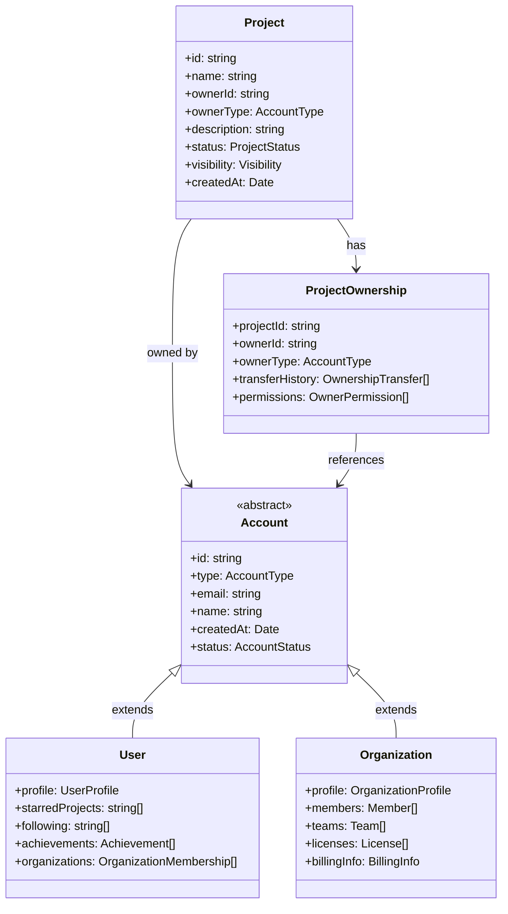
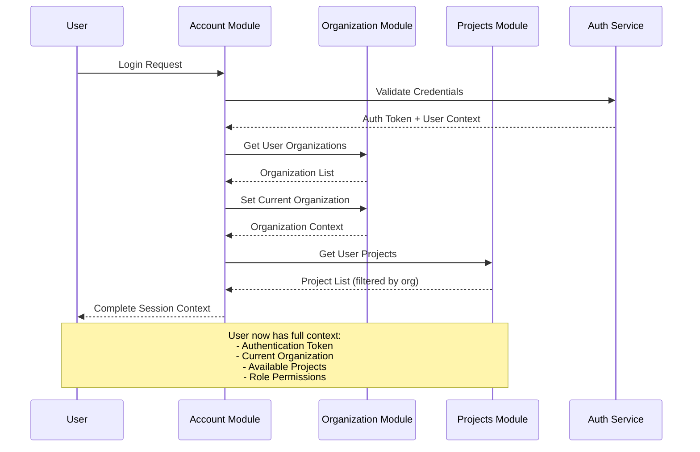
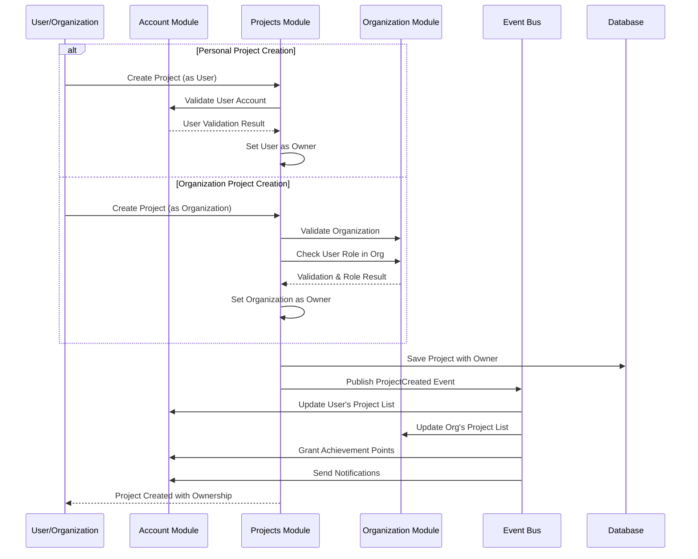
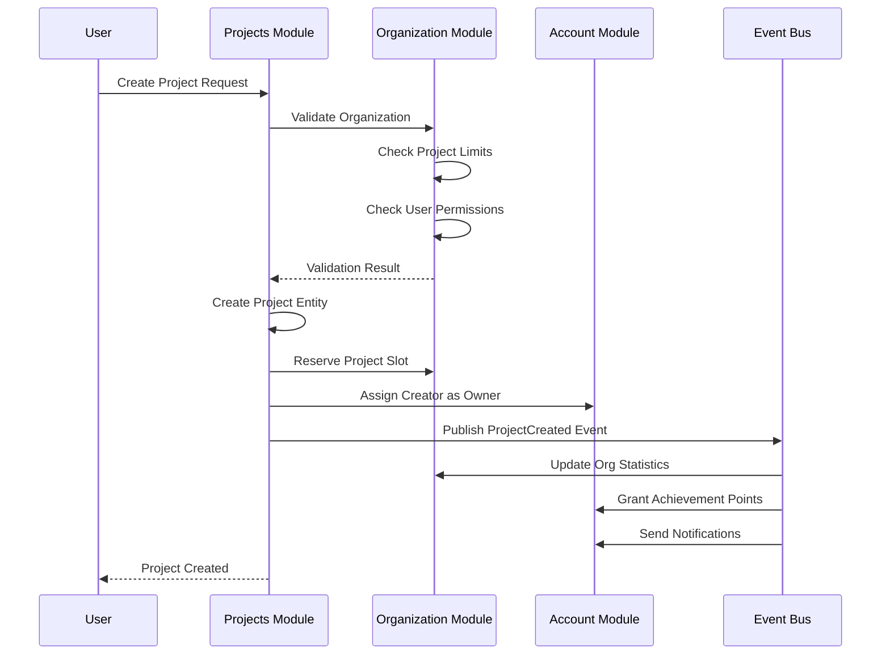
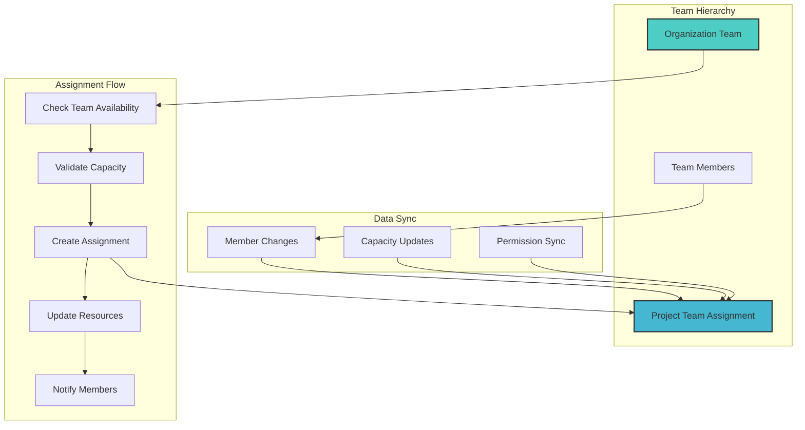
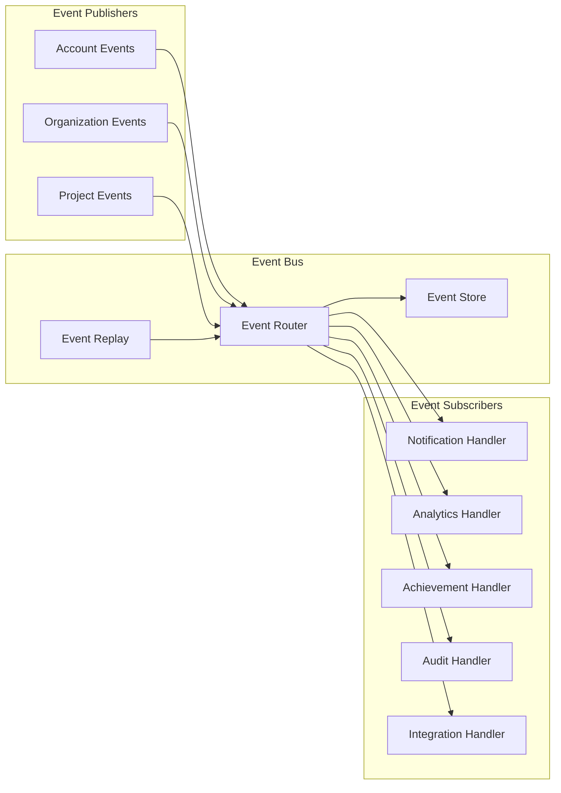
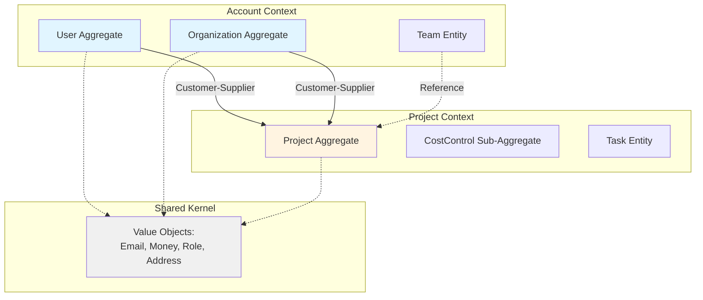

# 跨模組整合架構 (Cross-Module Integration Architecture)

## 概述
本文件描述六個核心模組（User、Organization、Project、Social、Achievement、Notification）之間的整合架構，確保資料流暢通、用戶體驗一致，以及系統邊界的可維護性。

### 核心設計原則
1. **User 和 Organization 獨立管理**: 個人用戶和組織分別管理，但可建立關聯
2. **Project 擁有者模型**: 專案必須有擁有者，可以是個人用戶或組織
3. **事件驅動架構**: 模組間透過事件進行鬆耦合通訊
4. **權限繼承機制**: 從 User/Organization → Project 的權限傳遞
5. **橫切關注點分離**: Social、Achievement、Notification 作為橫切模組

## 整合架構圖

```mermaid
graph TB
    subgraph "Core Business Modules (核心業務模組)"
        U1[User Module<br/>用戶模組]
        U2[User Profiles<br/>用戶檔案]
        U3[Authentication<br/>身份驗證]
        
        O1[Organization Module<br/>組織模組]
        O2[Organizations<br/>組織管理]
        O3[Memberships<br/>成員資格]
        O4[Teams<br/>團隊管理]
        
        P1[Project Module<br/>專案模組]
        P2[Projects<br/>專案]
        P3[Tasks<br/>任務]
        P4[Documents<br/>文件]
        P5[Activities<br/>活動]
    end
    
    subgraph "Cross-Cutting Modules (橫切模組)"
        S1[Social Module<br/>社交模組]
        S2[Following<br/>追蹤關係]
        S3[Recommendations<br/>推薦系統]
        
        A1[Achievement Module<br/>成就模組]
        A2[Badges<br/>徽章系統]
        A3[Leaderboards<br/>排行榜]
        
        N1[Notification Module<br/>通知模組]
        N2[Channels<br/>通知通道]
        N3[Templates<br/>通知模板]
    end
    
    subgraph "Shared Services (共享服務)"
        SH1[Event Bus<br/>事件匯流排]
        SH2[File Storage<br/>檔案儲存]
        SH3[Search Engine<br/>搜尋引擎]
        SH4[Analytics<br/>分析服務]
        SH5[Email Service<br/>郵件服務]
        SH6[WebSocket Hub<br/>即時通訊]
    end
    
    %% User to Organization
    U2 -.->|User Context<br/>用戶上下文| O3
    U3 -->|Auth Token<br/>認證令牌| O2
    
    %% User/Organization to Projects (擁有者關係)
    U2 -->|Personal Owner<br/>個人擁有| P2
    O2 -->|Org Owner<br/>組織擁有| P2
    P2 -->|Ownership<br/>擁有權| P3
    
    %% Organization to Projects
    O2 -->|Org Context<br/>組織上下文| P2
    O3 -->|Access Control<br/>存取控制| P2
    O4 -->|Team Resources<br/>團隊資源| P3
    
    %% User to Projects
    U2 -->|User Assignment<br/>用戶指派| P3
    P5 -->|Activity Events<br/>活動事件| U2
    
    %% Cross-cutting module connections
    S2 -->|Follow Users/Orgs/Projects<br/>追蹤關係| U2
    S2 -->|Follow Users/Orgs/Projects<br/>追蹤關係| O2
    S2 -->|Follow Users/Orgs/Projects<br/>追蹤關係| P2
    
    A2 -->|User Achievements<br/>用戶成就| U2
    A2 -->|Org Achievements<br/>組織成就| O2
    A2 -->|Project Achievements<br/>專案成就| P2
    
    N2 -->|User Notifications<br/>用戶通知| U2
    N2 -->|Org Notifications<br/>組織通知| O2
    N2 -->|Project Notifications<br/>專案通知| P2
    
    %% Shared Service Connections
    N2 --> SH5
    P5 --> SH1
    P4 --> SH2
    All --> SH3
    All --> SH4
    P5 --> SH6
    
    style U1 fill:#ff6b6b,stroke:#c92a2a,stroke-width:3px
    style O1 fill:#4ecdc4,stroke:#20c997,stroke-width:3px
    style P1 fill:#ffd43b,stroke:#fab005,stroke-width:3px
    style S1 fill:#a8e6cf,stroke:#4caf50,stroke-width:2px
    style A1 fill:#ffb3ba,stroke:#e91e63,stroke-width:2px
    style N1 fill:#bae1ff,stroke:#2196f3,stroke-width:2px
    style SH1 fill:#f9ca24,stroke:#333,stroke-width:2px
```



## 關鍵整合點

### Account-Project 擁有者關係架構



## Key Integration Points

### 1. Authentication & Authorization Flow



### 2. Project Creation with Owner Assignment Flow



### 3. Original Project Creation Cross-Module Flow



### 4. Team Assignment Integration



## Domain Event Integration

### Event Flow Architecture



### 跨模組事件目錄

| 事件名稱 | 發布者 | 訂閱者 | 用途說明 |
|---------|--------|--------|----------|
| UserRegistered | Account | Organization, Analytics | 建立預設組織，追蹤註冊 |
| OrganizationCreated | Organization | Account, Billing | 授予擁有者角色，設定帳務 |
| ProjectCreated | Projects | Organization, Account | 更新配額限制，授予成就 |
| ProjectOwnershipTransferred | Projects | Account, Organization | 轉移擁有權，更新權限 |
| TaskCompleted | Projects | Account, Analytics | 更新成就，追蹤生產力 |
| TeamAssigned | Projects | Organization, Account | 更新容量，通知成員 |
| MemberInvited | Organization | Account, Email | 建立邀請，發送郵件 |
| DocumentShared | Projects | Account, Notification | 通知接收者，記錄活動 |
| PaymentProcessed | Organization | Projects, Account | 更新限制，啟用功能 |
| StarredProjectAdded | Account | Projects, Analytics | 更新星標計數，分析偏好 |
| UserFollowed | Account | Account, Notification | 建立追蹤關係，發送通知 |

## Data Consistency Patterns

### 1. Eventual Consistency

```typescript
// 範例：跨模組的用戶刪除 Saga
class UserDeletionSaga {
  private steps = [
    { module: 'Account', action: 'deactivateUser' },
    { module: 'Organization', action: 'removeMemberships' },
    { module: 'Projects', action: 'transferProjectOwnership' }, // 轉移專案擁有權
    { module: 'Projects', action: 'reassignTasks' },
    { module: 'Documents', action: 'transferOwnership' }
  ];
  
  async execute(userId: string): Promise<void> {
    const sagaId = generateSagaId();
    
    // 先檢查用戶擁有的專案
    const ownedProjects = await this.getUserOwnedProjects(userId);
    if (ownedProjects.length > 0) {
      // 需要先處理專案擁有權轉移
      await this.handleProjectOwnershipTransfer(userId, ownedProjects);
    }
    
    for (const step of this.steps) {
      try {
        await this.executeStep(step, userId, sagaId);
        await this.recordStepCompletion(sagaId, step);
      } catch (error) {
        await this.compensate(sagaId, step);
        throw error;
      }
    }
  }
  
  private async handleProjectOwnershipTransfer(
    userId: string, 
    projects: Project[]
  ): Promise<void> {
    for (const project of projects) {
      // 轉移給組織或指定的繼承者
      const newOwner = await this.determineNewOwner(project);
      await this.transferProjectOwnership(project.id, newOwner);
    }
  }
}
```

### 2. Distributed Transactions

```typescript
// 範例：包含擁有者設定的專案建立交易
interface ProjectTransactionContext {
  transactionId: string;
  ownerId: string;  // Account ID (User or Organization)
  ownerType: 'user' | 'organization';
  projectData: CreateProjectDto;
  organizationId?: string;  // 如果是組織專案
  reservations: ResourceReservation[];
}

class ProjectCreationTransaction {
  async execute(context: ProjectTransactionContext): Promise<Project> {
    // Phase 1: 準備階段 - 驗證擁有者
    const ownerValidation = await this.validateOwner(context);
    if (!ownerValidation.isValid) {
      throw new InvalidOwnerException(ownerValidation.reason);
    }
    
    // Phase 2: 準備資源
    const preparations = await Promise.all([
      this.accountModule.prepareProjectOwnership(context),
      context.organizationId ? 
        this.orgModule.prepareProjectSlot(context) : 
        Promise.resolve({ canCommit: true }),
      this.resourceModule.prepareTeamAllocation(context),
      this.billingModule.prepareCostAllocation(context)
    ]);
    
    // Phase 3: 提交或回滾
    if (preparations.every(p => p.canCommit)) {
      const project = await this.commitTransaction(context, preparations);
      
      // Phase 4: 設定擁有者關係
      await this.setProjectOwnership(project, context);
      
      return project;
    } else {
      await this.rollbackTransaction(context, preparations);
      throw new TransactionFailedException();
    }
  }
  
  private async validateOwner(context: ProjectTransactionContext): Promise<ValidationResult> {
    if (context.ownerType === 'user') {
      return await this.accountModule.validateUserCanCreateProject(context.ownerId);
    } else {
      return await this.orgModule.validateOrgCanCreateProject(context.ownerId);
    }
  }
  
  private async setProjectOwnership(project: Project, context: ProjectTransactionContext): Promise<void> {
    const ownership = new ProjectOwnership({
      projectId: project.id,
      ownerId: context.ownerId,
      ownerType: context.ownerType,
      createdAt: new Date()
    });
    
    await this.projectModule.setOwnership(ownership);
    
    // 發布擁有權建立事件
    await this.eventBus.publish(new ProjectOwnershipCreatedEvent(project, ownership));
  }
}
```

## API Gateway Integration

### Unified API Structure

```yaml
openapi: 3.0.0
paths:
  # Account Module Endpoints
  /api/v1/users:
    get:
      tags: [Account]
      x-module: account
      x-rate-limit: 100/hour
      
  /api/v1/users/{userId}/profile:
    get:
      tags: [Account]
      x-module: account
      x-cache: 300s
      
  # Organization Module Endpoints
  /api/v1/organizations:
    post:
      tags: [Organization]
      x-module: organization
      x-requires-auth: true
      x-requires-role: verified_user
      
  # Projects Module Endpoints
  /api/v1/projects:
    get:
      tags: [Projects]
      x-module: projects
      x-requires-context: organization
      parameters:
        - name: organizationId
          in: query
          required: true
          
  # Cross-Module Endpoints
  /api/v1/dashboard:
    get:
      tags: [Integration]
      x-modules: [account, organization, projects]
      x-aggregate: true
```

### Request Context Propagation

```typescript
// Middleware for cross-module context
export class ModuleContextMiddleware implements NestMiddleware {
  use(req: Request, res: Response, next: NextFunction) {
    const context: ModuleContext = {
      userId: req.user?.id,
      organizationId: req.headers['x-organization-id'],
      projectId: req.params.projectId,
      permissions: req.user?.permissions,
      traceId: req.headers['x-trace-id'] || generateTraceId()
    };
    
    // Attach to request
    req.moduleContext = context;
    
    // Propagate to downstream services
    ModuleContextProvider.set(context);
    
    next();
  }
}
```

## Shared Component Library

### Angular Components

```typescript
// 跨模組共用的 UI 元件 - 支援 Account (User/Organization) 選擇
@Component({
  selector: 'app-account-selector',
  standalone: true,
  template: `
    <div class="account-selector">
      <!-- Account 類型選擇 -->
      <div class="account-type-toggle">
        <button [class.active]="accountType() === 'user'" 
                (click)="setAccountType('user')">
          個人用戶
        </button>
        <button [class.active]="accountType() === 'organization'" 
                (click)="setAccountType('organization')">
          組織
        </button>
      </div>
      
      <!-- 搜尋輸入 -->
      <input [(ngModel)]="searchTerm" 
             (ngModelChange)="searchAccounts($event)"
             [placeholder]="accountType() === 'user' ? '搜尋用戶...' : '搜尋組織...'">
      
      <!-- Account 列表 -->
      <div class="account-list">
        @for (account of filteredAccounts(); track account.id) {
          <div class="account-item" (click)="selectAccount(account)">
            <app-account-avatar [account]="account" [type]="accountType()" />
            <div class="account-info">
              <span class="name">{{ account.name }}</span>
              <span class="email">{{ account.email }}</span>
              @if (accountType() === 'organization') {
                <span class="member-count">{{ account.memberCount }} 成員</span>
              }
            </div>
          </div>
        }
      </div>
    </div>
  `
})
export class AccountSelectorComponent {
  @Input() context: 'project-owner' | 'team-member' | 'global' = 'global';
  @Input() multiple = false;
  @Input() includeUsers = true;
  @Input() includeOrganizations = true;
  @Output() accountSelected = new EventEmitter<Account | Account[]>();
  
  private accountService = inject(AccountService);
  private orgService = inject(OrganizationService);
  private projectService = inject(ProjectService);
  
  searchTerm = signal('');
  accountType = signal<'user' | 'organization'>('user');
  filteredAccounts = signal<Account[]>([]);
  
  constructor() {
    // 根據 context 設定預設類型
    effect(() => {
      if (this.context === 'project-owner' && this.includeOrganizations) {
        this.accountType.set('organization');
      }
    });
  }
  
  async searchAccounts(term: string) {
    if (this.accountType() === 'user') {
      await this.searchUsers(term);
    } else {
      await this.searchOrganizations(term);
    }
  }
  
  private async searchUsers(term: string) {
    if (this.context === 'project-owner') {
      // 搜尋可以擁有專案的用戶
      this.filteredAccounts.set(
        await this.accountService.searchUsersWithProjectPermission(term)
      );
    } else if (this.context === 'team-member') {
      // 搜尋可加入團隊的用戶
      const currentOrg = this.orgService.currentOrganization();
      this.filteredAccounts.set(
        await this.orgService.searchAvailableMembers(currentOrg?.id, term)
      );
    } else {
      // 全域搜尋
      this.filteredAccounts.set(
        await this.accountService.searchUsers(term)
      );
    }
  }
  
  private async searchOrganizations(term: string) {
    if (this.context === 'project-owner') {
      // 搜尋可以擁有專案的組織
      this.filteredAccounts.set(
        await this.orgService.searchOrganizationsWithProjectPermission(term)
      );
    } else {
      // 全域組織搜尋
      this.filteredAccounts.set(
        await this.orgService.searchOrganizations(term)
      );
    }
  }
  
  selectAccount(account: Account) {
    if (this.multiple) {
      // 多選邏輯
      const selected = this.selectedAccounts.update(accounts => [...accounts, account]);
      this.accountSelected.emit(selected);
    } else {
      // 單選邏輯
      this.accountSelected.emit(account);
    }
  }
}
```

### Shared Services

```typescript
// Notification Service used by all modules
@Injectable({
  providedIn: 'root'
})
export class NotificationService {
  private notificationHub = inject(NotificationHub);
  private userPreferences = inject(UserPreferencesService);
  
  async notify(notification: CrossModuleNotification): Promise<void> {
    // Get user preferences
    const prefs = await this.userPreferences.getNotificationPreferences(
      notification.userId
    );
    
    // Route to appropriate channels
    const channels = this.determineChannels(notification, prefs);
    
    // Send through each channel
    await Promise.all(
      channels.map(channel => 
        this.sendThroughChannel(notification, channel)
      )
    );
    
    // Log notification
    await this.logNotification(notification);
  }
  
  private determineChannels(
    notification: CrossModuleNotification,
    preferences: NotificationPreferences
  ): NotificationChannel[] {
    const channels: NotificationChannel[] = [];
    
    // Always include in-app
    channels.push('IN_APP');
    
    // Check other channels based on preferences and importance
    if (notification.importance >= 'HIGH' || preferences.email.enabled) {
      channels.push('EMAIL');
    }
    
    if (notification.importance === 'CRITICAL' || preferences.push.enabled) {
      channels.push('PUSH');
    }
    
    if (preferences.integrations.slack?.enabled) {
      channels.push('SLACK');
    }
    
    return channels;
  }
}
```

## Performance Optimization Strategies

### 1. Cross-Module Caching

```typescript
// Distributed cache for cross-module data
@Injectable()
export class CrossModuleCache {
  private redis = inject(RedisService);
  
  // Cache user's full context
  async cacheUserContext(userId: string, context: UserContext): Promise<void> {
    const key = `user_context:${userId}`;
    const ttl = 3600; // 1 hour
    
    await this.redis.setex(key, ttl, JSON.stringify({
      user: context.user,
      organizations: context.organizations,
      currentOrganization: context.currentOrganization,
      projects: context.projects,
      permissions: context.permissions,
      preferences: context.preferences
    }));
  }
  
  // Cache organization's project list
  async cacheOrgProjects(orgId: string, projects: Project[]): Promise<void> {
    const key = `org_projects:${orgId}`;
    const ttl = 300; // 5 minutes
    
    await this.redis.setex(key, ttl, JSON.stringify(projects));
  }
  
  // Invalidation strategy
  async invalidateUserContext(userId: string): Promise<void> {
    const patterns = [
      `user_context:${userId}`,
      `user_permissions:${userId}:*`,
      `user_projects:${userId}:*`
    ];
    
    for (const pattern of patterns) {
      const keys = await this.redis.keys(pattern);
      if (keys.length > 0) {
        await this.redis.del(...keys);
      }
    }
  }
}
```

### 2. Query Optimization

```typescript
// GraphQL Federation for cross-module queries
@Resolver('User')
export class UserResolver {
  @ResolveField('organizations')
  async getOrganizations(
    @Parent() user: User,
    @Context() context: GraphQLContext
  ): Promise<Organization[]> {
    // Use DataLoader to batch organization queries
    return context.loaders.organizationLoader.loadMany(
      user.organizationIds
    );
  }
  
  @ResolveField('projects')
  async getProjects(
    @Parent() user: User,
    @Args('organizationId') orgId: string,
    @Context() context: GraphQLContext
  ): Promise<Project[]> {
    // Use DataLoader with context-aware caching
    const key = `${user.id}:${orgId}`;
    return context.loaders.projectLoader.load(key);
  }
  
  @ResolveField('achievements')
  async getAchievements(
    @Parent() user: User,
    @Context() context: GraphQLContext
  ): Promise<Achievement[]> {
    // Cached in user context
    return context.cache.get(`achievements:${user.id}`) ||
           context.loaders.achievementLoader.load(user.id);
  }
}
```

## Security Integration

### 1. Permission Synchronization

```typescript
// Permission sync across modules
export class PermissionSyncService {
  async syncPermissions(event: PermissionChangeEvent): Promise<void> {
    const { userId, organizationId, changes } = event;
    
    // Update organization module
    await this.updateOrganizationPermissions(userId, organizationId, changes);
    
    // Cascade to projects
    const projects = await this.getOrganizationProjects(organizationId);
    await Promise.all(
      projects.map(project => 
        this.updateProjectPermissions(userId, project.id, changes)
      )
    );
    
    // Invalidate caches
    await this.invalidatePermissionCaches(userId, organizationId);
    
    // Notify affected services
    await this.notifyPermissionChange(event);
  }
}
```

### 2. Audit Trail Integration

```typescript
// Unified audit logging across modules
export class CrossModuleAuditService {
  async logActivity(activity: AuditActivity): Promise<void> {
    const enrichedActivity = {
      ...activity,
      timestamp: new Date(),
      correlationId: CorrelationContext.getId(),
      userContext: await this.getUserContext(activity.userId),
      moduleContext: this.getModuleContext(activity.module)
    };
    
    // Store in audit log
    await this.auditRepository.save(enrichedActivity);
    
    // Stream to analytics
    await this.analyticsStream.send(enrichedActivity);
    
    // Check compliance rules
    await this.complianceChecker.check(enrichedActivity);
  }
}
```

## Monitoring and Observability

### 1. Distributed Tracing

```typescript
// OpenTelemetry integration for cross-module tracing
export class TracingService {
  private tracer = trace.getTracer('cross-module-integration');
  
  async traceModuleInteraction<T>(
    operation: string,
    moduleFrom: string,
    moduleTo: string,
    fn: () => Promise<T>
  ): Promise<T> {
    const span = this.tracer.startSpan(operation, {
      attributes: {
        'module.from': moduleFrom,
        'module.to': moduleTo,
        'organization.id': ContextProvider.getOrgId(),
        'user.id': ContextProvider.getUserId()
      }
    });
    
    try {
      const result = await fn();
      span.setStatus({ code: SpanStatusCode.OK });
      return result;
    } catch (error) {
      span.setStatus({ 
        code: SpanStatusCode.ERROR,
        message: error.message 
      });
      throw error;
    } finally {
      span.end();
    }
  }
}
```

### 2. Health Check Integration

```typescript
// Unified health check across modules
@Controller('health')
export class HealthController {
  constructor(
    private health: HealthCheckService,
    private accountHealth: AccountHealthIndicator,
    private orgHealth: OrganizationHealthIndicator,
    private projectHealth: ProjectHealthIndicator
  ) {}
  
  @Get()
  @HealthCheck()
  check() {
    return this.health.check([
      () => this.accountHealth.isHealthy('account-module'),
      () => this.orgHealth.isHealthy('organization-module'),
      () => this.projectHealth.isHealthy('projects-module'),
      () => this.checkCrossModuleIntegration()
    ]);
  }
  
  private async checkCrossModuleIntegration(): Promise<HealthIndicatorResult> {
    try {
      // Test cross-module communication
      const testUser = await this.getTestUser();
      const testOrg = await this.getTestOrganization(testUser.id);
      const testProject = await this.getTestProject(testOrg.id);
      
      return {
        'cross-module-integration': {
          status: 'up',
          details: {
            user: testUser.id,
            organization: testOrg.id,
            project: testProject.id
          }
        }
      };
    } catch (error) {
      return {
        'cross-module-integration': {
          status: 'down',
          message: error.message
        }
      };
    }
  }
}
```

## Migration and Deployment Strategy

### 1. Module Versioning

```yaml
# Module version compatibility matrix
compatibility:
  account-module:
    v2.0.0:
      compatible-with:
        organization-module: ["v1.5.0", "v2.0.0"]
        projects-module: ["v1.8.0", "v2.0.0", "v2.1.0"]
      breaking-changes:
        - "User schema migration required"
        - "Authentication token format changed"
        
  organization-module:
    v2.0.0:
      compatible-with:
        account-module: ["v2.0.0"]
        projects-module: ["v1.8.0", "v2.0.0", "v2.1.0"]
      features:
        - "Multi-organization support"
        - "Advanced billing integration"
```

### 2. Blue-Green Deployment

```typescript
// Deployment orchestration for modules
export class ModuleDeploymentOrchestrator {
  async deployWithZeroDowntime(
    module: string,
    version: string
  ): Promise<DeploymentResult> {
    // 1. Deploy to green environment
    await this.deployToGreen(module, version);
    
    // 2. Run integration tests
    const testResult = await this.runCrossModuleTests(module, version);
    if (!testResult.passed) {
      await this.rollbackGreen(module);
      throw new DeploymentFailedException(testResult);
    }
    
    // 3. Gradual traffic shift
    await this.shiftTraffic(module, {
      steps: [10, 25, 50, 100],
      interval: 300, // 5 minutes
      rollbackOnError: true
    });
    
    // 4. Complete deployment
    await this.promoteGreenToBlue(module);
    
    return { module, version, status: 'SUCCESS' };
  }
}
```

## Context Map (上下文地圖)

### 上下文關係圖



### 上下文邊界定義

#### Account Context (帳戶上下文)
**職責**: 
- 用戶身份與檔案管理
- 組織結構管理
- 團隊與成員管理
- 成就與通知系統

**聚合根**:
- User Aggregate
- Organization Aggregate

**對外介面** (Published Language):
- UserCreated Event
- OrganizationCreated Event
- TeamAssigned Event
- MemberJoined Event

---

#### Project Context (專案上下文)
**職責**:
- 專案生命週期管理
- 任務與里程碑追蹤
- 文件與現場記錄管理
- 成本控制與預算管理

**聚合根**:
- Project Aggregate
  - CostControl Sub-Aggregate

**對外介面** (Published Language):
- ProjectCreated Event
- TaskAssigned Event
- MilestoneCompleted Event
- BudgetExceeded Event

---

## 上下文整合策略

### 1. Customer-Supplier (客戶-供應商)

**Account Context (Supplier) → Project Context (Customer)**

```typescript
// Account Context 提供
interface IAccountContextAPI {
  getUserById(userId: string): Promise<UserDTO>;
  getOrganizationById(orgId: string): Promise<OrganizationDTO>;
  getTeamMembers(teamId: string): Promise<MemberDTO[]>;
}

// Project Context 使用
class ProjectApplicationService {
  constructor(private accountAPI: IAccountContextAPI) {}
  
  async createProject(ownerId: string, ownerType: 'user' | 'organization') {
    // 驗證擁有者存在
    if (ownerType === 'user') {
      const user = await this.accountAPI.getUserById(ownerId);
      // ...
    } else {
      const org = await this.accountAPI.getOrganizationById(ownerId);
      // ...
    }
  }
}
```

### 2. Domain Events (領域事件整合)

**Account Context 發布 → Project Context 訂閱**

```typescript
// Account Context 發布
class UserAggregate {
  joinTeam(teamId: string) {
    // ...
    eventBus.publish(new UserJoinedTeamEvent(this.userId, teamId));
  }
}

// Project Context 訂閱
class ProjectEventHandler {
  @Subscribe(UserJoinedTeamEvent)
  async handleUserJoinedTeam(event: UserJoinedTeamEvent) {
    // 更新專案團隊成員快取
    await this.updateProjectTeamCache(event.teamId);
  }
}
```

**Project Context 發布 → Account Context 訂閱**

```typescript
// Project Context 發布
class ProjectAggregate {
  completeTask(taskId: string) {
    // ...
    eventBus.publish(new TaskCompletedEvent(this.projectId, taskId, assigneeId));
  }
}

// Account Context 訂閱
class NotificationEventHandler {
  @Subscribe(TaskCompletedEvent)
  async handleTaskCompleted(event: TaskCompletedEvent) {
    // 發送完成通知給用戶
    await this.notificationService.notify(
      event.assigneeId,
      'Task completed',
      '您的任務已完成'
    );
    
    // 檢查是否觸發成就
    await this.achievementService.checkAchievements(event.assigneeId);
  }
}
```

### 3. Shared Kernel (共享核心)

**共享的 Value Objects**:

```typescript
// 兩個上下文都使用
class Email {
  private readonly value: string;
  
  constructor(email: string) {
    if (!this.isValid(email)) {
      throw new Error('Invalid email format');
    }
    this.value = email;
  }
  
  static isValid(email: string): boolean {
    return /^[^\s@]+@[^\s@]+\.[^\s@]+$/.test(email);
  }
}

class Money {
  constructor(
    public readonly amount: number,
    public readonly currency: string = 'TWD'
  ) {}
  
  add(other: Money): Money {
    if (this.currency !== other.currency) {
      throw new Error('Currency mismatch');
    }
    return new Money(this.amount + other.amount, this.currency);
  }
}

class Role {
  private static readonly VALID_ROLES = [
    'owner', 'manager', 'engineer', 'supervisor', 'worker', 'viewer'
  ];
  
  constructor(public readonly value: string) {
    if (!Role.VALID_ROLES.includes(value)) {
      throw new Error(`Invalid role: ${value}`);
    }
  }
}
```

## Anti-Corruption Layer (防腐層)

### Firebase ACL (Account Context)

```typescript
// domain-layer/account-context/repository-interfaces/IUserRepository.ts
interface IUserRepository {
  findById(userId: string): Promise<User>;
  save(user: User): Promise<void>;
  findByEmail(email: string): Promise<User | null>;
}

// infrastructure-layer/repositories/account-context/FirebaseUserRepository.ts
class FirebaseUserRepository implements IUserRepository {
  constructor(
    private firestore: Firestore,
    private mapper: UserMapper
  ) {}
  
  async findById(userId: string): Promise<User> {
    const doc = await this.firestore.collection('users').doc(userId).get();
    if (!doc.exists) throw new Error('User not found');
    
    // Mapper 負責 Firestore Document → Domain Entity 轉換
    return this.mapper.toDomain(doc.data());
  }
  
  async save(user: User): Promise<void> {
    // Mapper 負責 Domain Entity → Firestore Document 轉換
    const data = this.mapper.toFirestore(user);
    await this.firestore.collection('users').doc(user.userId).set(data);
  }
}
```

### Mapper 範例

```typescript
// infrastructure-layer/mappers/User-Mapper.ts
class UserMapper {
  toDomain(data: any): User {
    return {
      userId: data.userId,
      email: new Email(data.email),
      displayName: data.displayName,
      phoneNumber: data.phoneNumber ? new PhoneNumber(data.phoneNumber) : undefined,
      profile: {
        avatar: data.profile?.avatar,
        bio: data.profile?.bio,
        certifications: data.profile?.certifications || [],
        skills: data.profile?.skills || []
      },
      achievements: data.achievements || [],
      following: data.following || [],
      starredProjects: data.starredProjects || [],
      organizationMemberships: data.organizationMemberships || [],
      teams: data.teams || [],
      createdAt: data.createdAt.toDate(),
      updatedAt: data.updatedAt.toDate()
    };
  }
  
  toFirestore(user: User): any {
    return {
      userId: user.userId,
      email: user.email.value,
      displayName: user.displayName,
      phoneNumber: user.phoneNumber?.value,
      profile: user.profile,
      achievements: user.achievements,
      following: user.following,
      starredProjects: user.starredProjects,
      organizationMemberships: user.organizationMemberships,
      teams: user.teams,
      createdAt: Timestamp.fromDate(user.createdAt),
      updatedAt: Timestamp.fromDate(user.updatedAt)
    };
  }
}
```

## 最佳實踐與指導原則

### 1. 模組邊界管理
- 保持領域邏輯在模組邊界內
- 使用事件進行跨模組通訊
- 避免跨模組直接存取資料庫
- 實作適當的錯誤邊界處理
- **Account 抽象層**: 統一處理 User 和 Organization 的共同行為
- **Context Map**: 明確定義上下文邊界和整合策略

### 2. 資料一致性
- 對非關鍵資料使用最終一致性
- 實作 Saga 模式處理分散式交易
- 維護所有變更的稽核軌跡
- 實作適當的補償邏輯
- **擁有權轉移**: 確保專案擁有權變更的原子性
- **Anti-Corruption Layer**: 保護領域模型不受外部系統影響

### 3. 效能優化
- 快取頻繁存取的跨模組資料
- 盡可能使用批次操作
- 實作斷路器模式提升韌性
- 監控並優化慢查詢
- **Account 查詢優化**: 使用 GraphQL DataLoader 批次載入
- **Shared Kernel**: 減少重複的 Value Objects

### 4. 安全性
- 在模組邊界驗證權限
- 傳輸中加密敏感資料
- 實作適當的身份驗證流程
- 稽核所有跨模組互動
- **擁有者權限**: 確保只有擁有者可以執行關鍵操作
- **Domain Events**: 安全的跨上下文通訊

### 5. 測試策略
- 為所有互動撰寫整合測試
- 測試失敗情境和補償機制
- 驗證向後相容性
- 對跨模組操作進行負載測試
- **Account-Project 測試**: 測試各種擁有者情境
- **Context Integration 測試**: 測試上下文間的事件流

### 6. Account-Project 特定準則
- **擁有者模型**: 每個專案必須有明確的擁有者（User 或 Organization）
- **權限繼承**: Organization 的管理者自動獲得該組織專案的管理權限
- **星標同步**: User 的星標專案需要即時同步更新
- **通知路由**: 根據擁有者類型決定通知發送策略
- **資料遷移**: 支援專案擁有權在 User 和 Organization 之間轉移
- **Customer-Supplier**: Account Context 作為 Project Context 的供應商