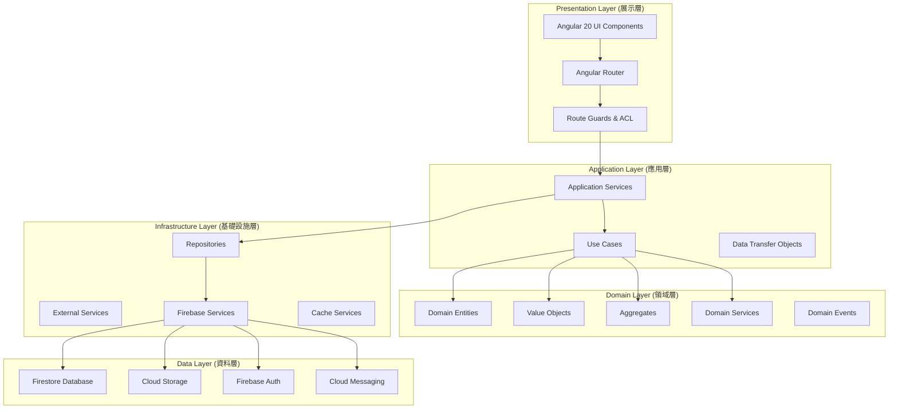
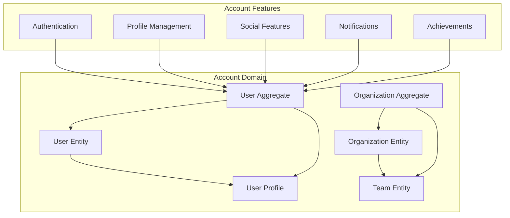
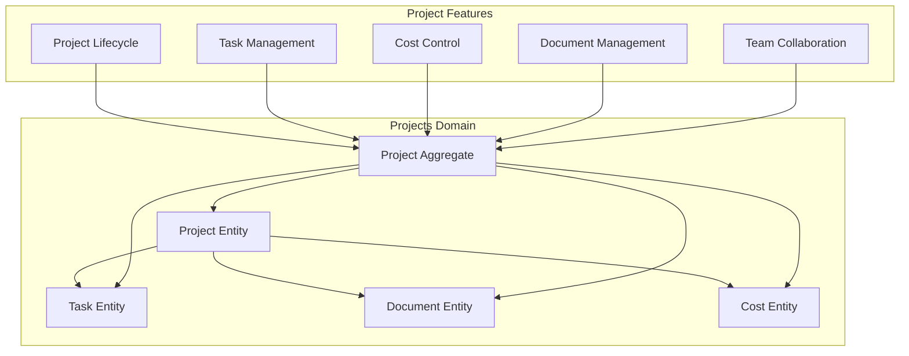
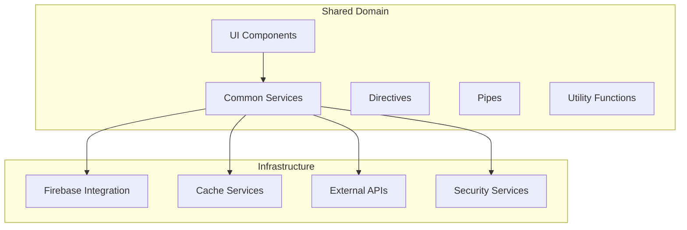
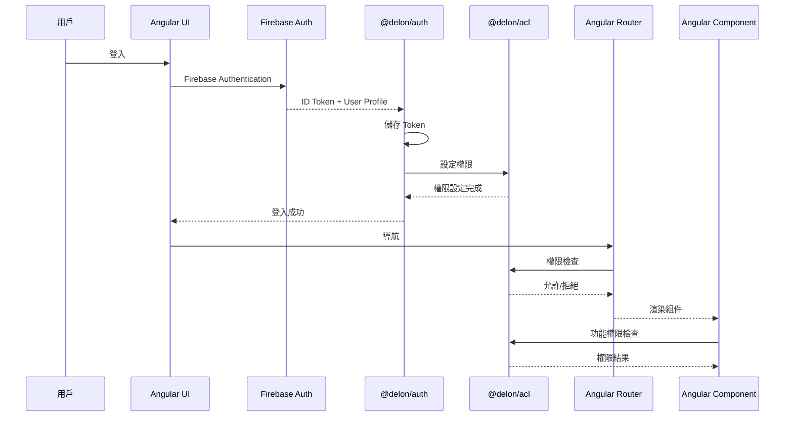
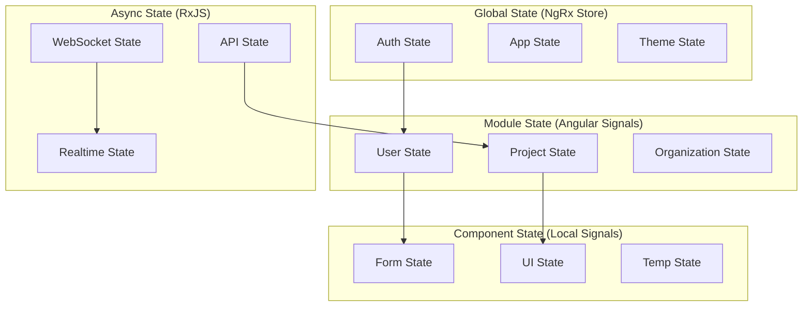
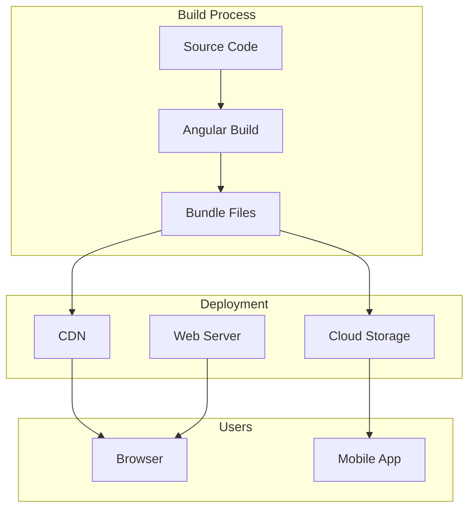
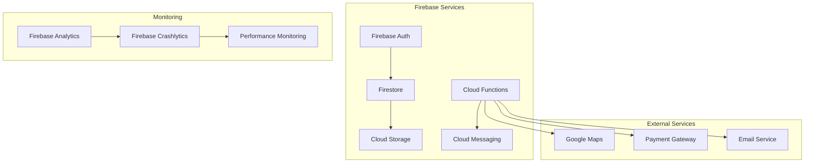
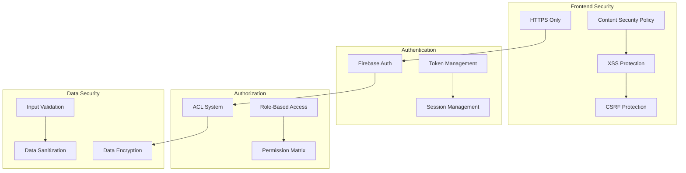
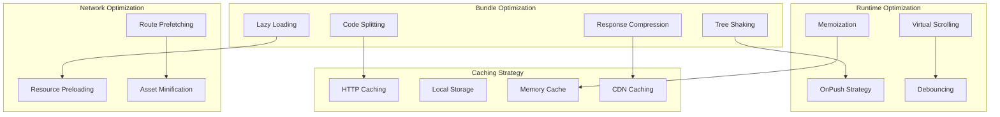

# 系統架構概覽 (System Architecture Overview)

## 整體架構圖

## 三個 DDD 領域架構

### 1. Account Domain (帳戶抽象層)

### 2. Projects Domain (專案管理)

### 3. Shared Domain (共享基礎設施)

## 認證與權限架構

### 認證流程架構

## 資料流架構

### 狀態管理架構

## 部署架構

### 前端部署

### 後端服務

## 安全架構

### 多層安全防護

## 效能架構

### 效能優化策略

## 相關文件
- [設計原則](../Global Notes/Design Principles.md)
- [技術棧標準](../Global Notes/Technology Stack.md)
- [認證流程策略](../Global Notes/Authentication Flow Strategy.md)
- [模組設計標準](../Global Notes/Module Design Standards.md)
