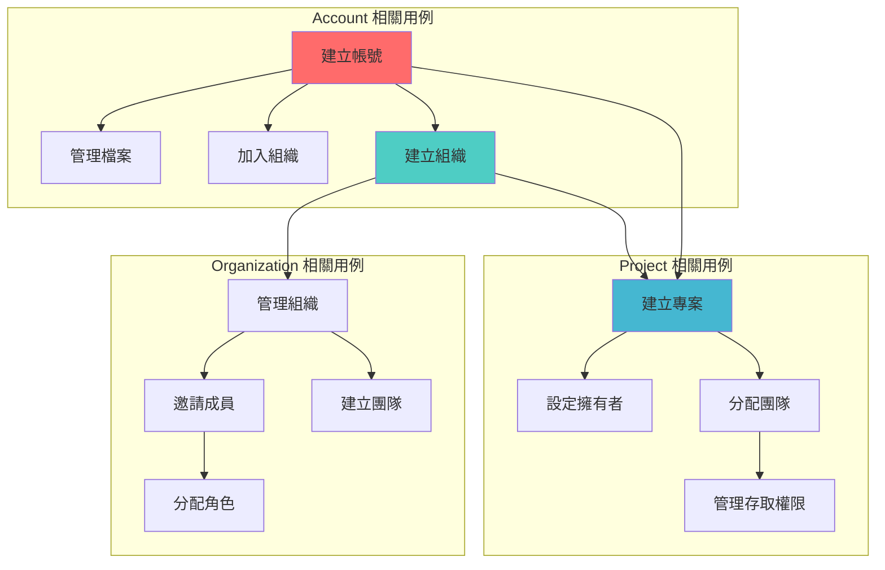

# 系統使用案例圖 (System Use Case Diagram)

## 系統概述

營建管理系統是一個綜合性的數位化平台，專為建築工程專案管理而設計。系統支援多種用戶角色，提供完整的專案生命週期管理功能，從專案規劃、執行到完工驗收的全過程管理。

## 完整系統使用案例圖

```mermaid
graph TB
    subgraph "系統參與者 (System Actors)"
        subgraph "個人用戶"
            Engineer[工程師<br/>Engineer]
            Supervisor[監工<br/>Supervisor]
            Contractor[承包商<br/>Contractor]
            Inspector[查驗員<br/>Inspector]
            SafetyOfficer[安全官<br/>Safety Officer]
        end
        
        subgraph "管理角色"
            ProjectManager[專案經理<br/>Project Manager]
            OrgManager[組織管理者<br/>Org Manager]
            Admin[系統管理員<br/>System Admin]
        end
        
        subgraph "外部參與者"
            Client[業主<br/>Client]
            Vendor[供應商<br/>Vendor]
            Authority[主管機關<br/>Authority]
        end
    end
    
    subgraph "營建管理系統 (Construction Management System)"
        subgraph "帳戶管理用例 (Account Use Cases)"
            UC1((註冊帳號<br/>Register Account))
            UC2((登入系統<br/>Login))
            UC3((管理個人檔案<br/>Manage Profile))
            UC4((管理專業證照<br/>Manage Licenses))
            UC5((追蹤用戶/組織<br/>Follow Users/Orgs))
            UC6((管理星標專案<br/>Manage Starred))
            UC7((檢視成就<br/>View Achievements))
            UC8((管理通知設定<br/>Manage Notifications))
        end
        
        subgraph "組織管理用例 (Organization Use Cases)"
            UC10((建立組織<br/>Create Organization))
            UC11((管理組織資料<br/>Manage Org Profile))
            UC12((邀請成員<br/>Invite Members))
            UC13((管理成員角色<br/>Manage Roles))
            UC14((建立團隊<br/>Create Teams))
            UC15((分配團隊<br/>Assign Teams))
            UC16((管理營業執照<br/>Manage Business License))
            UC17((管理帳務<br/>Manage Billing))
        end
        
        subgraph "專案管理用例 (Project Use Cases)"
            UC20((建立專案<br/>Create Project))
            UC21((設定專案資訊<br/>Setup Project Info))
            UC22((管理里程碑<br/>Manage Milestones))
            UC23((分配任務<br/>Assign Tasks))
            UC24((追蹤進度<br/>Track Progress))
            UC25((管理文件<br/>Manage Documents))
            UC26((上傳現場照片<br/>Upload Site Photos))
            UC27((填寫施工日誌<br/>Write Daily Reports))
            UC28((管理甘特圖<br/>Manage Gantt Chart))
        end
        
        subgraph "資源管理用例 (Resource Use Cases)"
            UC30((管理材料<br/>Manage Materials))
            UC31((管理設備<br/>Manage Equipment))
            UC32((控制預算<br/>Control Budget))
            UC33((追蹤成本<br/>Track Costs))
            UC34((預測支出<br/>Forecast Expenses))
            UC35((分析差異<br/>Analyze Variance))
            UC36((管理供應商<br/>Manage Vendors))
        end
        
        subgraph "品質安全用例 (Quality & Safety Use Cases)"
            UC40((執行查驗<br/>Perform Inspection))
            UC41((記錄缺失<br/>Record Defects))
            UC42((追蹤改善<br/>Track Improvements))
            UC43((管理安全記錄<br/>Manage Safety Records))
            UC44((通報事故<br/>Report Incidents))
            UC45((安全巡檢<br/>Safety Patrol))
            UC46((記錄天氣<br/>Log Weather))
        end
        
        subgraph "溝通協作用例 (Communication Use Cases)"
            UC50((發送通知<br/>Send Notifications))
            UC51((討論議題<br/>Discuss Topics))
            UC52((評論文件<br/>Comment Documents))
            UC53((即時訊息<br/>Instant Messaging))
            UC54((視訊會議<br/>Video Conference))
            UC55((分享檔案<br/>Share Files))
        end
        
        subgraph "報表分析用例 (Reporting Use Cases)"
            UC60((產生進度報告<br/>Generate Progress Report))
            UC61((成本分析報告<br/>Cost Analysis Report))
            UC62((品質統計報表<br/>Quality Statistics))
            UC63((安全績效報表<br/>Safety Performance))
            UC64((資源使用報表<br/>Resource Usage))
            UC65((匯出資料<br/>Export Data))
        end
    end
    
    %% 工程師用例連接
    Engineer --> UC1
    Engineer --> UC2
    Engineer --> UC3
    Engineer --> UC4
    Engineer --> UC5
    Engineer --> UC6
    Engineer --> UC7
    Engineer --> UC8
    Engineer --> UC20
    Engineer --> UC23
    Engineer --> UC24
    Engineer --> UC25
    Engineer --> UC26
    Engineer --> UC27
    Engineer --> UC30
    Engineer --> UC31
    Engineer --> UC40
    Engineer --> UC41
    Engineer --> UC50
    Engineer --> UC51
    Engineer --> UC52
    
    %% 監工用例連接
    Supervisor --> UC1
    Supervisor --> UC2
    Supervisor --> UC3
    Supervisor --> UC22
    Supervisor --> UC23
    Supervisor --> UC24
    Supervisor --> UC26
    Supervisor --> UC27
    Supervisor --> UC30
    Supervisor --> UC31
    Supervisor --> UC40
    Supervisor --> UC41
    Supervisor --> UC42
    Supervisor --> UC43
    Supervisor --> UC45
    Supervisor --> UC46
    Supervisor --> UC50
    Supervisor --> UC51
    
    %% 承包商用例連接
    Contractor --> UC1
    Contractor --> UC2
    Contractor --> UC3
    Contractor --> UC10
    Contractor --> UC11
    Contractor --> UC12
    Contractor --> UC13
    Contractor --> UC14
    Contractor --> UC15
    Contractor --> UC20
    Contractor --> UC21
    Contractor --> UC22
    Contractor --> UC30
    Contractor --> UC31
    Contractor --> UC32
    Contractor --> UC33
    Contractor --> UC36
    
    %% 專案經理用例連接
    ProjectManager --> UC1
    ProjectManager --> UC2
    ProjectManager --> UC3
    ProjectManager --> UC14
    ProjectManager --> UC15
    ProjectManager --> UC20
    ProjectManager --> UC21
    ProjectManager --> UC22
    ProjectManager --> UC23
    ProjectManager --> UC24
    ProjectManager --> UC25
    ProjectManager --> UC28
    ProjectManager --> UC32
    ProjectManager --> UC33
    ProjectManager --> UC34
    ProjectManager --> UC35
    ProjectManager --> UC60
    ProjectManager --> UC61
    
    %% 組織管理者用例連接
    OrgManager --> UC10
    OrgManager --> UC11
    OrgManager --> UC12
    OrgManager --> UC13
    OrgManager --> UC14
    OrgManager --> UC15
    OrgManager --> UC16
    OrgManager --> UC17
    OrgManager --> UC20
    OrgManager --> UC32
    
    %% 查驗員用例連接
    Inspector --> UC1
    Inspector --> UC2
    Inspector --> UC3
    Inspector --> UC40
    Inspector --> UC41
    Inspector --> UC42
    Inspector --> UC62
    
    %% 安全官用例連接
    SafetyOfficer --> UC1
    SafetyOfficer --> UC2
    SafetyOfficer --> UC3
    SafetyOfficer --> UC43
    SafetyOfficer --> UC44
    SafetyOfficer --> UC45
    SafetyOfficer --> UC63
    
    %% 業主用例連接
    Client --> UC2
    Client --> UC3
    Client --> UC24
    Client --> UC25
    Client --> UC26
    Client --> UC60
    Client --> UC61
    Client --> UC65
    
    %% 供應商用例連接
    Vendor --> UC2
    Vendor --> UC3
    Vendor --> UC30
    Vendor --> UC31
    Vendor --> UC36
    
    %% 主管機關用例連接
    Authority --> UC2
    Authority --> UC25
    Authority --> UC40
    Authority --> UC62
    Authority --> UC63
    Authority --> UC65
    
    %% 系統管理員用例連接
    Admin --> UC1
    Admin --> UC2
    Admin --> UC3
    Admin --> UC10
    Admin --> UC11
    Admin --> UC12
    Admin --> UC13
    Admin --> UC17
    Admin --> UC65
    
    %% 樣式設定
    classDef userStyle fill:#e3f2fd,stroke:#1976d2,stroke-width:2px
    classDef managerStyle fill:#f3e5f5,stroke:#7b1fa2,stroke-width:2px
    classDef externalStyle fill:#e8f5e8,stroke:#388e3c,stroke-width:2px
    classDef accountUC fill:#fff3e0,stroke:#f57c00,stroke-width:2px
    classDef orgUC fill:#fce4ec,stroke:#c2185b,stroke-width:2px
    classDef projectUC fill:#e8eaf6,stroke:#3f51b5,stroke-width:2px
    classDef resourceUC fill:#e0f2f1,stroke:#00796b,stroke-width:2px
    classDef qualityUC fill:#f3e5f5,stroke:#7b1fa2,stroke-width:2px
    classDef commUC fill:#e3f2fd,stroke:#1976d2,stroke-width:2px
    classDef reportUC fill:#fff8e1,stroke:#fbc02d,stroke-width:2px
    
    class Engineer,Supervisor,Contractor,Inspector,SafetyOfficer userStyle
    class ProjectManager,OrgManager,Admin managerStyle
    class Client,Vendor,Authority externalStyle
    class UC1,UC2,UC3,UC4,UC5,UC6,UC7,UC8 accountUC
    class UC10,UC11,UC12,UC13,UC14,UC15,UC16,UC17 orgUC
    class UC20,UC21,UC22,UC23,UC24,UC25,UC26,UC27,UC28 projectUC
    class UC30,UC31,UC32,UC33,UC34,UC35,UC36 resourceUC
    class UC40,UC41,UC42,UC43,UC44,UC45,UC46 qualityUC
    class UC50,UC51,UC52,UC53,UC54,UC55 commUC
    class UC60,UC61,UC62,UC63,UC64,UC65 reportUC
```

## 核心用例關係圖

### Account-Organization-Project 關係

## 用例詳細說明

### 1. 帳戶管理用例群

#### UC1: 註冊帳號
- **主要參與者**: 所有用戶類型
- **前置條件**: 無
- **主要流程**:
  1. 用戶選擇註冊類型（個人/組織）
  2. 填寫基本資料
  3. 驗證電子郵件
  4. 設定密碼
  5. 完成註冊
- **後置條件**: 建立新帳號，可以登入系統

#### UC3: 管理個人檔案
- **主要參與者**: 已註冊用戶
- **前置條件**: 已登入系統
- **主要流程**:
  1. 進入個人檔案頁面
  2. 編輯個人資料
  3. 上傳頭像
  4. 更新專業資訊
  5. 儲存變更
- **擴展用例**: UC4 管理專業證照

#### UC5: 追蹤用戶/組織
- **主要參與者**: 已註冊用戶
- **前置條件**: 已登入系統
- **主要流程**:
  1. 搜尋用戶或組織
  2. 檢視檔案資訊
  3. 點擊追蹤按鈕
  4. 接收追蹤對象的更新
- **相關用例**: UC8 管理通知設定

### 2. 組織管理用例群

#### UC10: 建立組織
- **主要參與者**: 承包商、組織管理者
- **前置條件**: 已有個人帳號
- **主要流程**:
  1. 選擇建立組織
  2. 填寫組織基本資料
  3. 上傳營業執照
  4. 設定組織類型
  5. 完成建立
- **後置條件**: 成為組織擁有者
- **包含用例**: UC16 管理營業執照

#### UC12: 邀請成員
- **主要參與者**: 組織管理者
- **前置條件**: 擁有組織管理權限
- **主要流程**:
  1. 進入成員管理頁面
  2. 輸入被邀請者信箱
  3. 設定初始角色
  4. 發送邀請
  5. 等待接受邀請
- **擴展用例**: UC13 管理成員角色

#### UC14: 建立團隊
- **主要參與者**: 組織管理者、專案經理
- **前置條件**: 屬於組織成員
- **主要流程**:
  1. 定義團隊名稱和用途
  2. 選擇團隊成員
  3. 指定團隊負責人
  4. 設定團隊權限
  5. 建立團隊
- **相關用例**: UC15 分配團隊

### 3. 專案管理用例群

#### UC20: 建立專案
- **主要參與者**: 承包商、專案經理、個人用戶、組織
- **前置條件**: 已登入系統
- **主要流程**:
  1. 選擇專案擁有者（個人或組織）
  2. 填寫專案基本資料
  3. 設定專案類型和規模
  4. 定義初始里程碑
  5. 建立專案
- **後置條件**: 成為專案擁有者
- **包含用例**: UC21 設定專案資訊

#### UC22: 管理里程碑
- **主要參與者**: 專案經理、監工
- **前置條件**: 有專案管理權限
- **主要流程**:
  1. 進入里程碑管理
  2. 新增/編輯里程碑
  3. 設定時程和交付物
  4. 關聯相關任務
  5. 追蹤完成狀態
- **相關用例**: UC23 分配任務、UC24 追蹤進度

#### UC26: 上傳現場照片
- **主要參與者**: 工程師、監工
- **前置條件**: 有專案存取權限
- **主要流程**:
  1. 選擇照片上傳
  2. 拍攝或選擇照片
  3. 加入說明和標籤
  4. 標記地理位置
  5. 上傳至專案
- **相關用例**: UC27 填寫施工日誌

### 4. 資源管理用例群

#### UC32: 控制預算
- **主要參與者**: 專案經理、承包商
- **前置條件**: 有財務管理權限
- **主要流程**:
  1. 設定專案總預算
  2. 分配各項預算
  3. 設定預算警示
  4. 審核預算變更
  5. 產生預算報表
- **相關用例**: UC33 追蹤成本、UC35 分析差異

### 5. 品質安全用例群

#### UC40: 執行查驗
- **主要參與者**: 查驗員、工程師、監工
- **前置條件**: 有查驗權限
- **主要流程**:
  1. 建立查驗表單
  2. 執行現場查驗
  3. 記錄查驗結果
  4. 拍照存證
  5. 產生查驗報告
- **擴展用例**: UC41 記錄缺失、UC42 追蹤改善

#### UC43: 管理安全記錄
- **主要參與者**: 安全官、監工
- **前置條件**: 有安全管理權限
- **主要流程**:
  1. 記錄安全巡檢
  2. 登記安全教育訓練
  3. 管理安全設備
  4. 追蹤安全指標
  5. 產生安全報表
- **相關用例**: UC44 通報事故、UC45 安全巡檢

### 6. 溝通協作用例群

#### UC50: 發送通知
- **主要參與者**: 所有用戶
- **前置條件**: 系統事件觸發或用戶主動發送
- **主要流程**:
  1. 觸發通知事件
  2. 選擇接收對象
  3. 設定通知優先級
  4. 發送通知
  5. 追蹤已讀狀態
- **擴展用例**: UC53 即時訊息

### 7. 報表分析用例群

#### UC60: 產生進度報告
- **主要參與者**: 專案經理、業主
- **前置條件**: 有報表查看權限
- **主要流程**:
  1. 選擇報告期間
  2. 選擇報告內容
  3. 系統收集資料
  4. 產生報告
  5. 匯出或分享
- **相關用例**: UC65 匯出資料

## 用例優先級分析

### 高優先級用例（核心功能）
1. UC1, UC2 - 註冊登入（基礎功能）
2. UC10 - 建立組織（組織基礎）
3. UC20 - 建立專案（專案基礎）
4. UC22, UC23, UC24 - 里程碑任務管理（專案核心）
5. UC25, UC26, UC27 - 文件照片日誌（專案執行）

### 中優先級用例（重要功能）
1. UC12, UC13, UC14, UC15 - 組織團隊管理
2. UC30, UC31, UC32, UC33 - 資源成本管理
3. UC40, UC41, UC42, UC43 - 品質安全管理
4. UC50, UC51, UC52 - 基本溝通協作

### 低優先級用例（進階功能）
1. UC5, UC6, UC7 - 社交功能
2. UC53, UC54, UC55 - 進階協作
3. UC34, UC35 - 進階財務分析
4. UC60-UC65 - 進階報表分析

## 系統整合點

### 外部系統整合
1. **政府系統**: 營業執照驗證、建照申請
2. **金融系統**: 付款、保證金管理
3. **供應商系統**: 材料訂購、庫存同步
4. **地圖服務**: 工地定位、路線規劃

### 內部模組整合
1. **Account ↔ Organization**: 成員管理、角色授權
2. **Organization ↔ Project**: 專案配額、團隊分配
3. **Account ↔ Project**: 擁有權、任務指派
4. **All Modules ↔ Notification**: 事件通知、狀態更新