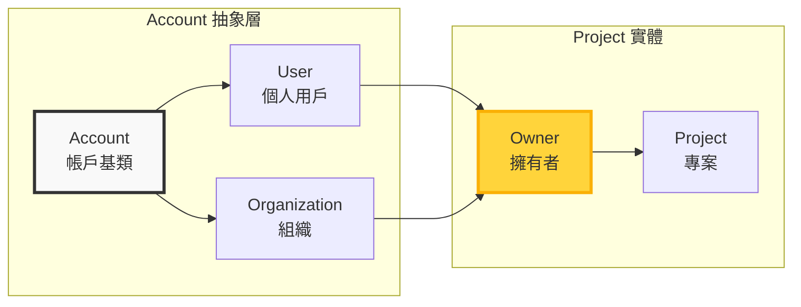
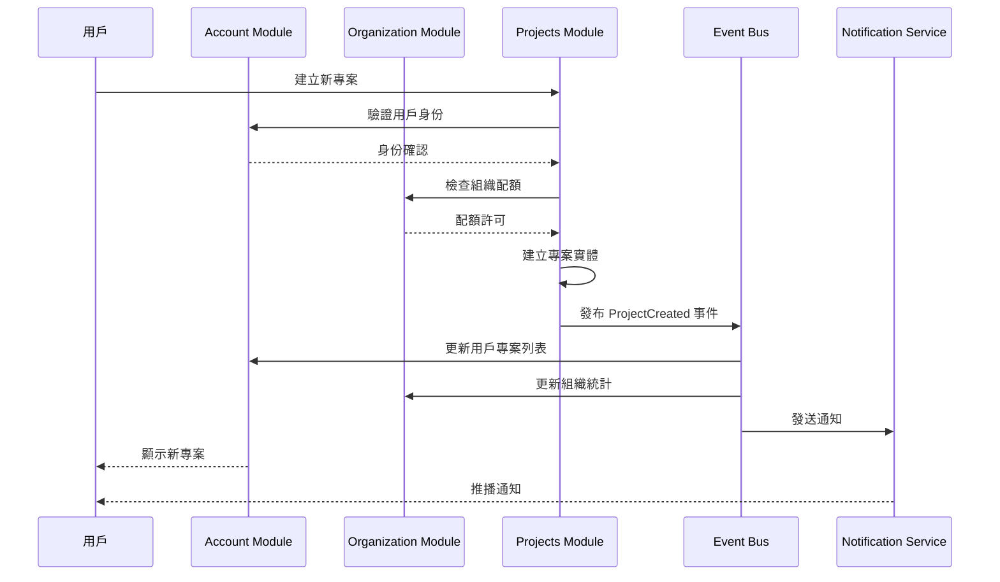
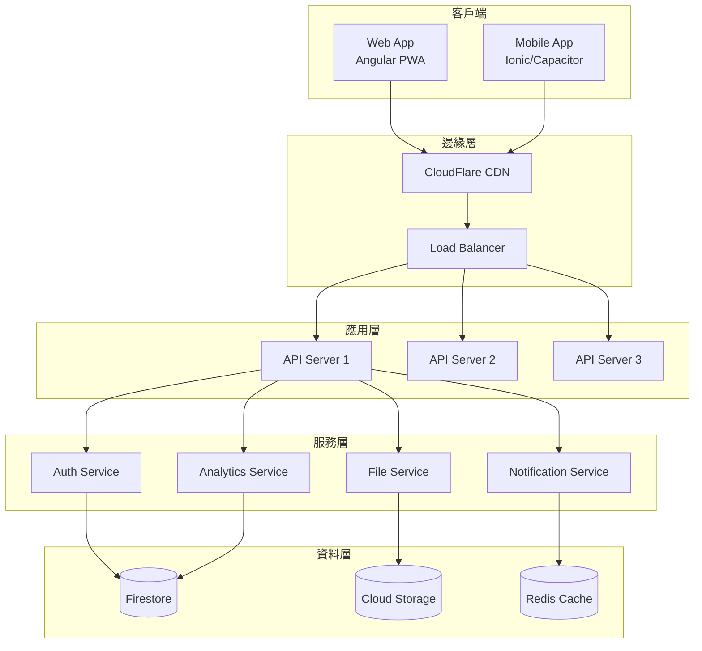

# 統一架構圖 (Unified Architecture Diagram)

## 系統總覽

營建管理系統採用領域驅動設計 (Domain-Driven Design, DDD) 架構，結合現代 Angular 20 技術棧，構建完整的營建專案管理平台。系統透過三個核心模組（帳戶模組、組織模組、專案模組）提供完整的功能支援。

## 核心架構概念

### Account 作為統一身份層
- **Account** 是所有實體的基礎抽象層
- **User**（個人用戶）和 **Organization**（組織）都繼承自 Account
- 實現了 Account ↔ Project 的擁有關係
- 支援個人或組織作為專案擁有者

## 整體系統架構圖

```mermaid
graph TB
    subgraph "展示層 (Presentation Layer)"
        subgraph "Account UI Components"
            AUI1[Profile Manager<br/>個人檔案管理]
            AUI2[Starred Projects<br/>星標專案]
            AUI3[Following System<br/>追蹤系統]
            AUI4[Achievements<br/>成就系統]
            AUI5[Notifications<br/>通知中心]
            AUI6[Team Viewer<br/>團隊檢視]
        end
        
        subgraph "Organization UI Components"
            OUI1[Org Dashboard<br/>組織儀表板]
            OUI2[Member Manager<br/>成員管理]
            OUI3[Team Manager<br/>團隊管理]
            OUI4[License Manager<br/>執照管理]
            OUI5[Billing Portal<br/>帳務入口]
        end
        
        subgraph "Projects UI Components"
            PUI1[Project Dashboard<br/>專案儀表板]
            PUI2[Task Board<br/>任務看板]
            PUI3[Document Center<br/>文件中心]
            PUI4[Progress Tracker<br/>進度追蹤]
            PUI5[Cost Controller<br/>成本控制]
            PUI6[Site Manager<br/>現場管理]
        end
    end
    
    subgraph "應用層 (Application Layer)"
        subgraph "Account Services"
            AS1[Account Service<br/>帳戶服務]
            AS2[Auth Service<br/>認證服務]
            AS3[Profile Service<br/>個人檔案服務]
            AS4[Social Service<br/>社交功能服務]
            AS5[Achievement Service<br/>成就服務]
        end
        
        subgraph "Organization Services"
            OS1[Org Service<br/>組織服務]
            OS2[Member Service<br/>成員服務]
            OS3[Team Service<br/>團隊服務]
            OS4[License Service<br/>執照服務]
            OS5[Billing Service<br/>帳務服務]
        end
        
        subgraph "Projects Services"
            PS1[Project Service<br/>專案服務]
            PS2[Task Service<br/>任務服務]
            PS3[Document Service<br/>文件服務]
            PS4[Progress Service<br/>進度服務]
            PS5[Cost Service<br/>成本服務]
            PS6[Site Service<br/>現場服務]
        end
        
        subgraph "Cross-Module Services"
            CMS1[Event Bus<br/>事件匯流排]
            CMS2[Notification Hub<br/>通知中樞]
            CMS3[Permission Manager<br/>權限管理]
            CMS4[File Storage<br/>檔案儲存]
            CMS5[Analytics Engine<br/>分析引擎]
        end
    end
    
    subgraph "領域層 (Domain Layer)"
        subgraph "Account Domain"
            AD1[Account Aggregate<br/>帳戶聚合根]
            AD2[User Entity<br/>用戶實體]
            AD3[Organization Entity<br/>組織實體]
            AD4[Profile Value Object<br/>個人檔案值物件]
            AD5[Achievement Entity<br/>成就實體]
            AD6[Following Entity<br/>追蹤實體]
        end
        
        subgraph "Organization Domain"
            OD1[Org Aggregate<br/>組織聚合根]
            OD2[Member Entity<br/>成員實體]
            OD3[Team Entity<br/>團隊實體]
            OD4[Role Value Object<br/>角色值物件]
            OD5[License Entity<br/>執照實體]
        end
        
        subgraph "Projects Domain"
            PD1[Project Aggregate<br/>專案聚合根]
            PD2[Owner Entity<br/>擁有者實體]
            PD3[Task Entity<br/>任務實體]
            PD4[Milestone Entity<br/>里程碑實體]
            PD5[Document Entity<br/>文件實體]
            PD6[Cost Entity<br/>成本實體]
        end
        
        subgraph "Shared Domain"
            SD1[Permission Entity<br/>權限實體]
            SD2[Notification Entity<br/>通知實體]
            SD3[File Entity<br/>檔案實體]
            SD4[Audit Entity<br/>稽核實體]
        end
    end
    
    subgraph "基礎設施層 (Infrastructure Layer)"
        subgraph "Data Persistence"
            DB1[(Firestore<br/>Users Collection)]
            DB2[(Firestore<br/>Organizations Collection)]
            DB3[(Firestore<br/>Projects Collection)]
            DB4[(Cloud Storage<br/>Files & Media)]
            DB5[(Firestore<br/>Audit Logs)]
        end
        
        subgraph "External Services"
            EXT1[Firebase Auth<br/>身份驗證]
            EXT2[Cloud Functions<br/>雲端函數]
            EXT3[FCM<br/>推播通知]
            EXT4[SendGrid<br/>郵件服務]
            EXT5[Twilio<br/>簡訊服務]
            EXT6[Google Maps<br/>地圖服務]
        end
        
        subgraph "Event Infrastructure"
            EVENT1[Event Bus<br/>事件匯流排]
            EVENT2[Event Store<br/>事件儲存]
            EVENT3[Message Queue<br/>訊息佇列]
            EVENT4[Event Processor<br/>事件處理器]
        end
    end
    
    %% 展示層到應用層連接
    AUI1 --> AS1
    AUI2 --> AS4
    AUI3 --> AS4
    AUI4 --> AS5
    AUI5 --> CMS2
    AUI6 --> AS1
    
    OUI1 --> OS1
    OUI2 --> OS2
    OUI3 --> OS3
    OUI4 --> OS4
    OUI5 --> OS5
    
    PUI1 --> PS1
    PUI2 --> PS2
    PUI3 --> PS3
    PUI4 --> PS4
    PUI5 --> PS5
    PUI6 --> PS6
    
    %% 應用層到領域層連接
    AS1 --> AD1
    AS2 --> AD1
    AS3 --> AD4
    AS4 --> AD6
    AS5 --> AD5
    
    OS1 --> OD1
    OS2 --> OD2
    OS3 --> OD3
    OS4 --> OD5
    OS5 --> OD1
    
    PS1 --> PD1
    PS1 --> PD2
    PS2 --> PD3
    PS3 --> PD5
    PS4 --> PD4
    PS5 --> PD6
    
    %% 跨模組服務連接
    CMS1 --> EVENT1
    CMS2 --> SD2
    CMS3 --> SD1
    CMS4 --> SD3
    CMS5 --> SD4
    
    %% 領域層到基礎設施層連接
    AD1 --> DB1
    OD1 --> DB2
    PD1 --> DB3
    SD3 --> DB4
    SD4 --> DB5
    
    %% 外部服務連接
    AS2 --> EXT1
    CMS2 --> EXT3
    CMS2 --> EXT4
    CMS2 --> EXT5
    PS6 --> EXT6
    
    %% 事件流連接
    EVENT1 --> EVENT2
    EVENT1 --> EVENT3
    EVENT3 --> EVENT4
    
    %% 樣式設定
    style AD1 fill:#ff6b6b,stroke:#c92a2a,stroke-width:3px
    style AD2 fill:#ff8787,stroke:#c92a2a,stroke-width:2px
    style AD3 fill:#ff8787,stroke:#c92a2a,stroke-width:2px
    style PD2 fill:#ffd43b,stroke:#fab005,stroke-width:3px
```



## 核心關係圖

### Account-Project 擁有關係



## 模組間事件流架構



## 技術架構實作

### Angular 20 現代化架構

```typescript
// 基礎 Account 服務實作
@Injectable({
  providedIn: 'root'
})
export class AccountService {
  // 使用 Signal 進行狀態管理
  private readonly _currentAccount = signal<Account | null>(null);
  private readonly _accountType = signal<'user' | 'organization' | null>(null);
  
  // 公開的只讀 signals
  readonly currentAccount = this._currentAccount.asReadonly();
  readonly accountType = this._accountType.asReadonly();
  readonly isAuthenticated = computed(() => !!this.currentAccount());
  
  // 依賴注入
  private readonly auth = inject(Auth);
  private readonly firestore = inject(Firestore);
  private readonly eventBus = inject(EventBusService);
  
  constructor() {
    // 監聽認證狀態變化
    effect(() => {
      const user = this.auth.currentUser;
      if (user) {
        this.loadAccountData(user.uid);
      } else {
        this._currentAccount.set(null);
        this._accountType.set(null);
      }
    });
  }
  
  async switchToOrganization(orgId: string): Promise<void> {
    const org = await this.getOrganization(orgId);
    this._currentAccount.set(org);
    this._accountType.set('organization');
    
    // 發布事件
    this.eventBus.publish(new AccountSwitchedEvent(org));
  }
  
  async createProject(projectData: CreateProjectDto): Promise<Project> {
    const account = this.currentAccount();
    if (!account) {
      throw new UnauthorizedException();
    }
    
    // 建立專案並設定擁有者
    const project = new Project({
      ...projectData,
      ownerId: account.id,
      ownerType: this.accountType()
    });
    
    // 儲存到 Firestore
    await this.saveProject(project);
    
    // 發布事件
    this.eventBus.publish(new ProjectCreatedEvent(project, account));
    
    return project;
  }
}
```

### 跨模組權限管理

```typescript
// 統一權限服務
@Injectable({
  providedIn: 'root'
})
export class PermissionService {
  private readonly accountService = inject(AccountService);
  private readonly cache = inject(CacheService);
  
  // 權限檢查的 computed signal
  readonly permissions = computed(() => {
    const account = this.accountService.currentAccount();
    if (!account) return [];
    
    return this.getAccountPermissions(account);
  });
  
  hasPermission(permission: string): boolean {
    return this.permissions().includes(permission);
  }
  
  async checkProjectAccess(projectId: string, requiredRole: ProjectRole): Promise<boolean> {
    const account = this.accountService.currentAccount();
    if (!account) return false;
    
    // 檢查是否為專案擁有者
    const project = await this.getProject(projectId);
    if (project.ownerId === account.id) {
      return true;
    }
    
    // 檢查團隊成員權限
    const teamMembership = await this.getTeamMembership(account.id, projectId);
    return teamMembership?.role >= requiredRole;
  }
}
```

### 事件驅動整合

```typescript
// 跨模組事件定義
export class ProjectCreatedEvent extends DomainEvent {
  constructor(
    public readonly project: Project,
    public readonly owner: Account
  ) {
    super('ProjectCreated');
  }
}

// 事件處理器
@Injectable()
export class ProjectEventHandlers {
  constructor(
    private readonly accountService: AccountService,
    private readonly orgService: OrganizationService,
    private readonly notificationService: NotificationService
  ) {}
  
  @EventHandler('ProjectCreated')
  async handleProjectCreated(event: ProjectCreatedEvent): Promise<void> {
    // 平行執行多個操作
    await Promise.all([
      this.updateOwnerProjects(event),
      this.updateOrganizationStats(event),
      this.sendNotifications(event),
      this.grantAchievements(event)
    ]);
  }
  
  private async updateOwnerProjects(event: ProjectCreatedEvent): Promise<void> {
    if (event.owner.type === 'user') {
      await this.accountService.addProjectToUser(event.owner.id, event.project.id);
    } else {
      await this.orgService.addProjectToOrganization(event.owner.id, event.project.id);
    }
  }
}
```

## 資料模型設計

### Account 階層結構

```typescript
// Account 基礎介面
interface Account {
  id: string;
  type: 'user' | 'organization';
  name: string;
  email: string;
  createdAt: Date;
  updatedAt: Date;
  status: AccountStatus;
}

// User 實作
interface User extends Account {
  type: 'user';
  profile: UserProfile;
  starredProjects: string[];
  following: string[];
  achievements: Achievement[];
  teams: TeamMembership[];
  organizationMemberships: OrganizationMembership[];
}

// Organization 實作
interface Organization extends Account {
  type: 'organization';
  profile: OrganizationProfile;
  members: Member[];
  teams: Team[];
  licenses: License[];
  billingInfo: BillingInfo;
  projectQuota: number;
}

// Project 擁有者關係
interface Project {
  id: string;
  name: string;
  ownerId: string;           // Account ID
  ownerType: 'user' | 'organization';
  // ... 其他專案屬性
}
```

## 部署架構



## 效能優化策略

### 1. 快取架構
- 使用 Redis 快取熱門資料
- 實作多層快取策略
- Signal-based 響應式快取

### 2. 載入優化
- 懶載入模組
- 預載入策略
- 虛擬滾動實作

### 3. 資料同步
- 即時資料同步使用 WebSocket
- 批次更新減少請求次數
- 樂觀更新提升體驗

## 安全架構

### 1. 身份驗證
- Firebase Auth 整合
- JWT Token 管理
- 多因素認證支援

### 2. 授權管理
- 基於角色的存取控制 (RBAC)
- 細粒度權限管理
- 動態權限載入

### 3. 資料保護
- 端對端加密
- 資料遮罩
- 稽核日誌

## 監控與維運

### 1. 應用監控
- 效能指標追蹤
- 錯誤日誌收集
- 用戶行為分析

### 2. 基礎設施監控
- 服務健康檢查
- 資源使用監控
- 自動擴展策略

### 3. 業務監控
- 關鍵業務指標
- 異常檢測
- 預警機制