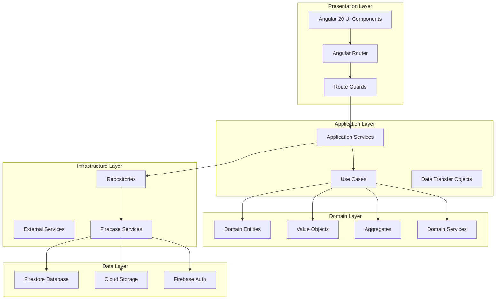

# 架構概覽 (Architecture Overview)

## 系統架構圖



## 架構層級說明

### 1. 展示層 (Presentation Layer)
- **技術**: Angular 20 + ng-alain + ng-zorro-antd
- **職責**: 用戶介面、用戶交互、資料展示
- **特點**: 
  - Standalone Components
  - Signal-based 狀態管理
  - 現代控制流程 (@if, @for, @switch)
  - 響應式設計

### 2. 應用層 (Application Layer)
- **職責**: 協調業務用例、處理應用邏輯
- **組件**:
  - Application Services
  - Use Cases
  - DTOs
  - Command/Query Handlers

### 3. 領域層 (Domain Layer)
- **職責**: 核心業務邏輯、業務規則
- **組件**:
  - Domain Entities
  - Value Objects
  - Aggregates
  - Domain Services
  - Domain Events

### 4. 基礎設施層 (Infrastructure Layer)
- **職責**: 外部服務整合、資料存取
- **組件**:
  - Repositories
  - External Services
  - Firebase Services
  - Message Queues

### 5. 資料層 (Data Layer)
- **技術**: Firebase (Firestore, Storage, Auth)
- **職責**: 資料持久化、外部服務

## 模組架構

### 功能模組
```typescript
const MODULE_ARCHITECTURE = {
  'user-module': {
    purpose: '個人用戶管理',
    features: ['認證', '個人檔案', '偏好設定', '個人成就'],
    dependencies: ['shared-module', 'domain-layer']
  },
  
  'organization-module': {
    purpose: '組織管理',
    features: ['組織建立', '成員管理', '團隊管理', '權限控制'],
    dependencies: ['shared-module', 'domain-layer']
  },
  
  'project-module': {
    purpose: '專案管理',
    features: ['專案生命週期', '任務管理', '成本控制', '文件管理'],
    dependencies: ['shared-module', 'user-module', 'organization-module']
  },
  
  'social-module': {
    purpose: '社交功能',
    features: ['追蹤關係', '推薦系統', '社交互動', '星標專案'],
    dependencies: ['shared-module', 'user-module', 'organization-module', 'project-module']
  },
  
  'achievement-module': {
    purpose: '成就系統',
    features: ['徽章系統', '排行榜', '成就規則', '計分系統'],
    dependencies: ['shared-module', 'user-module', 'organization-module', 'project-module']
  },
  
  'notification-module': {
    purpose: '通知系統',
    features: ['通知通道', '通知模板', '偏好設定', '通知歷史'],
    dependencies: ['shared-module', 'user-module', 'organization-module', 'project-module']
  },
  
  'shared-module': {
    purpose: '共享組件和服務',
    features: ['UI 組件', '工具函數', '通用服務', '設計系統'],
    dependencies: ['ng-alain', 'ng-zorro-antd']
  }
};
```

## 資料流架構

### 1. 單向資料流
```
User Action → Component → Service → State → UI Update
```

### 2. 狀態管理架構
```typescript
const STATE_ARCHITECTURE = {
  'Global State': {
    technology: 'NgRx Store',
    scope: ['用戶認證', '應用設定', '主題配置']
  },
  
  'Module State': {
    technology: 'Angular Signals',
    scope: ['模組內部狀態', '業務邏輯狀態']
  },
  
  'Component State': {
    technology: 'Local Signals',
    scope: ['表單狀態', 'UI 交互狀態']
  },
  
  'Async State': {
    technology: 'RxJS Observables',
    scope: ['API 調用', 'WebSocket 連接']
  }
};
```

## 安全架構

### 1. 認證流程
```
Login → Firebase Auth → JWT Token → Route Guard → Component Access
```

### 2. 授權架構
```
User Role → ACL Service → Permission Check → Feature Access
```

### 3. 資料安全
- 前端驗證 + 後端驗證
- 敏感資料加密
- HTTPS 傳輸
- CORS 配置

## 效能架構

### 1. 載入策略
- 路由懶加載
- 組件懶加載 (@defer)
- 圖片懶加載
- 代碼分割

### 2. 快取策略
- HTTP 快取
- 本地儲存快取
- 記憶體快取
- CDN 快取

### 3. 優化策略
- OnPush 變更檢測
- 虛擬滾動
- 分頁載入
- 預載入

## 部署架構

### 1. 前端部署
- Angular 建置 (ng build)
- 靜態檔案部署
- CDN 分發
- 環境配置

### 2. 後端服務
- Firebase Functions
- Firestore Database
- Cloud Storage
- Authentication

### 3. 監控和日誌
- Firebase Analytics
- Error Tracking
- Performance Monitoring
- User Analytics

## 擴展性設計

### 1. 水平擴展
- 微服務架構思維
- 模組化設計
- 獨立部署能力

### 2. 垂直擴展
- 組件可重用性
- 服務可配置性
- 主題可定制性

### 3. 功能擴展
- 插件架構
- 事件驅動
- 配置驅動

## 相關文件
- [設計原則](./Design Principles.md)
- [技術棧標準](./Technology Stack.md)
- [狀態管理策略](./State Management Strategy.md)
- [安全策略](./Security Strategy.md)
- [效能策略](./Performance Strategy.md)
