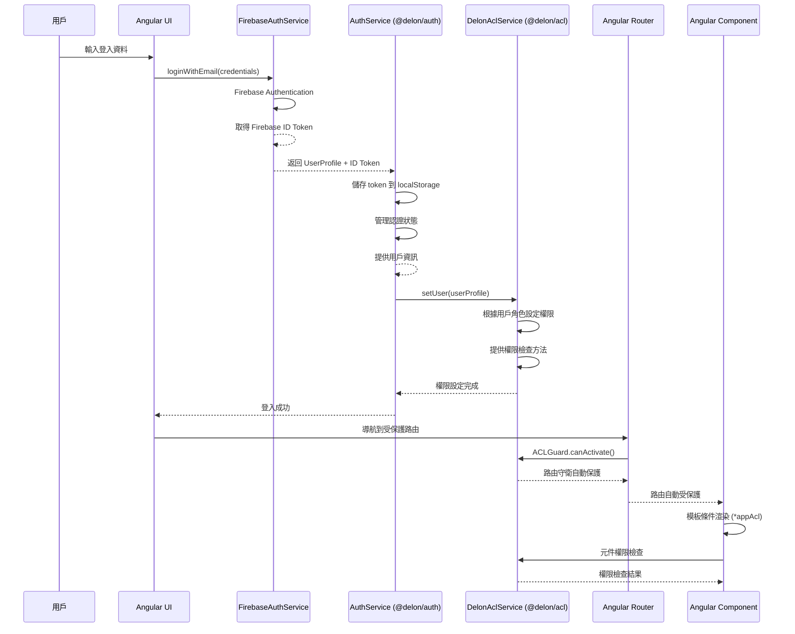

# 認證串接流程策略 (Authentication Flow Strategy)

## 概述
本文件定義了完整的認證串接流程，包含 Firebase Authentication、@delon/auth、@delon/acl 和 Angular 應用的整合設計。

## 認證架構圖



## 四層認證架構

### 1. Firebase Authentication (第一層)
**職責**: 用戶身份驗證和 Token 管理

```typescript
@Injectable()
export class FirebaseAuthService {
  constructor(private firebaseAuth: Auth) {}

  // 電子郵件登入
  async loginWithEmail(credentials: LoginCredentials): Promise<FirebaseUser> {
    try {
      const userCredential = await signInWithEmailAndPassword(
        this.firebaseAuth,
        credentials.email,
        credentials.password
      );
      
      // 取得 ID Token
      const idToken = await userCredential.user.getIdToken();
      
      // 取得用戶資料
      const userProfile = await this.getUserProfile(userCredential.user.uid);
      
      return {
        uid: userCredential.user.uid,
        email: userCredential.user.email!,
        idToken,
        profile: userProfile
      };
    } catch (error) {
      throw new Error(`Login failed: ${error.message}`);
    }
  }

  // 取得用戶資料
  private async getUserProfile(uid: string): Promise<UserProfile> {
    // 從 Firestore 載入用戶詳細資料
    const userDoc = await getDoc(doc(this.firestore, 'users', uid));
    return userDoc.data() as UserProfile;
  }

  // 登出
  async logout(): Promise<void> {
    await signOut(this.firebaseAuth);
  }

  // Token 刷新
  async refreshToken(): Promise<string> {
    const user = this.firebaseAuth.currentUser;
    if (!user) {
      throw new Error('No authenticated user');
    }
    return await user.getIdToken(true);
  }
}
```

### 2. @delon/auth (第二層)
**職責**: 認證狀態管理和 Token 儲存

```typescript
@Injectable()
export class AuthService {
  constructor(
    private tokenService: ITokenService,
    private authConfig: DelonAuthConfig,
    private http: HttpClient
  ) {}

  // 登入處理
  async login(credentials: LoginCredentials): Promise<AuthResult> {
    try {
      // 1. Firebase 認證
      const firebaseUser = await this.firebaseAuthService.loginWithEmail(credentials);
      
      // 2. 儲存 Token
      const token = {
        token: firebaseUser.idToken,
        refresh_token: firebaseUser.refreshToken,
        expires_in: firebaseUser.expiresIn,
        token_type: 'Bearer'
      };
      this.tokenService.set(token);
      
      // 3. 設定認證狀態
      this.setAuthState({
        isAuthenticated: true,
        user: firebaseUser.profile,
        token: firebaseUser.idToken
      });
      
      // 4. 設定 ACL 權限
      await this.setupUserPermissions(firebaseUser.profile);
      
      return {
        success: true,
        user: firebaseUser.profile,
        token: firebaseUser.idToken
      };
    } catch (error) {
      this.setAuthState({ isAuthenticated: false, user: null, token: null });
      throw error;
    }
  }

  // 設定用戶權限
  private async setupUserPermissions(user: UserProfile): Promise<void> {
    const permissions = await this.getUserPermissions(user.id);
    this.aclService.setUser(user, permissions);
  }

  // 取得用戶權限
  private async getUserPermissions(userId: string): Promise<string[]> {
    // 從後端 API 取得用戶權限
    const response = await this.http.get<PermissionResponse>(`/api/users/${userId}/permissions`).toPromise();
    return response.permissions;
  }

  // 登出處理
  async logout(): Promise<void> {
    // 1. Firebase 登出
    await this.firebaseAuthService.logout();
    
    // 2. 清除 Token
    this.tokenService.clear();
    
    // 3. 清除認證狀態
    this.setAuthState({ isAuthenticated: false, user: null, token: null });
    
    // 4. 清除 ACL 權限
    this.aclService.clear();
  }

  // 檢查認證狀態
  isAuthenticated(): boolean {
    return this.tokenService.valid() && this.getAuthState().isAuthenticated;
  }

  // 取得當前用戶
  getCurrentUser(): UserProfile | null {
    return this.getAuthState().user;
  }
}
```

### 3. @delon/acl (第三層)
**職責**: 權限控制和路由保護

```typescript
@Injectable()
export class ACLService {
  constructor(private acl: ACLService) {}

  // 設定用戶權限
  setUser(user: UserProfile, permissions: string[]): void {
    this.acl.setUser({
      id: user.id,
      name: user.displayName,
      email: user.email,
      avatar: user.avatar,
      roles: user.roles,
      permissions: permissions
    });
  }

  // 檢查權限
  can(permission: string): boolean {
    return this.acl.can(permission);
  }

  // 檢查角色
  hasRole(role: string): boolean {
    return this.acl.hasRole(role);
  }

  // 檢查多個權限 (AND 邏輯)
  canAll(permissions: string[]): boolean {
    return permissions.every(permission => this.can(permission));
  }

  // 檢查多個權限 (OR 邏輯)
  canAny(permissions: string[]): boolean {
    return permissions.some(permission => this.can(permission));
  }

  // 清除權限
  clear(): void {
    this.acl.clear();
  }
}

// 路由守衛
export const aclGuard: CanActivateFn = (route, state) => {
  const aclService = inject(ACLService);
  const router = inject(Router);
  
  const requiredPermission = route.data?.['permission'] as string;
  const requiredRole = route.data?.['role'] as string;
  
  // 檢查權限
  if (requiredPermission && !aclService.can(requiredPermission)) {
    return router.parseUrl('/403');
  }
  
  // 檢查角色
  if (requiredRole && !aclService.hasRole(requiredRole)) {
    return router.parseUrl('/403');
  }
  
  return true;
};
```

### 4. Angular 應用 (第四層)
**職責**: 路由保護和模板權限控制

```typescript
// 路由配置
export const routes: Routes = [
  {
    path: 'account',
    loadChildren: () => import('./account/account.module').then(m => m.AccountModule),
    canActivate: [authGuard, aclGuard],
    data: { permission: 'account:read' }
  },
  {
    path: 'projects',
    loadChildren: () => import('./projects/projects.module').then(m => m.ProjectsModule),
    canActivate: [authGuard, aclGuard],
    data: { permission: 'projects:read' }
  },
  {
    path: 'admin',
    loadChildren: () => import('./admin/admin.module').then(m => m.AdminModule),
    canActivate: [authGuard, aclGuard],
    data: { role: 'admin' }
  }
];

// 認證守衛
export const authGuard: CanActivateFn = (route, state) => {
  const authService = inject(AuthService);
  const router = inject(Router);
  
  if (authService.isAuthenticated()) {
    return true;
  }
  
  return router.parseUrl('/auth/login');
};
```

## 模板權限控制

### 1. 指令使用
```html
<!-- 基於權限顯示 -->
<button *appAcl="'projects:create'">建立專案</button>

<!-- 基於角色顯示 -->
<div *appAcl="'admin'">管理員功能</div>

<!-- 多權限檢查 (AND) -->
<button *appAcl="['projects:create', 'projects:write']">建立專案</button>

<!-- 多權限檢查 (OR) -->
<div *appAcl="'projects:read|projects:write'">專案相關功能</div>
```

### 2. 組件權限檢查
```typescript
@Component({
  selector: 'app-project-list',
  template: `
    <button 
      *ngIf="canCreateProject()" 
      (click)="createProject()">
      建立專案
    </button>
  `
})
export class ProjectListComponent {
  constructor(private aclService: ACLService) {}

  canCreateProject(): boolean {
    return this.aclService.can('projects:create');
  }

  canEditProject(project: Project): boolean {
    return this.aclService.can('projects:write') && 
           project.ownerId === this.getCurrentUserId();
  }
}
```

## 權限設計

### 1. 權限矩陣
```typescript
const PERMISSION_MATRIX = {
  'account': {
    'read': ['user', 'admin'],
    'write': ['user', 'admin'],
    'delete': ['admin']
  },
  'projects': {
    'read': ['user', 'admin', 'project_manager'],
    'write': ['admin', 'project_manager'],
    'create': ['admin', 'project_manager'],
    'delete': ['admin']
  },
  'organizations': {
    'read': ['user', 'admin', 'org_manager'],
    'write': ['admin', 'org_manager'],
    'create': ['admin'],
    'delete': ['admin']
  }
};
```

### 2. 角色定義
```typescript
const ROLES = {
  'admin': {
    description: '系統管理員',
    permissions: ['*'] // 所有權限
  },
  'org_manager': {
    description: '組織管理員',
    permissions: ['organizations:*', 'projects:*', 'account:read']
  },
  'project_manager': {
    description: '專案經理',
    permissions: ['projects:*', 'account:read']
  },
  'user': {
    description: '一般用戶',
    permissions: ['account:read', 'account:write', 'projects:read']
  }
};
```

## 安全考量

### 1. Token 安全
- 使用 HTTPS 傳輸
- Token 過期自動刷新
- 安全的 Token 儲存 (localStorage)
- 登出時清除所有 Token

### 2. 權限驗證
- 前端權限檢查僅為 UI 控制
- 後端 API 必須驗證權限
- 敏感操作需要額外確認

### 3. 會話管理
- 自動登出機制
- 多設備登入控制
- 會話超時處理

## 相關文件
- [設計原則](./Design Principles.md)
- [安全策略](./Security Strategy.md)
- [狀態管理策略](./State Management Strategy.md)
- [路由策略](./Routing Strategy.md)
