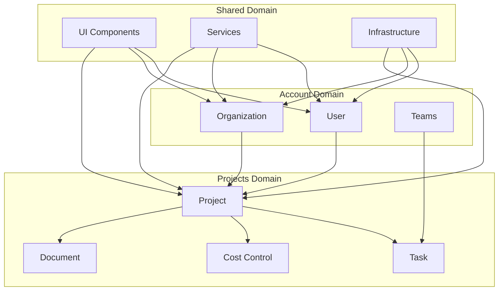

# 領域驅動設計策略 (Domain-Driven Design Strategy)

## 概述
本文件定義了基於 DDD 的系統架構策略，將系統劃分為三個核心領域，每個領域都有清晰的邊界和職責。

## 三個核心領域

### 1. Account 領域 (帳戶抽象層)
**職責**: 用戶身份、權限管理和組織結構

#### 1.1 User 子領域 (個人用戶)
- **目標用戶**: 工程師、監工、承包商
- **核心實體**:
  - `UserProfile`: 個人資料 + 專業證照
  - `StarredProjects`: 星標專案
  - `Following`: 追蹤的用戶/組織
  - `Achievements`: 成就徽章
  - `Notifications`: 通知中心
  - `TeamMemberships`: 所屬團隊
  - `OrganizationMemberships`: 加入的組織

#### 1.2 Organization 子領域 (組織)
- **目標用戶**: 營造公司、建設公司
- **核心實體**:
  - `OrganizationProfile`: 組織資料 + 營業執照
  - `OrganizationMembers`: 組織成員
  - `Teams`: 團隊 (工務組/安全組/品管組)

### 2. Projects 領域 (專案管理)
**職責**: 專案生命週期、任務管理和成本控制

#### 2.1 核心子領域
- **Project Management**: 專案建立、規劃、執行、監控
- **Task Management**: 任務分配、追蹤、完成
- **Cost Control**: 預算管理、成本控制、財務報告
- **Document Management**: 文件管理、版本控制
- **Team Collaboration**: 團隊協作、溝通、報告

### 3. Shared 領域 (共享基礎設施)
**職責**: 跨領域共享功能和基礎設施

#### 3.1 核心子領域
- **UI Components**: 可重用 UI 組件
- **Services**: 通用服務和工具
- **Infrastructure**: 基礎設施和外部服務整合
- **Security**: 認證、授權、安全策略
- **Notifications**: 通知系統
- **File Management**: 檔案上傳、儲存、管理

## 領域邊界和上下文

### 領域間關係


### 上下文映射
- **Account ↔ Projects**: 用戶參與專案，組織擁有專案
- **Account ↔ Shared**: 共享 UI 組件和服務
- **Projects ↔ Shared**: 共享基礎設施和工具

## 領域模型設計原則

### 1. 聚合根 (Aggregate Roots)
```typescript
const AGGREGATE_ROOTS = {
  'Account Domain': {
    'UserAggregate': {
      root: 'User',
      entities: ['UserProfile', 'Achievements', 'Notifications'],
      invariants: ['用戶資料完整性', '通知一致性']
    },
    'OrganizationAggregate': {
      root: 'Organization',
      entities: ['OrganizationProfile', 'Members', 'Teams'],
      invariants: ['組織資料完整性', '成員權限一致性']
    }
  },
  
  'Projects Domain': {
    'ProjectAggregate': {
      root: 'Project',
      entities: ['ProjectInfo', 'Tasks', 'Documents', 'Costs'],
      invariants: ['專案狀態一致性', '成本控制規則']
    }
  }
};
```

### 2. 值對象 (Value Objects)
```typescript
const VALUE_OBJECTS = {
  'Account Domain': [
    'Email', 'PhoneNumber', 'ProfessionalLicense',
    'Role', 'Permission', 'NotificationType'
  ],
  'Projects Domain': [
    'ProjectStatus', 'TaskPriority', 'CostAmount',
    'DocumentType', 'MilestoneDate'
  ],
  'Shared Domain': [
    'FileMetadata', 'SecurityToken', 'AuditInfo'
  ]
};
```

### 3. 領域服務 (Domain Services)
```typescript
const DOMAIN_SERVICES = {
  'Account Domain': [
    'UserRegistrationService',
    'PermissionValidationService',
    'OrganizationMembershipService'
  ],
  'Projects Domain': [
    'ProjectLifecycleService',
    'TaskAssignmentService',
    'CostCalculationService'
  ],
  'Shared Domain': [
    'NotificationService',
    'FileUploadService',
    'SecurityService'
  ]
};
```

## 模組對應關係

### Angular 模組映射
```typescript
const MODULE_MAPPING = {
  'user-module': {
    domain: 'User',
    subdomains: ['User Profile', 'Authentication', 'Personal Preferences'],
    features: [
      'user-profile', 'user-preferences', 'authentication', 'personal-achievements'
    ]
  },
  
  'organization-module': {
    domain: 'Organization',
    subdomains: ['Organization Management', 'Member Management', 'Team Management'],
    features: [
      'organization-management', 'member-management', 'team-management', 'billing'
    ]
  },
  
  'project-module': {
    domain: 'Project',
    subdomains: ['Project Management', 'Task Management', 'Cost Control'],
    features: [
      'project-lifecycle', 'task-management', 'cost-control',
      'document-management', 'team-collaboration', 'reporting'
    ]
  },
  
  'social-module': {
    domain: 'Social',
    subdomains: ['Relationships', 'Networking', 'Recommendations'],
    features: [
      'following', 'recommendations', 'social-interactions', 'starred-projects'
    ]
  },
  
  'achievement-module': {
    domain: 'Achievement',
    subdomains: ['Rules Engine', 'Badges', 'Leaderboards'],
    features: [
      'badges', 'leaderboards', 'achievement-rules', 'scoring-system'
    ]
  },
  
  'notification-module': {
    domain: 'Notification',
    subdomains: ['Channels', 'Templates', 'Preferences'],
    features: [
      'notification-channels', 'templates', 'preferences', 'notification-history'
    ]
  },
  
  'shared-module': {
    domain: 'Shared',
    subdomains: ['UI Components', 'Services', 'Infrastructure'],
    features: [
      'ui-components', 'common-services', 'file-management',
      'security-services', 'infrastructure-integration'
    ]
  }
};
```

## 資料模型設計

### Firestore 集合結構
```typescript
const FIRESTORE_COLLECTIONS = {
  'Account Domain': {
    'users': '用戶基本資料',
    'userProfiles': '用戶詳細資料',
    'organizations': '組織資料',
    'organizationMembers': '組織成員關係',
    'teams': '團隊資料',
    'teamMembers': '團隊成員關係',
    'achievements': '成就資料',
    'notifications': '通知資料'
  },
  
  'Projects Domain': {
    'projects': '專案基本資料',
    'projectTasks': '專案任務',
    'projectDocuments': '專案文件',
    'projectCosts': '專案成本',
    'projectMembers': '專案成員',
    'projectUpdates': '專案更新'
  },
  
  'Shared Domain': {
    'files': '檔案資料',
    'auditLogs': '審計日誌',
    'systemConfig': '系統配置'
  }
};
```

## 實作策略

### 1. 領域層實作
- 每個領域有獨立的 `domain-layer` 目錄
- 包含實體、值對象、聚合根、領域服務
- 不依賴外部框架，純業務邏輯

### 2. 應用層實作
- 每個領域有對應的應用服務
- 協調領域對象和外部服務
- 處理用例和命令/查詢

### 3. 基礎設施層實作
- 實作領域介面的具體實作
- 處理資料持久化和外部服務整合
- 包含 Repository 和 External Service 實作

### 4. 展示層實作
- Angular 模組對應領域邊界
- 每個模組專注於特定領域的功能
- 使用共享模組提供通用功能

## 測試策略

### 1. 領域層測試
- 單元測試覆蓋所有領域邏輯
- 測試業務規則和約束
- 模擬外部依賴

### 2. 應用層測試
- 整合測試驗證用例
- 測試領域服務協調
- 測試錯誤處理

### 3. 基礎設施層測試
- 測試 Repository 實作
- 測試外部服務整合
- 測試資料轉換

### 4. 展示層測試
- 組件單元測試
- 整合測試
- E2E 測試

## 相關文件
- [設計原則](./Design Principles.md)
- [架構概覽](./Architecture Overview.md)
- [技術棧標準](./Technology Stack.md)
- [狀態管理策略](./State Management Strategy.md)
