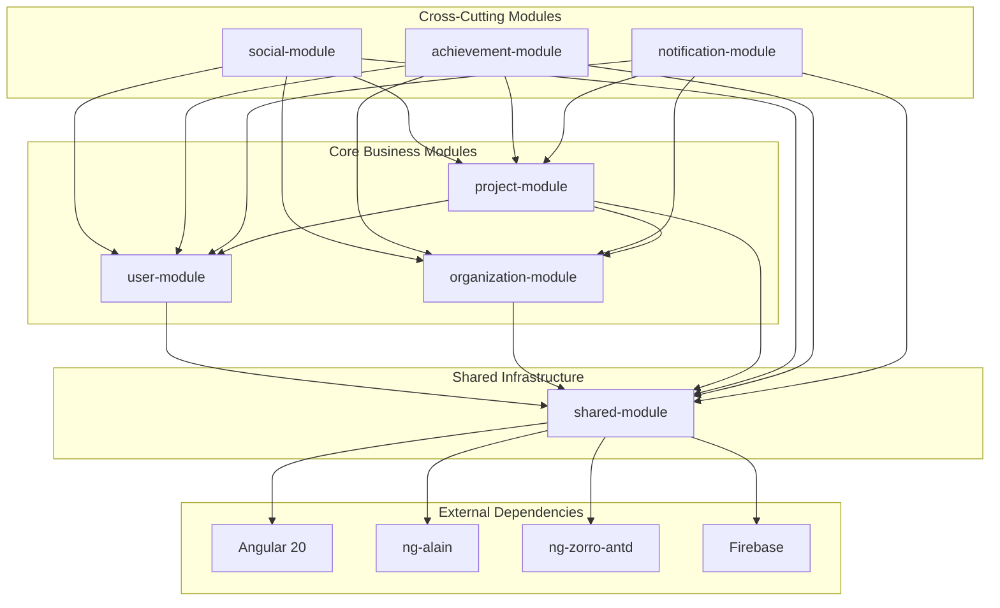

# 模組設計標準 (Module Design Standards)

## 概述
基於六個核心模組定義，制定統一的模組設計標準，確保每個模組都有清晰的職責和一致的結構。

## 模組職責定義

### 1. user-module (用戶模組)
**對應領域**: User Domain (個人用戶管理)

#### 1.1 模組職責
- 個人用戶身份管理和認證
- 個人資料和偏好設定
- 專業證照和技能管理
- 個人成就和進度追蹤

#### 1.2 子模組結構
```
user-module/
├── profile/                # 個人資料管理
│   ├── basic-info/        # 基本資料
│   ├── professional/      # 專業證照
│   └── preferences/       # 個人偏好
├── authentication/         # 身份認證
│   ├── login/             # 登入功能
│   ├── registration/      # 註冊功能
│   └── password/          # 密碼管理
├── achievements/           # 個人成就
│   ├── badges/            # 徽章系統
│   ├── progress/          # 進度追蹤
│   └── history/           # 成就歷史
└── shared/                # 用戶模組共享功能
    ├── guards/            # 用戶權限守衛
    ├── services/          # 用戶服務
    └── models/            # 用戶資料模型
```

#### 1.3 核心功能
- **用戶註冊/登入**: Firebase Authentication
- **個人資料管理**: 基本資料 + 專業證照
- **偏好設定**: 個人化配置
- **成就系統**: 個人徽章和進度追蹤

### 2. organization-module (組織模組)
**對應領域**: Organization Domain (組織管理)

#### 2.1 模組職責
- 組織結構和成員管理
- 團隊建立和分配
- 組織設定和權限管理
- 組織級別成就和統計

#### 2.2 子模組結構
```
organization-module/
├── management/             # 組織管理
│   ├── profile/           # 組織資料
│   ├── settings/          # 組織設定
│   └── billing/           # 帳務管理
├── members/               # 成員管理
│   ├── invitations/       # 邀請管理
│   ├── roles/             # 角色管理
│   └── permissions/       # 權限管理
├── teams/                 # 團隊管理
│   ├── creation/          # 團隊建立
│   ├── assignment/        # 團隊分配
│   └── collaboration/     # 團隊協作
└── shared/                # 組織模組共享功能
    ├── guards/            # 組織權限守衛
    ├── services/          # 組織服務
    └── models/            # 組織資料模型
```

#### 2.3 核心功能
- **組織建立**: 組織基本資料和設定
- **成員管理**: 邀請、角色、權限管理
- **團隊管理**: 團隊建立、分配、協作
- **組織統計**: 成員活動、專案統計

### 3. project-module (專案模組)
**對應領域**: Project Domain (專案管理)

#### 3.1 模組職責
- 專案生命週期管理
- 任務分配和追蹤
- 成本控制和預算管理
- 文件管理和版本控制
- 團隊協作和溝通

#### 3.2 子模組結構
```
project-module/
├── lifecycle/              # 專案生命週期
│   ├── creation/          # 專案建立
│   ├── planning/          # 專案規劃
│   ├── execution/         # 專案執行
│   └── closure/           # 專案結案
├── tasks/                 # 任務管理
│   ├── task-list/         # 任務列表
│   ├── assignments/       # 任務分配
│   └── tracking/          # 任務追蹤
├── cost-control/          # 成本控制
│   ├── budget/            # 預算管理
│   ├── actual-costs/      # 實際成本
│   └── forecasting/       # 成本預測
├── documents/             # 文件管理
│   ├── upload/            # 文件上傳
│   ├── versioning/        # 版本控制
│   └── sharing/           # 文件分享
├── collaboration/         # 團隊協作
│   ├── communication/     # 溝通工具
│   ├── reporting/         # 報告系統
│   └── meetings/          # 會議管理
└── shared/                # 專案模組共享功能
    ├── guards/            # 專案權限守衛
    ├── services/          # 專案服務
    └── models/            # 專案資料模型
```

#### 3.3 核心功能
- **專案建立**: 專案基本資料，團隊分配
- **任務管理**: 任務建立，分配，追蹤，完成
- **成本控制**: 預算設定，成本追蹤，差異分析
- **文件管理**: 文件上傳，版本控制，權限管理
- **團隊協作**: 即時溝通，進度報告，會議管理
- **專案監控**: 進度追蹤，風險管理，品質控制

### 4. social-module (社交模組)
**對應領域**: Social Domain (社交功能)

#### 4.1 模組職責
- 用戶關係管理
- 社交網絡建立
- 內容推薦系統
- 社交互動功能

#### 4.2 子模組結構
```
social-module/
├── relationships/          # 關係管理
│   ├── following/         # 追蹤關係
│   ├── followers/         # 粉絲關係
│   └── connections/       # 連結分析
├── networking/            # 社交網絡
│   ├── discovery/         # 用戶發現
│   ├── recommendations/   # 推薦系統
│   └── mutual/            # 共同連結
├── interactions/          # 社交互動
│   ├── likes/             # 點讚功能
│   ├── comments/          # 評論功能
│   └── shares/            # 分享功能
└── shared/                # 社交模組共享功能
    ├── services/          # 社交服務
    └── models/            # 社交資料模型
```

#### 4.3 核心功能
- **追蹤系統**: 追蹤用戶、組織、專案
- **推薦引擎**: 智能推薦用戶和內容
- **社交互動**: 點讚、評論、分享
- **網絡分析**: 社交關係圖譜分析

### 5. achievement-module (成就模組)
**對應領域**: Achievement Domain (成就系統)

#### 5.1 模組職責
- 成就規則引擎
- 徽章和獎勵系統
- 排行榜和競爭機制
- 成就分類和統計

#### 5.2 子模組結構
```
achievement-module/
├── rules-engine/          # 規則引擎
│   ├── triggers/          # 觸發條件
│   ├── conditions/        # 成就條件
│   └── scoring/           # 計分系統
├── badges/                # 徽章系統
│   ├── categories/        # 徽章分類
│   ├── design/            # 徽章設計
│   └── distribution/      # 徽章分發
├── leaderboards/          # 排行榜
│   ├── global/            # 全域排行榜
│   ├── organization/      # 組織排行榜
│   └── category/          # 分類排行榜
└── shared/                # 成就模組共享功能
    ├── services/          # 成就服務
    └── models/            # 成就資料模型
```

#### 5.3 核心功能
- **成就規則**: 自動化成就觸發和驗證
- **徽章系統**: 多層級徽章和獎勵
- **排行榜**: 多維度競爭和排名
- **成就統計**: 成就分析和報告

### 6. notification-module (通知模組)
**對應領域**: Notification Domain (通知系統)

#### 6.1 模組職責
- 多通道通知管理
- 通知模板和個性化
- 通知偏好設定
- 通知歷史和統計

#### 6.2 子模組結構
```
notification-module/
├── channels/              # 通知通道
│   ├── in-app/           # 應用內通知
│   ├── email/            # 郵件通知
│   ├── sms/              # 簡訊通知
│   └── push/             # 推送通知
├── templates/             # 通知模板
│   ├── system/           # 系統模板
│   ├── user/             # 用戶模板
│   └── organization/     # 組織模板
├── preferences/           # 偏好設定
│   ├── user/             # 用戶偏好
│   ├── organization/     # 組織偏好
│   └── project/          # 專案偏好
└── shared/                # 通知模組共享功能
    ├── services/          # 通知服務
    └── models/            # 通知資料模型
```

#### 6.3 核心功能
- **多通道通知**: 支援多種通知方式
- **模板管理**: 可自定義通知模板
- **偏好控制**: 細粒度通知偏好設定
- **通知歷史**: 完整的通知記錄和統計

### 7. shared-module (共享模組)
**對應領域**: Shared Domain (共享基礎設施)

#### 7.1 模組職責
- 可重用 UI 組件
- 通用服務和工具
- 基礎設施整合
- 安全服務

#### 7.2 子模組結構
```
shared-module/
├── components/             # UI 組件
│   ├── forms/             # 表單組件
│   ├── tables/            # 表格組件
│   ├── modals/            # 模態框組件
│   ├── charts/            # 圖表組件
│   └── layout/            # 佈局組件
├── services/              # 通用服務
│   ├── api/               # API 服務
│   ├── auth/              # 認證服務
│   ├── file/              # 檔案服務
│   └── util/              # 工具服務
├── directives/            # 指令
│   ├── validation/        # 驗證指令
│   ├── interaction/       # 交互指令
│   └── display/           # 顯示指令
├── pipes/                 # 管道
│   ├── formatting/        # 格式化管道
│   ├── filtering/         # 過濾管道
│   └── transformation/    # 轉換管道
└── models/                # 共享資料模型
    ├── interfaces/        # 介面定義
    ├── types/             # 型別定義
    └── constants/         # 常數定義
```

#### 7.3 核心功能
- **UI 組件庫**: 可重用的 Angular 組件
- **通用服務**: API 調用，認證，檔案等
- **工具函數**: 日期處理，字串處理，驗證等
- **基礎設施**: Firebase 整合，外部服務整合
- **安全服務**: 權限控制，資料驗證，加密

## 模組間依賴關係

### 依賴圖


### 依賴規則
1. **user-module** 可以依賴 **shared-module**
2. **organization-module** 可以依賴 **shared-module**
3. **project-module** 可以依賴 **shared-module**、**user-module** 和 **organization-module**
4. **social-module** 可以依賴 **shared-module** 和所有核心業務模組
5. **achievement-module** 可以依賴 **shared-module** 和所有核心業務模組
6. **notification-module** 可以依賴 **shared-module** 和所有核心業務模組
7. **shared-module** 不應依賴其他業務模組
8. 所有模組都可以依賴外部框架和服務

## 模組設計標準

### 1. 檔案結構標準
每個模組都應遵循以下結構：
```
{module-name}/
├── features/              # 功能實作
│   ├── {feature-name}/   # 具體功能
│   │   ├── components/   # 組件
│   │   ├── services/     # 服務
│   │   ├── models/       # 資料模型
│   │   └── routing/      # 路由配置
├── shared/               # 模組內共享
│   ├── components/       # 共享組件
│   ├── services/         # 共享服務
│   └── models/           # 共享模型
├── guards/               # 路由守衛
├── interceptors/         # HTTP 攔截器
├── models/               # 模組資料模型
├── services/             # 模組服務
└── {module-name}.module.ts
```

### 2. 命名規範
- **檔案**: kebab-case (`user-profile.component.ts`)
- **目錄**: kebab-case (`user-profile/`)
- **組件**: PascalCase (`UserProfileComponent`)
- **服務**: PascalCase + Service (`UserService`)
- **介面**: PascalCase + Interface (`UserInterface`)
- **常數**: UPPER_SNAKE_CASE (`API_ENDPOINTS`)

### 3. 狀態管理標準
```typescript
const STATE_MANAGEMENT_STANDARD = {
  'Global State': {
    technology: 'NgRx Store',
    scope: '跨模組共享狀態',
    examples: ['用戶認證', '應用設定', '主題配置']
  },
  
  'Module State': {
    technology: 'Angular Signals',
    scope: '模組內部狀態',
    examples: ['模組資料', 'UI 狀態', '業務邏輯狀態']
  },
  
  'Component State': {
    technology: 'Local Signals',
    scope: '組件內部狀態',
    examples: ['表單狀態', 'UI 交互', '臨時狀態']
  }
};
```

### 4. 路由配置標準
```typescript
const ROUTING_STANDARD = {
  'Route Structure': {
    pattern: '/{module}/{feature}/{action}',
    example: '/account/profile/edit',
    lazy: true
  },
  
  'Guards': {
    type: 'Function Guards',
    examples: ['authGuard', 'aclGuard', 'roleGuard']
  },
  
  'Resolvers': {
    purpose: '預載入資料',
    examples: ['userResolver', 'projectResolver']
  }
};
```

## 模組測試標準

### 1. 測試覆蓋率
- **單元測試**: > 80%
- **整合測試**: > 60%
- **E2E 測試**: 關鍵流程 100%

### 2. 測試結構
```
{module-name}/
├── features/
│   └── {feature-name}/
│       ├── components/
│       │   └── {component}.spec.ts
│       └── services/
│           └── {service}.spec.ts
├── shared/
│   └── services/
│       └── {service}.spec.ts
└── e2e/
    └── {module-name}.e2e-spec.ts
```

## 相關文件
- [領域驅動設計策略](./Domain-Driven Design Strategy.md)
- [設計原則](./Design Principles.md)
- [架構概覽](./Architecture Overview.md)
- [技術棧標準](./Technology Stack.md)
