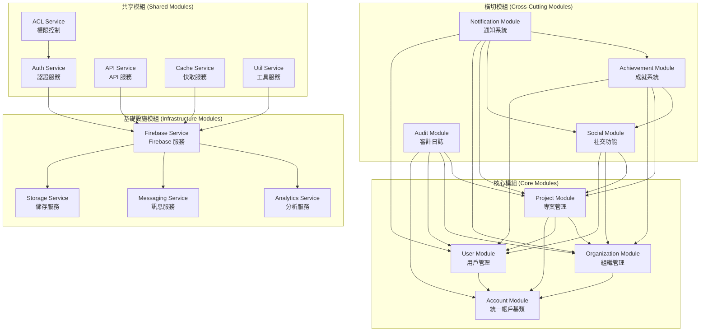
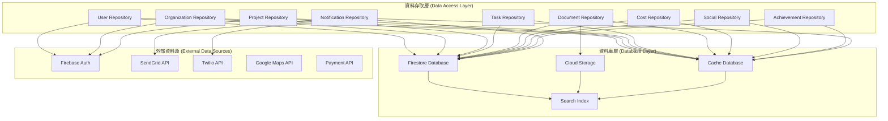
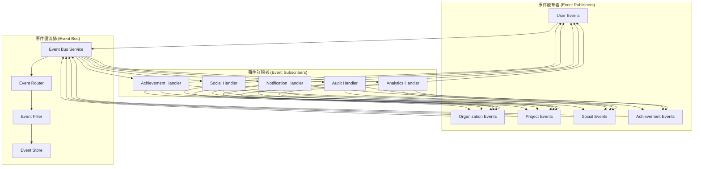

# 模組依賴圖

## 概述

本文件詳細說明 ng-alain 企業級建築工程管理平台中各模組間的依賴關係，確保模組設計的清晰性和可維護性。

## 模組依賴總覽

### 1. 核心模組依賴圖



### 2. 詳細模組依賴矩陣

| 模組 | Account | User | Organization | Project | Social | Achievement | Notification | Audit |
|------|---------|------|--------------|---------|--------|-------------|--------------|-------|
| **Account** | - | ✓ | ✓ | ✓ | ○ | ○ | ○ | ✓ |
| **User** | - | - | ○ | ✓ | ✓ | ✓ | ✓ | ✓ |
| **Organization** | - | - | - | ✓ | ✓ | ✓ | ✓ | ✓ |
| **Project** | - | - | - | - | ✓ | ✓ | ✓ | ✓ |
| **Social** | - | - | - | - | - | ✓ | ✓ | ○ |
| **Achievement** | - | - | - | - | - | - | ✓ | ○ |
| **Notification** | - | - | - | - | - | - | - | ✓ |
| **Audit** | - | - | - | - | - | - | - | - |

**圖例**:
- ✓ = 強依賴 (直接調用)
- ○ = 事件依賴 (事件驅動)
- - = 無依賴

### 3. 服務層依賴圖

```mermaid
graph TB
    subgraph "應用服務層 (Application Services)"
        A[User Application Service]
        B[Organization Application Service]
        C[Project Application Service]
        D[Social Application Service]
        E[Achievement Application Service]
        F[Notification Application Service]
    end
    
    subgraph "領域服務層 (Domain Services)"
        G[User Domain Service]
        H[Organization Domain Service]
        I[Project Domain Service]
        J[Social Domain Service]
        K[Achievement Domain Service]
        L[Notification Domain Service]
    end
    
    subgraph "基礎設施服務層 (Infrastructure Services)"
        M[Firebase Auth Service]
        N[Firestore Service]
        O[Storage Service]
        P[Messaging Service]
        Q[Email Service]
        R[SMS Service]
    end
    
    subgraph "共享服務層 (Shared Services)"
        S[Auth Service]
        T[ACL Service]
        U[API Service]
        V[Cache Service]
        W[Event Bus Service]
        X[Logger Service]
    end
    
    %% 應用服務依賴
    A --> G
    A --> S
    A --> T
    A --> U
    A --> W
    A --> X
    
    B --> H
    B --> S
    B --> T
    B --> U
    B --> W
    B --> X
    
    C --> I
    C --> S
    C --> T
    C --> U
    C --> W
    C --> X
    
    D --> J
    D --> S
    D --> U
    D --> W
    D --> X
    
    E --> K
    E --> S
    E --> U
    E --> W
    E --> X
    
    F --> L
    F --> S
    F --> U
    F --> W
    F --> X
    
    %% 領域服務依賴
    G --> M
    G --> N
    G --> V
    
    H --> M
    H --> N
    H --> V
    
    I --> M
    I --> N
    I --> O
    I --> V
    
    J --> M
    J --> N
    J --> V
    
    K --> M
    K --> N
    K --> V
    
    L --> M
    L --> N
    L --> P
    L --> Q
    L --> R
    L --> V
    
    %% 共享服務依賴
    S --> M
    T --> S
    U --> N
    V --> N
    W --> X
```



### 4. 資料層依賴圖



### 5. 事件驅動依賴圖



### 6. 組件層依賴圖

```mermaid
graph TB
    subgraph "頁面組件 (Page Components)"
        A[Dashboard Page]
        B[User List Page]
        C[Project List Page]
        D[Organization Page]
    end
    
    subgraph "功能組件 (Feature Components)"
        E[User Form Component]
        F[Project Form Component]
        G[Task Management Component]
        H[Document Upload Component]
        I[Cost Control Component]
    end
    
    subgraph "共享組件 (Shared Components)"
        J[Data Table Component]
        K[Form Component]
        L[Modal Component]
        M[Notification Component]
        N[Loading Component]
    end
    
    subgraph "服務組件 (Service Components)"
        O[Auth Service]
        P[API Service]
        Q[State Service]
        R[Event Service]
    end
    
    %% 頁面組件依賴
    A --> E
    A --> F
    A --> G
    A --> J
    A --> K
    A --> L
    A --> M
    A --> N
    A --> O
    A --> P
    A --> Q
    A --> R
    
    B --> E
    B --> J
    B --> K
    B --> L
    B --> M
    B --> N
    B --> O
    B --> P
    B --> Q
    B --> R
    
    C --> F
    C --> G
    C --> H
    C --> I
    C --> J
    C --> K
    C --> L
    C --> M
    C --> N
    C --> O
    C --> P
    C --> Q
    C --> R
    
    D --> E
    D --> J
    D --> K
    D --> L
    D --> M
    D --> N
    D --> O
    D --> P
    D --> Q
    D --> R
    
    %% 功能組件依賴
    E --> K
    E --> L
    E --> N
    E --> O
    E --> P
    E --> Q
    
    F --> K
    F --> L
    F --> N
    F --> O
    F --> P
    F --> Q
    
    G --> J
    G --> K
    G --> L
    G --> M
    G --> N
    G --> O
    G --> P
    G --> Q
    G --> R
    
    H --> K
    H --> L
    H --> N
    H --> O
    H --> P
    H --> Q
    
    I --> J
    I --> K
    I --> L
    I --> N
    I --> O
    I --> P
    I --> Q
```



## 依賴管理策略

### 1. 依賴注入原則

#### 1.1 服務注入
```typescript
// 正確的依賴注入
@Injectable({
  providedIn: 'root'
})
export class UserService {
  constructor(
    private http: HttpClient,
    private authService: AuthService,
    private aclService: AclService,
    private apiService: ApiService
  ) {}
}

// 避免循環依賴
@Injectable({
  providedIn: 'root'
})
export class ProjectService {
  constructor(
    private userService: UserService,
    private organizationService: OrganizationService
  ) {}
  
  // 使用事件而非直接調用避免循環依賴
  private eventBus = inject(EventBusService);
}
```

#### 1.2 組件注入
```typescript
// 組件中的依賴注入
@Component({
  selector: 'app-user-list',
  standalone: true,
  imports: [CommonModule, NzTableModule, NzButtonModule],
  template: `...`
})
export class UserListComponent {
  constructor(
    private userService: UserService,
    private notificationService: NotificationService,
    private cdr: ChangeDetectorRef
  ) {}
}
```

### 2. 事件驅動解耦

#### 2.1 事件定義
```typescript
// 定義事件介面
export interface UserCreatedEvent {
  type: 'USER_CREATED';
  payload: {
    userId: string;
    userData: User;
    timestamp: Date;
  };
}

export interface ProjectUpdatedEvent {
  type: 'PROJECT_UPDATED';
  payload: {
    projectId: string;
    changes: Partial<Project>;
    updatedBy: string;
    timestamp: Date;
  };
}
```

#### 2.2 事件發布
```typescript
// 在服務中發布事件
@Injectable({
  providedIn: 'root'
})
export class UserService {
  constructor(private eventBus: EventBusService) {}
  
  async createUser(userData: User): Promise<User> {
    const user = await this.saveUser(userData);
    
    // 發布事件
    this.eventBus.publish<UserCreatedEvent>({
      type: 'USER_CREATED',
      payload: {
        userId: user.id,
        userData: user,
        timestamp: new Date()
      }
    });
    
    return user;
  }
}
```

#### 2.3 事件訂閱
```typescript
// 在服務中訂閱事件
@Injectable({
  providedIn: 'root'
})
export class NotificationService {
  constructor(private eventBus: EventBusService) {
    // 訂閱用戶創建事件
    this.eventBus.subscribe<UserCreatedEvent>('USER_CREATED', (event) => {
      this.sendWelcomeNotification(event.payload.userId);
    });
    
    // 訂閱專案更新事件
    this.eventBus.subscribe<ProjectUpdatedEvent>('PROJECT_UPDATED', (event) => {
      this.notifyProjectMembers(event.payload.projectId, event.payload.changes);
    });
  }
}
```

### 3. 介面隔離原則

#### 3.1 定義清晰介面
```typescript
// 定義服務介面
export interface IUserService {
  getUsers(): Observable<User[]>;
  getUserById(id: string): Observable<User>;
  createUser(user: User): Observable<User>;
  updateUser(id: string, user: Partial<User>): Observable<User>;
  deleteUser(id: string): Observable<void>;
}

export interface IProjectService {
  getProjects(): Observable<Project[]>;
  getProjectById(id: string): Observable<Project>;
  createProject(project: Project): Observable<Project>;
  updateProject(id: string, project: Partial<Project>): Observable<Project>;
  deleteProject(id: string): Observable<void>;
}
```

#### 3.2 實作介面
```typescript
// 實作服務介面
@Injectable({
  providedIn: 'root'
})
export class UserService implements IUserService {
  // 實作介面方法
}

@Injectable({
  providedIn: 'root'
})
export class ProjectService implements IProjectService {
  // 實作介面方法
}
```

### 4. 依賴反轉原則

#### 4.1 抽象依賴
```typescript
// 定義抽象依賴
export abstract class IUserRepository {
  abstract getUsers(): Observable<User[]>;
  abstract getUserById(id: string): Observable<User>;
  abstract createUser(user: User): Observable<User>;
  abstract updateUser(id: string, user: Partial<User>): Observable<User>;
  abstract deleteUser(id: string): Observable<void>;
}

export abstract class IProjectRepository {
  abstract getProjects(): Observable<Project[]>;
  abstract getProjectById(id: string): Observable<Project>;
  abstract createProject(project: Project): Observable<Project>;
  abstract updateProject(id: string, project: Partial<Project>): Observable<Project>;
  abstract deleteProject(id: string): Observable<void>;
}
```

#### 4.2 具體實作
```typescript
// 具體實作
@Injectable({
  providedIn: 'root'
})
export class FirestoreUserRepository extends IUserRepository {
  constructor(private firestore: Firestore) {
    super();
  }
  
  // 實作抽象方法
}

@Injectable({
  providedIn: 'root'
})
export class FirestoreProjectRepository extends IProjectRepository {
  constructor(private firestore: Firestore) {
    super();
  }
  
  // 實作抽象方法
}
```

## 依賴分析工具

### 1. 依賴檢查腳本
```bash
#!/bin/bash
# 檢查模組依賴
echo "檢查模組依賴..."

# 檢查循環依賴
npx madge --circular src/app

# 檢查未使用的依賴
npx depcheck

# 檢查重複依賴
npx duplicate-package-checker

echo "依賴檢查完成"
```

### 2. 依賴視覺化
```bash
# 生成依賴圖
npx madge --image dependency-graph.png src/app

# 生成模組圖
npx madge --image module-graph.png src/app/modules

# 生成服務圖
npx madge --image service-graph.png src/app/services
```

### 3. 依賴監控
```typescript
// 依賴監控服務
@Injectable({
  providedIn: 'root'
})
export class DependencyMonitorService {
  private dependencies = new Map<string, string[]>();
  
  registerDependency(module: string, dependency: string): void {
    if (!this.dependencies.has(module)) {
      this.dependencies.set(module, []);
    }
    this.dependencies.get(module)!.push(dependency);
  }
  
  getDependencies(module: string): string[] {
    return this.dependencies.get(module) || [];
  }
  
  detectCircularDependencies(): string[][] {
    // 檢測循環依賴的邏輯
    return [];
  }
}
```

## 最佳實踐

### 1. 依賴設計原則
- **單一職責**: 每個模組只負責一個功能
- **開閉原則**: 對擴展開放，對修改封閉
- **里氏替換**: 子類可以替換父類
- **介面隔離**: 使用多個專門的介面
- **依賴反轉**: 依賴抽象而非具體實作

### 2. 依賴管理策略
- **最小依賴**: 只依賴必要的模組
- **事件驅動**: 使用事件解耦模組
- **介面抽象**: 定義清晰的介面
- **依賴注入**: 使用 DI 容器管理依賴

### 3. 依賴監控
- **定期檢查**: 定期檢查依賴關係
- **自動化測試**: 自動化測試依賴
- **視覺化工具**: 使用工具視覺化依賴
- **文檔更新**: 及時更新依賴文檔

## 參考資源

- [Angular 依賴注入指南](https://angular.io/guide/dependency-injection)
- [模組設計最佳實踐](https://docs.microsoft.com/en-us/dotnet/architecture/modern-web-apps-azure/common-web-application-architectures)
- [依賴管理工具](https://www.npmjs.com/package/madge)

---

*本文件為模組依賴圖，旨在提供清晰的模組依賴關係和最佳實踐。*
