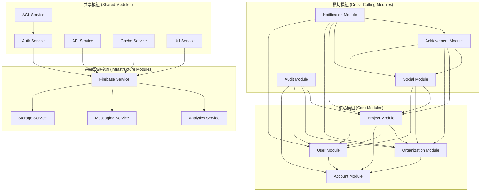
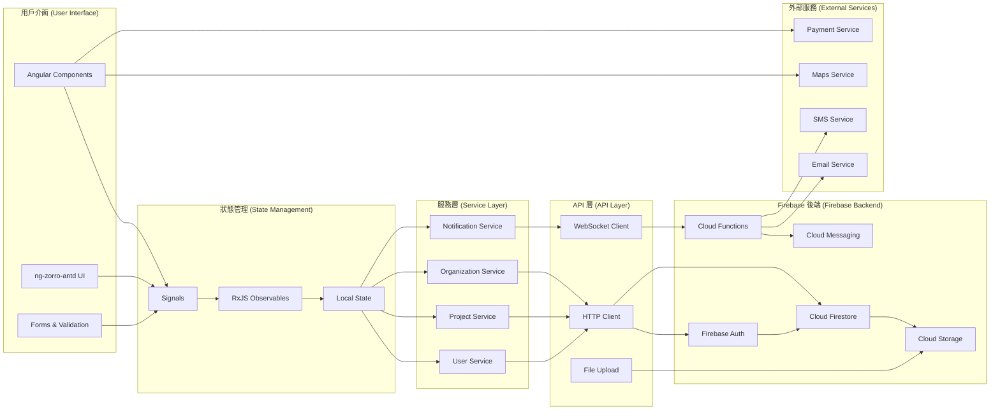
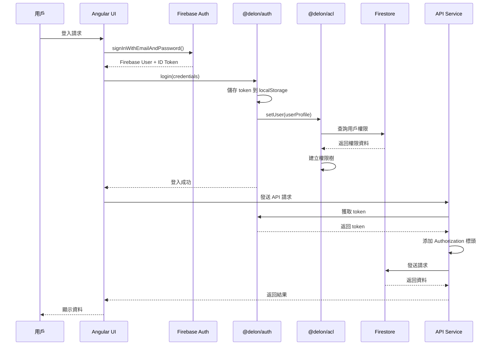
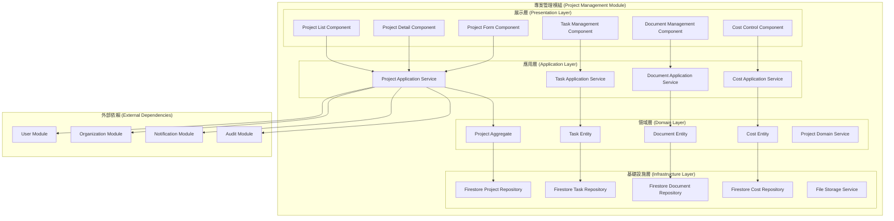
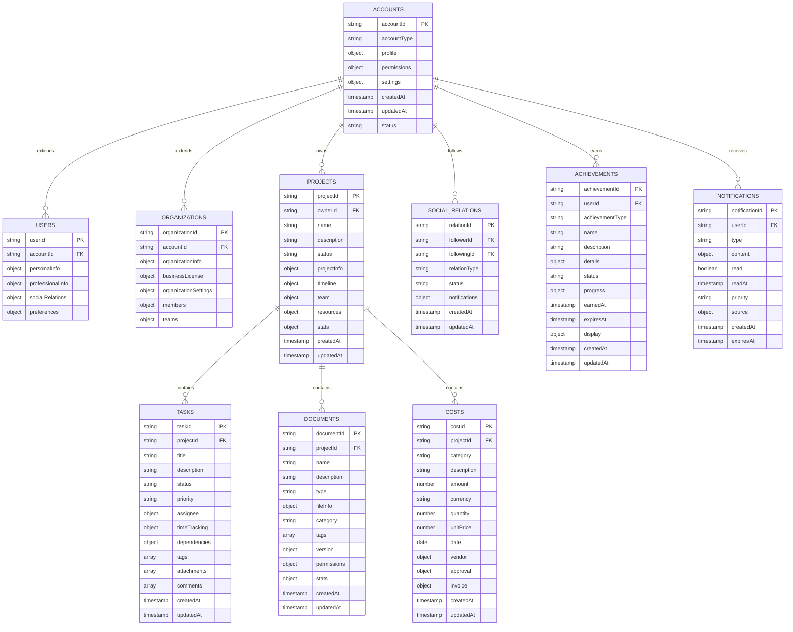
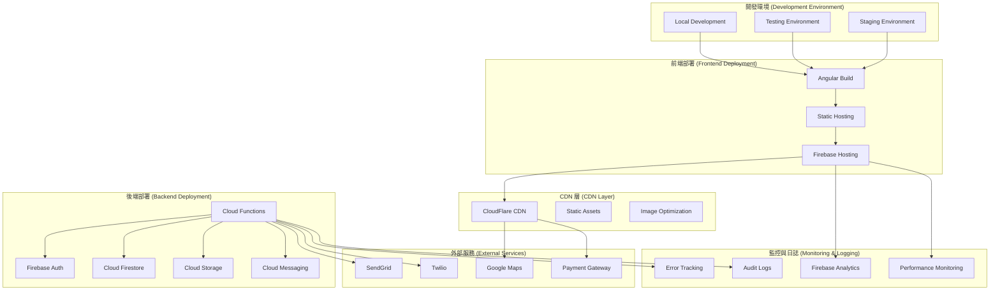

# 系統架構圖

## 概述

本文件提供 ng-alain 企業級建築工程管理平台的完整系統架構圖，包括前端、後端、資料庫和外部服務的整合架構。

## 系統架構總覽

### 1. 整體架構圖

```mermaid
graph TB
    subgraph "前端層 (Frontend Layer)"
        subgraph "Angular 20 應用"
            A[Angular 20 App]
            B[Standalone Components]
            C[Signals State Management]
            D[Modern Control Flow]
            E[Typed Forms]
        end
        
        subgraph "UI 框架"
            F[ng-zorro-antd]
            G[@delon/abc]
            H[@delon/theme]
            I[@delon/util]
        end
        
        subgraph "認證與權限"
            J[@delon/auth]
            K[@delon/acl]
            L[Firebase Auth]
        end
        
        subgraph "狀態管理"
            M[RxJS Observables]
            N[Signal-based State]
            O[Local Storage]
        end
    end
    
    subgraph "API 層 (API Layer)"
        P[REST API]
        Q[GraphQL API]
        R[WebSocket API]
        S[File Upload API]
    end
    
    subgraph "後端層 (Backend Layer)"
        subgraph "Firebase 服務"
            T[Firebase Auth]
            U[Cloud Firestore]
            V[Cloud Storage]
            W[Cloud Functions]
            X[Cloud Messaging]
        end
        
        subgraph "業務邏輯"
            Y[User Service]
            Z[Project Service]
            AA[Organization Service]
            BB[Notification Service]
        end
    end
    
    subgraph "資料層 (Data Layer)"
        CC[Firestore Database]
        DD[Cloud Storage]
        EE[Cache Layer]
        FF[Search Index]
    end
    
    subgraph "外部服務 (External Services)"
        GG[SendGrid Email]
        HH[Twilio SMS]
        II[Google Maps]
        JJ[Payment Gateway]
    end
    
    subgraph "監控與日誌 (Monitoring & Logging)"
        KK[Firebase Analytics]
        LL[Error Tracking]
        MM[Performance Monitoring]
        NN[Audit Logs]
    end
    
    %% 連接關係
    A --> F
    A --> G
    A --> H
    A --> I
    A --> J
    A --> K
    A --> L
    
    B --> C
    B --> D
    B --> E
    
    J --> L
    K --> J
    
    M --> N
    N --> O
    
    A --> P
    A --> Q
    A --> R
    A --> S
    
    P --> T
    Q --> U
    R --> W
    S --> V
    
    T --> Y
    U --> Z
    V --> AA
    W --> BB
    X --> BB
    
    Y --> CC
    Z --> CC
    AA --> CC
    BB --> CC
    
    CC --> DD
    CC --> EE
    CC --> FF
    
    BB --> GG
    BB --> HH
    A --> II
    A --> JJ
    
    A --> KK
    W --> LL
    A --> MM
    W --> NN
```

### 2. 模組架構圖



### 3. 資料流架構圖



### 4. 認證與授權架構圖



### 5. 專案管理模組架構圖



### 6. 資料庫架構圖



### 7. 部署架構圖



## 技術規格

### 1. 前端技術棧
- **框架**: Angular 20.3.0
- **UI 庫**: ng-zorro-antd 20.3.1
- **狀態管理**: Signals + RxJS
- **建置工具**: Angular CLI + Vite
- **型別檢查**: TypeScript 5.9.2

### 2. 後端技術棧
- **平台**: Firebase
- **資料庫**: Cloud Firestore
- **認證**: Firebase Auth
- **儲存**: Cloud Storage
- **函數**: Cloud Functions
- **訊息**: Cloud Messaging

### 3. 外部服務
- **郵件**: SendGrid
- **簡訊**: Twilio
- **地圖**: Google Maps API
- **支付**: Stripe/PayPal
- **監控**: Firebase Analytics

### 4. 開發工具
- **版本控制**: Git
- **包管理**: Yarn 4.9.2
- **程式碼品質**: ESLint + Prettier
- **測試**: Jest + Playwright
- **部署**: Firebase CLI

## 效能指標

### 1. 前端效能
- **首次載入時間**: < 2 秒
- **互動時間**: < 100 毫秒
- **Bundle 大小**: < 1MB (gzipped)
- **Lighthouse 分數**: > 90

### 2. 後端效能
- **API 響應時間**: < 200 毫秒
- **資料庫查詢時間**: < 100 毫秒
- **檔案上傳時間**: < 5 秒 (10MB)
- **並發用戶數**: > 10,000

### 3. 可用性指標
- **系統可用性**: 99.9%
- **錯誤率**: < 0.1%
- **恢復時間**: < 5 分鐘
- **資料備份**: 每日自動備份

## 安全架構

### 1. 認證安全
- **多因子認證**: 支援 MFA
- **Token 管理**: JWT + Refresh Token
- **會話管理**: 自動過期機制
- **密碼策略**: 強密碼要求

### 2. 授權安全
- **角色權限**: RBAC 模型
- **資源權限**: 細粒度控制
- **API 安全**: 請求驗證
- **資料加密**: 傳輸和儲存加密

### 3. 資料安全
- **資料備份**: 自動備份策略
- **資料恢復**: 快速恢復機制
- **隱私保護**: GDPR 合規
- **審計日誌**: 完整操作記錄

## 擴展性設計

### 1. 水平擴展
- **微服務架構**: 模組化設計
- **負載平衡**: 自動負載分配
- **資料分片**: 資料庫分片策略
- **快取策略**: 多層快取設計

### 2. 垂直擴展
- **資源監控**: 實時資源監控
- **自動擴展**: 根據負載自動擴展
- **效能優化**: 持續效能優化
- **容量規劃**: 預測性容量規劃

## 參考資源

- [Angular 20 官方文件](https://v20.angular.dev/)
- [ng-zorro-antd 文件](https://ng.ant.design/)
- [Firebase 官方文件](https://firebase.google.com/docs)
- [系統架構設計最佳實踐](https://docs.microsoft.com/en-us/azure/architecture/)

---

*本文件為系統架構圖，旨在提供完整的技術架構和設計規範。*
