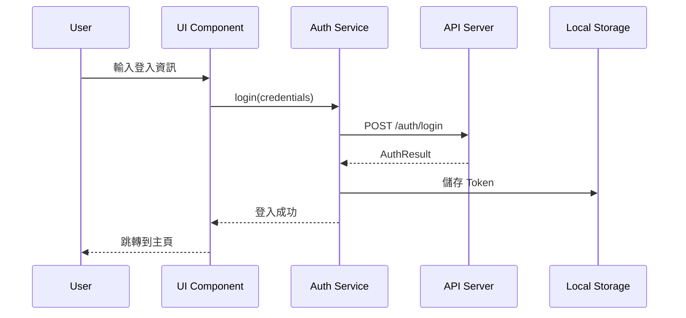
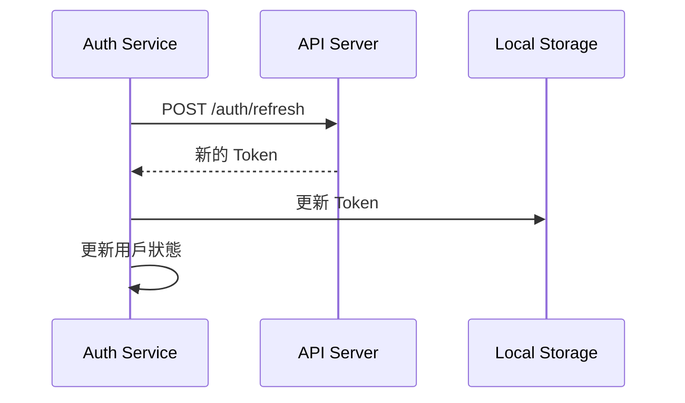

# 認證服務 (Auth Service)

## 概述

認證服務負責處理用戶身份驗證、授權和會話管理，提供統一的認證介面。

## 功能特色

### 1. 身份驗證
- **登入**: 支援多種登入方式
- **登出**: 安全登出和會話清理
- **註冊**: 用戶註冊和驗證
- **密碼重設**: 密碼重設流程

### 2. 授權管理
- **角色檢查**: 檢查用戶角色權限
- **權限驗證**: 驗證特定操作權限
- **存取控制**: 控制資源存取權限
- **動態權限**: 支援動態權限更新

### 3. 會話管理
- **Token 管理**: JWT Token 的生成和驗證
- **會話追蹤**: 追蹤用戶會話狀態
- **自動續期**: Token 自動續期機制
- **多設備管理**: 支援多設備登入管理

## 使用範例

```typescript
// 注入服務
constructor(private authService: AuthService) {}

// 用戶登入
async login(credentials: LoginCredentials): Promise<AuthResult> {
  return this.authService.login(credentials);
}

// 檢查登入狀態
isAuthenticated(): boolean {
  return this.authService.isAuthenticated();
}

// 獲取當前用戶
getCurrentUser(): User | null {
  return this.authService.getCurrentUser();
}

// 檢查權限
hasPermission(permission: string): boolean {
  return this.authService.hasPermission(permission);
}

// 檢查角色
hasRole(role: string): boolean {
  return this.authService.hasRole(role);
}

// 用戶登出
logout(): void {
  this.authService.logout();
}
```

## API 規格

### AuthService 方法

| 方法 | 參數 | 返回值 | 說明 |
|------|------|--------|------|
| login | credentials | Promise<AuthResult> | 用戶登入 |
| logout | void | void | 用戶登出 |
| register | userData | Promise<AuthResult> | 用戶註冊 |
| resetPassword | email | Promise<void> | 重設密碼 |
| refreshToken | void | Promise<string> | 刷新 Token |
| isAuthenticated | void | boolean | 檢查登入狀態 |
| getCurrentUser | void | User \| null | 獲取當前用戶 |
| hasPermission | permission | boolean | 檢查權限 |
| hasRole | role | boolean | 檢查角色 |
| getToken | void | string \| null | 獲取 Token |

### 認證相關介面

```typescript
interface LoginCredentials {
  email: string;
  password: string;
  rememberMe?: boolean;
}

interface AuthResult {
  success: boolean;
  user?: User;
  token?: string;
  refreshToken?: string;
  message?: string;
}

interface User {
  id: string;
  email: string;
  name: string;
  roles: string[];
  permissions: string[];
  profile?: UserProfile;
}

interface UserProfile {
  avatar?: string;
  phone?: string;
  department?: string;
  position?: string;
}
```

## 認證流程

### 登入流程


### Token 刷新流程


## 權限管理

### 角色權限配置
```typescript
interface RolePermission {
  role: string;
  permissions: string[];
}

const ROLE_PERMISSIONS: RolePermission[] = [
  {
    role: 'admin',
    permissions: ['user:read', 'user:write', 'user:delete', 'project:read', 'project:write', 'project:delete']
  },
  {
    role: 'manager',
    permissions: ['user:read', 'project:read', 'project:write']
  },
  {
    role: 'user',
    permissions: ['project:read']
  }
];
```

### 權限檢查
```typescript
// 檢查特定權限
hasPermission(permission: string): boolean {
  const user = this.getCurrentUser();
  if (!user) return false;
  
  return user.permissions.includes(permission);
}

// 檢查多個權限（AND 邏輯）
hasAllPermissions(permissions: string[]): boolean {
  return permissions.every(permission => this.hasPermission(permission));
}

// 檢查多個權限（OR 邏輯）
hasAnyPermission(permissions: string[]): boolean {
  return permissions.some(permission => this.hasPermission(permission));
}
```

## 路由守衛

### 認證守衛
```typescript
@Injectable()
export class AuthGuard implements CanActivate {
  constructor(private authService: AuthService, private router: Router) {}
  
  canActivate(route: ActivatedRouteSnapshot): boolean {
    if (this.authService.isAuthenticated()) {
      return true;
    }
    
    this.router.navigate(['/login']);
    return false;
  }
}
```

### 角色守衛
```typescript
@Injectable()
export class RoleGuard implements CanActivate {
  constructor(private authService: AuthService, private router: Router) {}
  
  canActivate(route: ActivatedRouteSnapshot): boolean {
    const requiredRoles = route.data['roles'] as string[];
    const user = this.authService.getCurrentUser();
    
    if (user && requiredRoles.some(role => user.roles.includes(role))) {
      return true;
    }
    
    this.router.navigate(['/unauthorized']);
    return false;
  }
}
```

## 安全考量

### Token 安全
- **儲存方式**: 使用 HttpOnly Cookie 或安全的 LocalStorage
- **過期時間**: 設定合理的 Token 過期時間
- **刷新機制**: 實現自動刷新機制
- **撤銷機制**: 支援 Token 撤銷

### 密碼安全
- **加密傳輸**: 使用 HTTPS 傳輸
- **密碼強度**: 實施密碼強度要求
- **雜湊儲存**: 密碼使用安全的雜湊演算法
- **重試限制**: 實施登入重試限制

## 最佳實踐

### 使用建議
1. **統一認證**: 使用統一的認證服務
2. **權限設計**: 設計清晰的權限體系
3. **安全實踐**: 遵循安全最佳實踐
4. **用戶體驗**: 提供良好的認證體驗

### 避免事項
1. 不要在客戶端儲存敏感資訊
2. 不要忽略 Token 過期處理
3. 不要使用弱密碼策略
4. 不要忘記實施登出清理
