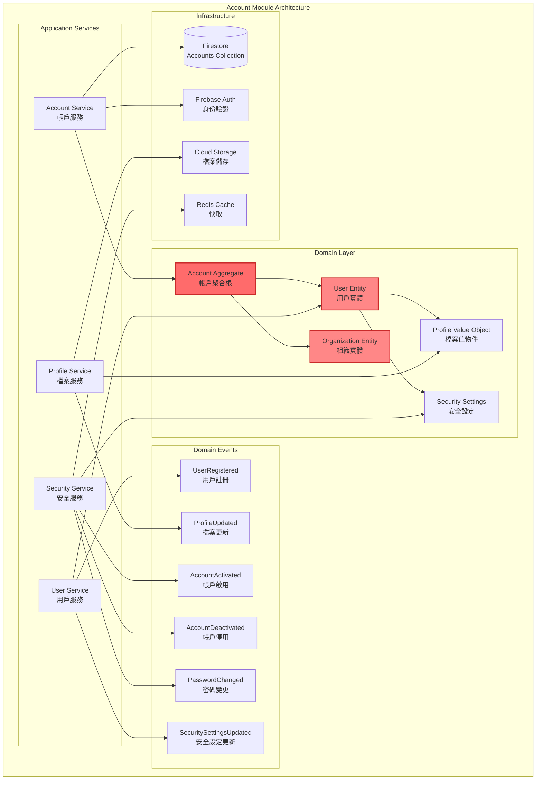
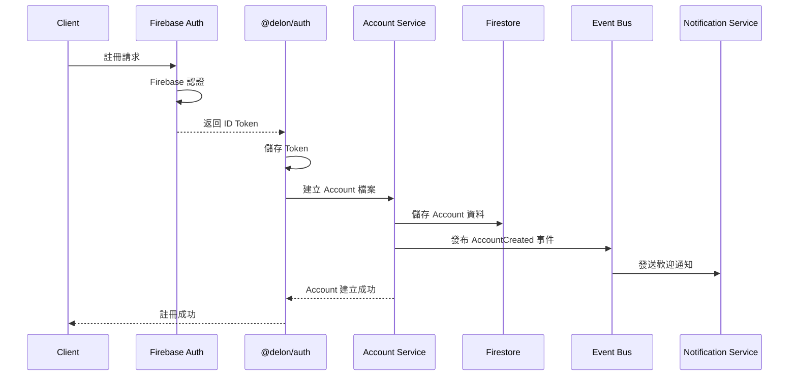

# 帳戶模組 (Account Module)

## 模組概述

帳戶模組是營建管理系統的核心身份管理模組，提供統一的帳戶抽象層。透過 Account 基礎類別，支援個人用戶（User）和組織（Organization）兩種帳戶類型，實現了靈活的身份管理和權限控制系統。

## 核心設計理念

### 1. Account 抽象層
- **統一身份基礎**: Account 作為所有身份實體的基礎類別
- **多態性支援**: User 和 Organization 都繼承自 Account
- **擁有者模型**: 支援作為專案擁有者的統一介面

### 2. 模組職責
Account Module 專注於基本的帳戶管理功能：
- Account 註冊與身份驗證
- Account 檔案管理
- 基本安全設定
- 帳戶狀態管理

**注意**: 社交功能（追蹤、星標）、成就系統、通知管理、團隊參與等功能屬於其他專門模組，不在 Account Module 範圍內。

## 架構圖



## 資料模型

### Account 基礎模型

```typescript
// Account 抽象基類
interface Account {
  accountId: string;
  accountType: 'user' | 'organization';
  profile: Profile;
  permissions: Permissions;
  settings: Settings;
  projectsOwned: string[];
  createdAt: Date;
  updatedAt: Date;
  lastLoginAt?: Date;
}

// 通用檔案
interface Profile {
  name: string;
  email: string;
  avatar?: string;
  bio?: string;
  phone?: string;
  location?: string;
  timezone: string;
  language: string;
}

// 權限集合
interface Permissions {
  roles: string[];
  capabilities: string[];
  organizationRoles?: { [organizationId: string]: string[] };
  projectRoles?: { [projectId: string]: string[] };
}

// 通用設定
interface Settings {
  notifications: NotificationSettings;
  privacy: PrivacySettings;
  preferences: UserPreferences;
}
```

### User 實體模型

```typescript
interface User extends Account {
  accountType: 'user';
  certificates: ProfessionalLicense[];
  socialRelations: SocialRelations;
  teams: TeamMembership[];
  organizationMemberships: OrganizationMembership[];
}

interface ProfessionalLicense {
  licenseId: string;
  name: string;
  issuer: string;
  issueDate: Date;
  expiryDate?: Date;
  certificateUrl?: string;
}

interface SocialRelations {
  following: Following[];
  followers: string[];
  starredProjects: StarredProject[];
  achievements: Achievement[];
}
```

### 社交功能模型

```typescript
interface StarredProject {
  projectId: string;
  starredAt: Date;
  note?: string;
}

interface Following {
  accountId: string;
  accountType: 'user' | 'organization';
  followedAt: Date;
  notifications: boolean;
}

interface Achievement {
  achievementId: string;
  type: AchievementType;
  name: string;
  description: string;
  icon: string;
  unlockedAt: Date;
  progress: number;
  maxProgress: number;
}
```

### 團隊成員資格模型

```typescript
interface TeamMembership {
  teamId: string;
  organizationId: string;
  role: TeamRole;
  joinedAt: Date;
  permissions: string[];
}

interface OrganizationMembership {
  organizationId: string;
  role: OrganizationRole;
  joinedAt: Date;
  department?: string;
  isActive: boolean;
}
```

## 核心功能

### 1. Account 管理
- Account 註冊（個人/組織選擇）
- Firebase 身份驗證整合
- @delon/auth 令牌管理
- @delon/acl 權限控制
- 帳戶啟用/停用

### 2. Account 檔案
- 基本資料編輯
- 頭像上傳
- 專業資訊管理
- 證照管理

### 3. 安全設定
- 密碼管理
- 雙因子認證設定
- 登入記錄查看
- 安全偏好設定

**注意**: 社交功能、成就系統、通知管理、團隊協作等功能屬於其他專門模組，不在 Account Module 範圍內。

## Firebase 整合

### Firestore 集合設計
- **統一 Accounts 集合**: `/accounts/{accountId}`
- **Account 基礎欄位**: `accountId`, `accountType`, `profile`, `permissions`
- **User 特定欄位**: `certificates`, `socialRelations`
- **Organization 特定欄位**: `businessLicense`, `members`, `teams`

### Firebase Auth 整合
- **Email/Password 認證**: 支援傳統登入方式
- **社交登入整合**: Google, Facebook 等
- **自訂 Claims**: `accountRoles`, `projectRoles`
- **Token 管理**: @delon/auth 整合

### @delon/auth 整合
- **Token 儲存**: localStorage 自動管理
- **自動刷新**: 令牌過期自動更新
- **HTTP 攔截**: 自動注入 Authorization 標頭
- **狀態管理**: 登入/登出狀態同步

### @delon/acl 整合
- **角色權限控制**: 基於 Account 角色設定
- **路由守衛**: ACLGuard 保護受控路由
- **元件權限**: *appAcl 指令控制顯示
- **動態更新**: 組織切換時權限同步

## 事件流

### Account 註冊流程


## 安全考量

### 1. Firebase 身份驗證
- Firebase ID Token 管理
- 自動 Token 刷新
- 多重要素驗證 (MFA)
- 社交登入安全

### 2. @delon/acl 授權控制
- 基於 Account 角色的存取控制
- 組織層級權限
- 專案層級權限
- 動態權限更新

### 3. Firestore 安全規則
- 統一 Account 權限檢查
- `hasAccountAccess` 函式
- 組織成員權限驗證
- 專案擁有者權限驗證

### 4. 資料保護
- Firebase 內建加密
- 敏感資料遮罩
- PII 資料保護
- 資料最小化原則

## 效能優化

### 1. Firestore 快取策略
- 本地快取 Account 資料
- 快取失效策略
- 離線同步支援

### 2. Angular Signals 整合
- 響應式狀態管理
- 自動變更偵測
- 計算屬性優化

### 3. 事件驅動架構
- 領域事件發布
- 非同步事件處理
- 批次操作優化

## 監控指標

### 1. 業務指標
- 每日活躍 Account (DAA)
- 註冊轉換率
- Account 留存率
- 功能使用率

### 2. 技術指標
- Firebase 回應時間
- Firestore 查詢效能
- Angular 應用效能
- 錯誤率

### 3. 安全指標
- Firebase Auth 失敗次數
- 異常存取模式
- Token 使用情況
- 安全事件
