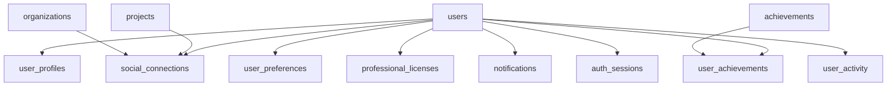

# Account Module Firebase Schema (帳戶模組 Firebase 架構)

## Firebase Schema 概述

Account Module Firebase Schema 定義了帳戶模組在 Firebase Firestore 中的資料結構，包括用戶認證、個人檔案、社交功能、成就系統、通知管理等所有帳戶相關的集合和文件結構。本架構採用 Firebase 最佳實踐，確保資料一致性、安全性和效能。

## Firestore 集合結構

### 1. 主要集合

```typescript
// Firestore 集合結構
const COLLECTIONS = {
  USERS: 'users',
  USER_PROFILES: 'user_profiles',
  USER_PREFERENCES: 'user_preferences',
  PROFESSIONAL_LICENSES: 'professional_licenses',
  SOCIAL_CONNECTIONS: 'social_connections',
  NOTIFICATIONS: 'notifications',
  ACHIEVEMENTS: 'achievements',
  USER_ACHIEVEMENTS: 'user_achievements',
  AUTH_SESSIONS: 'auth_sessions',
  USER_ACTIVITY: 'user_activity'
} as const;
```

### 2. 集合關係圖



## 用戶集合 (users)

### 1. 用戶文件結構

```typescript
interface UserDocument {
  // 基本資訊
  id: string;                    // 用戶 ID (Firebase Auth UID)
  email: string;                 // 電子郵件
  emailVerified: boolean;        // 電子郵件驗證狀態
  displayName: string;           // 顯示名稱
  photoURL: string | null;       // 頭像 URL
  
  // 認證資訊
  providerId: string;           // 認證提供者 ID
  providerData: ProviderData[];  // 認證提供者資料
  customClaims: Record<string, any>; // 自訂聲明
  
  // 狀態資訊
  disabled: boolean;             // 帳戶是否停用
  metadata: UserMetadata;        // 用戶元資料
  
  // 時間戳記
  createdAt: Timestamp;          // 建立時間
  updatedAt: Timestamp;          // 更新時間
  lastSignInAt: Timestamp | null; // 最後登入時間
  
  // 索引欄位
  emailHash: string;             // 電子郵件雜湊 (用於搜尋)
  displayNameLower: string;      // 小寫顯示名稱 (用於搜尋)
}

interface ProviderData {
  providerId: string;
  uid: string;
  displayName: string | null;
  email: string | null;
  phoneNumber: string | null;
  photoURL: string | null;
}

interface UserMetadata {
  creationTime: Timestamp;
  lastSignInTime: Timestamp | null;
  lastRefreshTime: Timestamp | null;
}
```

### 2. 用戶集合索引

```typescript
// Firestore 索引配置
const USER_INDEXES = {
  // 複合索引
  emailVerified_disabled: ['emailVerified', 'disabled'],
  createdAt_disabled: ['createdAt', 'disabled'],
  lastSignInAt_disabled: ['lastSignInAt', 'disabled'],
  
  // 單一欄位索引
  email: ['email'],
  displayNameLower: ['displayNameLower'],
  emailHash: ['emailHash']
};
```

## 用戶檔案集合 (user_profiles)

### 1. 用戶檔案文件結構

```typescript
interface UserProfileDocument {
  // 基本資訊
  userId: string;                // 關聯的用戶 ID
  firstName: string;             // 名字
  lastName: string;              // 姓氏
  middleName?: string;           // 中間名
  preferredName?: string;        // 偏好名稱
  
  // 聯絡資訊
  phoneNumber?: string;          // 電話號碼
  phoneNumberVerified: boolean;  // 電話號碼驗證狀態
  address?: Address;             // 地址
  timezone: string;             // 時區
  
  // 個人資訊
  dateOfBirth?: Timestamp;       // 生日
  gender?: 'MALE' | 'FEMALE' | 'OTHER' | 'PREFER_NOT_TO_SAY';
  bio?: string;                  // 個人簡介
  website?: string;              // 個人網站
  linkedinUrl?: string;          // LinkedIn 連結
  githubUrl?: string;            // GitHub 連結
  
  // 專業資訊
  jobTitle?: string;             // 職稱
  company?: string;              // 公司
  industry?: string;             // 產業
  experience?: Experience[];     // 工作經驗
  
  // 技能與興趣
  skills: string[];              // 技能標籤
  interests: string[];           // 興趣標籤
  languages: Language[];         // 語言能力
  
  // 隱私設定
  privacySettings: PrivacySettings;
  
  // 時間戳記
  createdAt: Timestamp;
  updatedAt: Timestamp;
  
  // 索引欄位
  fullNameLower: string;         // 全名小寫 (用於搜尋)
  skillsLower: string[];         // 技能小寫 (用於搜尋)
}

interface Address {
  street: string;
  city: string;
  state: string;
  country: string;
  postalCode: string;
  coordinates?: {
    latitude: number;
    longitude: number;
  };
}

interface Experience {
  company: string;
  position: string;
  startDate: Timestamp;
  endDate?: Timestamp;
  description?: string;
  isCurrent: boolean;
}

interface Language {
  code: string;                  // ISO 639-1 語言代碼
  name: string;                  // 語言名稱
  proficiency: 'BASIC' | 'INTERMEDIATE' | 'ADVANCED' | 'NATIVE';
}

interface PrivacySettings {
  profileVisibility: 'PUBLIC' | 'PRIVATE' | 'CONNECTIONS_ONLY';
  emailVisibility: 'PUBLIC' | 'PRIVATE' | 'CONNECTIONS_ONLY';
  phoneVisibility: 'PUBLIC' | 'PRIVATE' | 'CONNECTIONS_ONLY';
  addressVisibility: 'PUBLIC' | 'PRIVATE' | 'CONNECTIONS_ONLY';
  experienceVisibility: 'PUBLIC' | 'PRIVATE' | 'CONNECTIONS_ONLY';
}
```

### 2. 用戶檔案集合索引

```typescript
const USER_PROFILE_INDEXES = {
  // 複合索引
  userId_createdAt: ['userId', 'createdAt'],
  privacySettings_profileVisibility: ['privacySettings.profileVisibility'],
  
  // 單一欄位索引
  fullNameLower: ['fullNameLower'],
  skillsLower: ['skillsLower'],
  jobTitle: ['jobTitle'],
  company: ['company'],
  industry: ['industry']
};
```

## 用戶偏好設定集合 (user_preferences)

### 1. 偏好設定文件結構

```typescript
interface UserPreferencesDocument {
  userId: string;                // 關聯的用戶 ID
  
  // 介面偏好
  theme: 'LIGHT' | 'DARK' | 'AUTO';
  language: string;             // ISO 639-1 語言代碼
  timezone: string;             // 時區
  dateFormat: 'MM/DD/YYYY' | 'DD/MM/YYYY' | 'YYYY-MM-DD';
  timeFormat: '12H' | '24H';
  
  // 通知偏好
  notifications: NotificationPreferences;
  
  // 隱私偏好
  privacy: PrivacyPreferences;
  
  // 功能偏好
  features: FeaturePreferences;
  
  // 時間戳記
  createdAt: Timestamp;
  updatedAt: Timestamp;
}

interface NotificationPreferences {
  email: {
    enabled: boolean;
    frequency: 'IMMEDIATE' | 'DAILY' | 'WEEKLY' | 'NEVER';
    types: {
      projectUpdates: boolean;
      teamInvitations: boolean;
      achievementUnlocks: boolean;
      socialConnections: boolean;
      systemAnnouncements: boolean;
    };
  };
  push: {
    enabled: boolean;
    types: {
      projectUpdates: boolean;
      teamInvitations: boolean;
      achievementUnlocks: boolean;
      socialConnections: boolean;
      systemAnnouncements: boolean;
    };
  };
  inApp: {
    enabled: boolean;
    types: {
      projectUpdates: boolean;
      teamInvitations: boolean;
      achievementUnlocks: boolean;
      socialConnections: boolean;
      systemAnnouncements: boolean;
    };
  };
}

interface PrivacyPreferences {
  profileVisibility: 'PUBLIC' | 'PRIVATE' | 'CONNECTIONS_ONLY';
  activityVisibility: 'PUBLIC' | 'PRIVATE' | 'CONNECTIONS_ONLY';
  projectVisibility: 'PUBLIC' | 'PRIVATE' | 'CONNECTIONS_ONLY';
  allowSearch: boolean;
  allowContact: boolean;
}

interface FeaturePreferences {
  enableBetaFeatures: boolean;
  enableAnalytics: boolean;
  enablePersonalization: boolean;
  enableSocialFeatures: boolean;
  enableAchievements: boolean;
}
```

## 專業證照集合 (professional_licenses)

### 1. 專業證照文件結構

```typescript
interface ProfessionalLicenseDocument {
  id: string;                    // 證照 ID
  userId: string;                // 關聯的用戶 ID
  
  // 證照資訊
  licenseType: 'PROFESSIONAL' | 'CERTIFICATION' | 'ACCREDITATION';
  licenseNumber: string;         // 證照號碼
  issuingAuthority: string;      // 發證機構
  licenseName: string;           // 證照名稱
  description?: string;          // 證照描述
  
  // 有效期
  issueDate: Timestamp;          // 發證日期
  expirationDate?: Timestamp;    // 到期日期
  isActive: boolean;             // 是否有效
  
  // 驗證資訊
  verificationStatus: 'PENDING' | 'VERIFIED' | 'REJECTED' | 'EXPIRED';
  verificationDate?: Timestamp;  // 驗證日期
  verificationNotes?: string;    // 驗證備註
  
  // 文件
  documents: LicenseDocument[];  // 相關文件
  
  // 時間戳記
  createdAt: Timestamp;
  updatedAt: Timestamp;
  
  // 索引欄位
  licenseTypeLower: string;      // 證照類型小寫
  issuingAuthorityLower: string; // 發證機構小寫
}

interface LicenseDocument {
  id: string;
  name: string;
  url: string;
  type: 'PDF' | 'IMAGE' | 'DOCUMENT';
  uploadedAt: Timestamp;
}
```

## 社交連結集合 (social_connections)

### 1. 社交連結文件結構

```typescript
interface SocialConnectionDocument {
  id: string;                    // 連結 ID
  userId: string;                // 用戶 ID
  targetUserId?: string;         // 目標用戶 ID (用於用戶連結)
  targetProjectId?: string;      // 目標專案 ID (用於專案連結)
  targetOrganizationId?: string; // 目標組織 ID (用於組織連結)
  
  // 連結類型
  type: 'FOLLOWING' | 'FOLLOWER' | 'STARRED_PROJECT' | 'STARRED_ORGANIZATION' | 'TEAM_MEMBER';
  
  // 連結狀態
  status: 'ACTIVE' | 'PENDING' | 'REJECTED' | 'BLOCKED';
  
  // 連結資訊
  connectionData: ConnectionData;
  
  // 時間戳記
  createdAt: Timestamp;
  updatedAt: Timestamp;
  
  // 索引欄位
  userId_type: string;          // 複合索引
  targetUserId_type: string;    // 複合索引
  targetProjectId_type: string; // 複合索引
}

interface ConnectionData {
  // 用戶連結資料
  userConnection?: {
    mutualConnections: number;
    connectionStrength: number;
    lastInteraction?: Timestamp;
  };
  
  // 專案連結資料
  projectConnection?: {
    starredAt: Timestamp;
    notes?: string;
    tags: string[];
  };
  
  // 組織連結資料
  organizationConnection?: {
    joinedAt: Timestamp;
    role?: string;
    permissions: string[];
  };
}
```

### 2. 社交連結集合索引

```typescript
const SOCIAL_CONNECTION_INDEXES = {
  // 複合索引
  userId_type_status: ['userId', 'type', 'status'],
  targetUserId_type_status: ['targetUserId', 'type', 'status'],
  targetProjectId_type_status: ['targetProjectId', 'type', 'status'],
  userId_createdAt: ['userId', 'createdAt'],
  
  // 單一欄位索引
  userId: ['userId'],
  targetUserId: ['targetUserId'],
  targetProjectId: ['targetProjectId'],
  type: ['type'],
  status: ['status']
};
```

## 通知集合 (notifications)

### 1. 通知文件結構

```typescript
interface NotificationDocument {
  id: string;                    // 通知 ID
  userId: string;                // 接收用戶 ID
  
  // 通知內容
  title: string;                 // 通知標題
  message: string;               // 通知訊息
  type: NotificationType;       // 通知類型
  
  // 通知狀態
  status: 'UNREAD' | 'READ' | 'ARCHIVED';
  priority: 'LOW' | 'MEDIUM' | 'HIGH' | 'URGENT';
  
  // 通知資料
  data: NotificationData;       // 通知相關資料
  
  // 動作
  actions: NotificationAction[]; // 可執行的動作
  
  // 時間戳記
  createdAt: Timestamp;
  readAt?: Timestamp;
  archivedAt?: Timestamp;
  expiresAt?: Timestamp;
  
  // 索引欄位
  userId_status: string;        // 複合索引
  userId_type: string;          // 複合索引
  userId_createdAt: string;     // 複合索引
}

type NotificationType = 
  | 'PROJECT_UPDATE'
  | 'TEAM_INVITATION'
  | 'ACHIEVEMENT_UNLOCKED'
  | 'SOCIAL_CONNECTION'
  | 'SYSTEM_ANNOUNCEMENT'
  | 'SECURITY_ALERT'
  | 'LICENSE_EXPIRY'
  | 'PAYMENT_REMINDER';

interface NotificationData {
  // 專案更新通知
  projectUpdate?: {
    projectId: string;
    projectName: string;
    updateType: 'MILESTONE' | 'TASK' | 'COMMENT' | 'STATUS_CHANGE';
    updateDetails: string;
  };
  
  // 團隊邀請通知
  teamInvitation?: {
    teamId: string;
    teamName: string;
    inviterId: string;
    inviterName: string;
    role: string;
  };
  
  // 成就解鎖通知
  achievementUnlocked?: {
    achievementId: string;
    achievementName: string;
    achievementDescription: string;
    points: number;
  };
  
  // 社交連結通知
  socialConnection?: {
    connectionType: 'FOLLOW' | 'STAR' | 'JOIN';
    targetId: string;
    targetName: string;
    targetType: 'USER' | 'PROJECT' | 'ORGANIZATION';
  };
  
  // 系統公告通知
  systemAnnouncement?: {
    announcementId: string;
    category: 'FEATURE' | 'MAINTENANCE' | 'SECURITY' | 'GENERAL';
    urgency: 'LOW' | 'MEDIUM' | 'HIGH' | 'CRITICAL';
  };
}

interface NotificationAction {
  id: string;
  label: string;
  type: 'BUTTON' | 'LINK' | 'DISMISS';
  url?: string;
  data?: Record<string, any>;
}
```

### 2. 通知集合索引

```typescript
const NOTIFICATION_INDEXES = {
  // 複合索引
  userId_status_createdAt: ['userId', 'status', 'createdAt'],
  userId_type_status: ['userId', 'type', 'status'],
  userId_priority_status: ['userId', 'priority', 'status'],
  
  // 單一欄位索引
  userId: ['userId'],
  type: ['type'],
  status: ['status'],
  priority: ['priority'],
  createdAt: ['createdAt']
};
```

## 成就集合 (achievements)

### 1. 成就文件結構

```typescript
interface AchievementDocument {
  id: string;                    // 成就 ID
  
  // 成就資訊
  name: string;                  // 成就名稱
  description: string;           // 成就描述
  category: AchievementCategory; // 成就類別
  type: AchievementType;         // 成就類型
  
  // 成就條件
  conditions: AchievementCondition[];
  
  // 獎勵
  rewards: AchievementReward[];
  
  // 成就設定
  settings: AchievementSettings;
  
  // 時間戳記
  createdAt: Timestamp;
  updatedAt: Timestamp;
  
  // 索引欄位
  category_type: string;       // 複合索引
  isActive: boolean;            // 是否啟用
}

type AchievementCategory = 
  | 'PROJECT_MANAGEMENT'
  | 'TEAM_COLLABORATION'
  | 'SKILL_DEVELOPMENT'
  | 'SOCIAL_INTERACTION'
  | 'SYSTEM_USAGE'
  | 'MILESTONE_REACHED';

type AchievementType = 
  | 'SINGLE_ACTION'
  | 'CUMULATIVE'
  | 'STREAK'
  | 'MILESTONE'
  | 'SOCIAL'
  | 'SKILL_BASED';

interface AchievementCondition {
  type: 'COUNT' | 'VALUE' | 'DATE' | 'COMPARISON';
  field: string;
  operator: 'EQUALS' | 'GREATER_THAN' | 'LESS_THAN' | 'CONTAINS';
  value: any;
  description: string;
}

interface AchievementReward {
  type: 'POINTS' | 'BADGE' | 'TITLE' | 'FEATURE_UNLOCK';
  value: number | string;
  description: string;
}

interface AchievementSettings {
  isActive: boolean;
  isHidden: boolean;
  isRepeatable: boolean;
  maxProgress: number;
  unlockThreshold: number;
  expiryDate?: Timestamp;
}
```

## 用戶成就集合 (user_achievements)

### 1. 用戶成就文件結構

```typescript
interface UserAchievementDocument {
  id: string;                    // 用戶成就 ID
  userId: string;                // 用戶 ID
  achievementId: string;         // 成就 ID
  
  // 成就狀態
  status: 'LOCKED' | 'IN_PROGRESS' | 'UNLOCKED' | 'COMPLETED';
  progress: number;              // 進度 (0-100)
  
  // 成就資料
  achievementData: UserAchievementData;
  
  // 時間戳記
  unlockedAt?: Timestamp;        // 解鎖時間
  completedAt?: Timestamp;       // 完成時間
  lastProgressUpdate: Timestamp;  // 最後進度更新時間
  
  // 索引欄位
  userId_status: string;         // 複合索引
  achievementId_status: string;  // 複合索引
}

interface UserAchievementData {
  // 進度追蹤
  progressTracking: {
    currentValue: number;
    targetValue: number;
    milestones: AchievementMilestone[];
  };
  
  // 成就統計
  statistics: {
    timesUnlocked: number;
    totalPointsEarned: number;
    averageCompletionTime?: number;
  };
  
  // 個人化資料
  personalization: {
    notes?: string;
    tags: string[];
    isFavorite: boolean;
  };
}

interface AchievementMilestone {
  id: string;
  name: string;
  description: string;
  threshold: number;
  reward: AchievementReward;
  unlockedAt?: Timestamp;
}
```

## 認證會話集合 (auth_sessions)

### 1. 認證會話文件結構

```typescript
interface AuthSessionDocument {
  id: string;                    // 會話 ID
  userId: string;                // 用戶 ID
  
  // 會話資訊
  sessionToken: string;          // 會話令牌
  refreshToken: string;          // 刷新令牌
  deviceInfo: DeviceInfo;       // 裝置資訊
  
  // 會話狀態
  status: 'ACTIVE' | 'EXPIRED' | 'REVOKED';
  isCurrent: boolean;            // 是否為當前會話
  
  // 時間戳記
  createdAt: Timestamp;
  lastActivityAt: Timestamp;
  expiresAt: Timestamp;
  revokedAt?: Timestamp;
  
  // 索引欄位
  userId_status: string;         // 複合索引
  userId_isCurrent: string;      // 複合索引
}

interface DeviceInfo {
  userAgent: string;
  platform: string;
  browser: string;
  os: string;
  deviceType: 'DESKTOP' | 'MOBILE' | 'TABLET';
  ipAddress: string;
  location?: {
    country: string;
    city: string;
    coordinates: {
      latitude: number;
      longitude: number;
    };
  };
}
```

## 用戶活動集合 (user_activity)

### 1. 用戶活動文件結構

```typescript
interface UserActivityDocument {
  id: string;                    // 活動 ID
  userId: string;                // 用戶 ID
  
  // 活動資訊
  type: ActivityType;           // 活動類型
  action: string;               // 執行的動作
  description: string;          // 活動描述
  
  // 活動資料
  data: ActivityData;          // 活動相關資料
  
  // 時間戳記
  timestamp: Timestamp;
  
  // 索引欄位
  userId_type: string;          // 複合索引
  userId_timestamp: string;     // 複合索引
}

type ActivityType = 
  | 'AUTHENTICATION'
  | 'PROFILE_UPDATE'
  | 'SOCIAL_ACTION'
  | 'ACHIEVEMENT_UNLOCK'
  | 'NOTIFICATION_INTERACTION'
  | 'SYSTEM_USAGE';

interface ActivityData {
  // 認證活動
  authentication?: {
    method: 'EMAIL' | 'GOOGLE' | 'FACEBOOK' | 'APPLE';
    success: boolean;
    ipAddress: string;
    userAgent: string;
  };
  
  // 個人檔案更新
  profileUpdate?: {
    field: string;
    oldValue: any;
    newValue: any;
  };
  
  // 社交活動
  socialAction?: {
    actionType: 'FOLLOW' | 'UNFOLLOW' | 'STAR' | 'UNSTAR';
    targetType: 'USER' | 'PROJECT' | 'ORGANIZATION';
    targetId: string;
  };
  
  // 成就解鎖
  achievementUnlock?: {
    achievementId: string;
    achievementName: string;
    points: number;
  };
  
  // 通知互動
  notificationInteraction?: {
    notificationId: string;
    action: 'READ' | 'CLICK' | 'DISMISS';
  };
}
```

## Firebase 安全規則

### 1. Firestore 安全規則

```javascript
rules_version = '2';
service cloud.firestore {
  match /databases/{database}/documents {
    // 用戶集合規則
    match /users/{userId} {
      allow read, write: if request.auth != null && request.auth.uid == userId;
      allow read: if request.auth != null && 
        resource.data.privacySettings.profileVisibility == 'PUBLIC';
    }
    
    // 用戶檔案規則
    match /user_profiles/{profileId} {
      allow read, write: if request.auth != null && 
        request.auth.uid == resource.data.userId;
      allow read: if request.auth != null && 
        resource.data.privacySettings.profileVisibility == 'PUBLIC';
    }
    
    // 用戶偏好設定規則
    match /user_preferences/{preferenceId} {
      allow read, write: if request.auth != null && 
        request.auth.uid == resource.data.userId;
    }
    
    // 專業證照規則
    match /professional_licenses/{licenseId} {
      allow read, write: if request.auth != null && 
        request.auth.uid == resource.data.userId;
    }
    
    // 社交連結規則
    match /social_connections/{connectionId} {
      allow read, write: if request.auth != null && 
        request.auth.uid == resource.data.userId;
      allow read: if request.auth != null && 
        request.auth.uid == resource.data.targetUserId;
    }
    
    // 通知規則
    match /notifications/{notificationId} {
      allow read, write: if request.auth != null && 
        request.auth.uid == resource.data.userId;
    }
    
    // 成就規則
    match /achievements/{achievementId} {
      allow read: if request.auth != null;
      allow write: if false; // 只有系統可以寫入
    }
    
    // 用戶成就規則
    match /user_achievements/{userAchievementId} {
      allow read, write: if request.auth != null && 
        request.auth.uid == resource.data.userId;
    }
    
    // 認證會話規則
    match /auth_sessions/{sessionId} {
      allow read, write: if request.auth != null && 
        request.auth.uid == resource.data.userId;
    }
    
    // 用戶活動規則
    match /user_activity/{activityId} {
      allow read, write: if request.auth != null && 
        request.auth.uid == resource.data.userId;
    }
  }
}
```

## 資料遷移策略

### 1. 版本控制

```typescript
interface SchemaVersion {
  version: string;
  description: string;
  migrationScript: string;
  rollbackScript: string;
  createdAt: Timestamp;
}

// 版本歷史
const SCHEMA_VERSIONS = {
  '1.0.0': {
    description: '初始架構',
    features: ['基本用戶管理', '個人檔案', '偏好設定']
  },
  '1.1.0': {
    description: '新增社交功能',
    features: ['社交連結', '通知系統']
  },
  '1.2.0': {
    description: '新增成就系統',
    features: ['成就管理', '用戶成就追蹤']
  }
};
```

### 2. 資料遷移腳本

```typescript
class SchemaMigrationService {
  async migrateToVersion(targetVersion: string): Promise<void> {
    const currentVersion = await this.getCurrentVersion();
    const migrationPath = this.getMigrationPath(currentVersion, targetVersion);
    
    for (const migration of migrationPath) {
      await this.executeMigration(migration);
    }
  }
  
  private async executeMigration(migration: Migration): Promise<void> {
    // 執行遷移腳本
    await this.runMigrationScript(migration.script);
    
    // 更新版本號
    await this.updateVersion(migration.version);
  }
}
```

## 效能優化

### 1. 查詢優化

```typescript
// 使用複合索引優化查詢
const OPTIMIZED_QUERIES = {
  // 獲取用戶通知
  getUserNotifications: (userId: string) => 
    db.collection('notifications')
      .where('userId', '==', userId)
      .where('status', '==', 'UNREAD')
      .orderBy('createdAt', 'desc')
      .limit(20),
  
  // 獲取用戶成就
  getUserAchievements: (userId: string) =>
    db.collection('user_achievements')
      .where('userId', '==', userId)
      .where('status', 'in', ['IN_PROGRESS', 'UNLOCKED'])
      .orderBy('lastProgressUpdate', 'desc'),
  
  // 搜尋用戶
  searchUsers: (query: string) =>
    db.collection('user_profiles')
      .where('fullNameLower', '>=', query.toLowerCase())
      .where('fullNameLower', '<=', query.toLowerCase() + '\uf8ff')
      .where('privacySettings.profileVisibility', '==', 'PUBLIC')
      .limit(10)
};
```

### 2. 快取策略

```typescript
class FirebaseCacheService {
  private cache = new Map<string, any>();
  private cacheExpiry = new Map<string, number>();
  
  async get<T>(key: string, fetcher: () => Promise<T>, ttl: number = 300000): Promise<T> {
    const cached = this.cache.get(key);
    const expiry = this.cacheExpiry.get(key);
    
    if (cached && expiry && Date.now() < expiry) {
      return cached;
    }
    
    const data = await fetcher();
    this.cache.set(key, data);
    this.cacheExpiry.set(key, Date.now() + ttl);
    
    return data;
  }
  
  invalidate(key: string): void {
    this.cache.delete(key);
    this.cacheExpiry.delete(key);
  }
}
```

## 監控與分析

### 1. 效能監控

```typescript
class FirebasePerformanceMonitor {
  async trackQueryPerformance(query: string, duration: number): Promise<void> {
    // 記錄查詢效能
    await this.logPerformanceMetric({
      type: 'QUERY_PERFORMANCE',
      query,
      duration,
      timestamp: new Date()
    });
  }
  
  async trackDocumentSize(collection: string, documentId: string, size: number): Promise<void> {
    // 記錄文件大小
    await this.logPerformanceMetric({
      type: 'DOCUMENT_SIZE',
      collection,
      documentId,
      size,
      timestamp: new Date()
    });
  }
}
```

### 2. 使用分析

```typescript
class FirebaseAnalyticsService {
  async trackUserAction(userId: string, action: string, data: any): Promise<void> {
    // 記錄用戶行為
    await this.logUserAction({
      userId,
      action,
      data,
      timestamp: new Date()
    });
  }
  
  async getUsageStatistics(timeRange: DateRange): Promise<UsageStatistics> {
    // 獲取使用統計
    return await this.aggregateUsageData(timeRange);
  }
}
```

## 測試策略

### 1. 單元測試

```typescript
describe('Firebase Schema', () => {
  let firestore: Firestore;
  
  beforeEach(() => {
    firestore = getFirestore();
  });
  
  it('應該能夠建立用戶文件', async () => {
    const userData: UserDocument = {
      id: 'test-user-id',
      email: 'test@example.com',
      emailVerified: true,
      displayName: 'Test User',
      photoURL: null,
      providerId: 'password',
      providerData: [],
      customClaims: {},
      disabled: false,
      metadata: {
        creationTime: Timestamp.now(),
        lastSignInTime: Timestamp.now(),
        lastRefreshTime: Timestamp.now()
      },
      createdAt: Timestamp.now(),
      updatedAt: Timestamp.now(),
      lastSignInAt: Timestamp.now(),
      emailHash: 'hash123',
      displayNameLower: 'test user'
    };
    
    await setDoc(doc(firestore, 'users', userData.id), userData);
    
    const docSnap = await getDoc(doc(firestore, 'users', userData.id));
    expect(docSnap.exists()).toBe(true);
    expect(docSnap.data()).toEqual(userData);
  });
});
```

### 2. 整合測試

```typescript
describe('Firebase Schema Integration', () => {
  it('應該能夠建立完整的用戶資料結構', async () => {
    const userId = 'test-user-id';
    
    // 建立用戶
    await createUser(userId);
    
    // 建立用戶檔案
    await createUserProfile(userId);
    
    // 建立偏好設定
    await createUserPreferences(userId);
    
    // 驗證資料完整性
    const user = await getUser(userId);
    const profile = await getUserProfile(userId);
    const preferences = await getUserPreferences(userId);
    
    expect(user).toBeDefined();
    expect(profile).toBeDefined();
    expect(preferences).toBeDefined();
  });
});
```

## 最佳實踐

### 1. 資料設計原則
- **正規化**: 適當的資料正規化避免重複
- **反正規化**: 在必要時使用反正規化提升查詢效能
- **索引優化**: 根據查詢模式設計適當的索引
- **資料一致性**: 使用事務確保資料一致性

### 2. 安全考量
- **存取控制**: 實施適當的 Firestore 安全規則
- **資料驗證**: 在客戶端和伺服器端都進行資料驗證
- **敏感資料**: 適當處理敏感資料的儲存和傳輸
- **稽核日誌**: 記錄重要的資料變更

### 3. 效能優化
- **查詢優化**: 設計高效的查詢模式
- **快取策略**: 實施適當的快取機制
- **批次操作**: 使用批次操作減少網路請求
- **分頁**: 實施適當的分頁機制

### 4. 可維護性
- **版本控制**: 實施架構版本控制
- **遷移策略**: 提供資料遷移機制
- **監控**: 實施效能和使用監控
- **文件**: 提供完整的架構文件